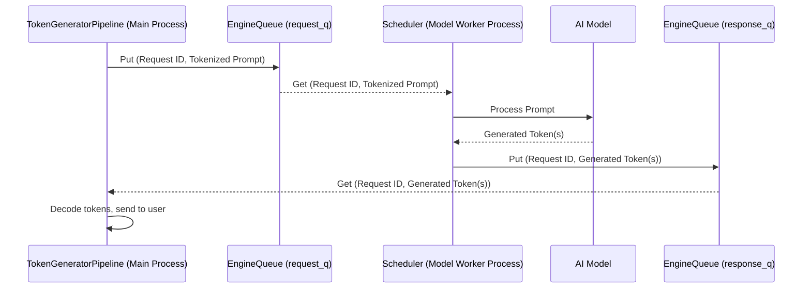

# Chapter 7: EngineQueue

Welcome back! In [Chapter 6: KV Cache Management](06_kv_cache_management_.md), we learned how `modular` intelligently manages memory for ongoing text generation using a "smart scratchpad" called the KV Cache. We've seen the [LLM Pipeline Orchestrator (`TokenGeneratorPipeline`)](03_llm_pipeline_orchestrator___tokengeneratorpipeline___.md) prepare requests and the [Model Worker](04_model_worker_.md) (with its [Scheduler (`TokenGenerationScheduler`, `EmbeddingsScheduler`)](05_scheduler___tokengenerationscheduler____embeddingsscheduler___.md)) do the heavy AI lifting.

But how do these two major components, which actually run in *different processes* (like separate offices in a building), talk to each other? If the `TokenGeneratorPipeline` wants to send a new story prompt to the `Model Worker`, how does it do that? And how does the `Model Worker` send the generated story back?

This is where the **`EngineQueue`** steps in. It's the primary communication backbone of `modular`.

## What Problem Does `EngineQueue` Solve?

Imagine a large organization with a main office (our API server) and a specialized research lab (our Model Worker). The main office receives customer requests (like "analyze this sample"), and the lab has the special equipment and experts to do the analysis.
*   The main office can't just shout across town to the lab.
*   The lab can't just appear in the main office with the results.
*   They need a reliable way to send documents (data) back and forth.

This is exactly the situation between our main API server process and the Model Worker process. They operate independently. The `EngineQueue` solves this by providing a robust and efficient **inter-process communication (IPC)** mechanism. Think of it as a sophisticated, multi-lane pneumatic tube system connecting the main office and the research lab.

It allows:
*   The API server (via the `TokenGeneratorPipeline`) to send new tasks (like "generate text for this prompt") to the Model Worker.
*   The Model Worker to send results (the generated text) back to the API server.
*   A way to send cancellation signals if a task needs to be stopped early.

Without `EngineQueue`, these two core parts of `modular` couldn't cooperate!

## Meet the `EngineQueue`: The Pneumatic Tube System

The `EngineQueue` isn't just one tube; it's a set of specialized inter-process queues designed for high-performance message passing. Each queue is like a dedicated pneumatic tube for a specific type of "document":

1.  **Request Queue (`request_q`)**: Carries new tasks (e.g., tokenized prompts) from the `TokenGeneratorPipeline` (in the main API server process) to the `Scheduler` (in the Model Worker process).
    *   *Analogy*: A tube labeled "NEW WORK ORDERS" going from the main office to the lab.
2.  **Response Queue (`response_q`)**: Carries completed results (e.g., generated tokens or embeddings) from the `Scheduler` back to the `TokenGeneratorPipeline`.
    *   *Analogy*: A tube labeled "COMPLETED RESULTS" going from the lab back to the main office.
3.  **Cancellation Queue (`cancel_q`)**: Carries signals to tell the `Scheduler` to stop working on a specific task if it's no longer needed.
    *   *Analogy*: An express tube labeled "URGENT: STOP TASK XYZ" going to the lab.

`modular` can use different technologies for these queues, primarily:
*   **Standard Python `multiprocessing.Queue`**: A built-in Python way to share data between processes. Good and reliable.
*   **ZMQ (ZeroMQ)**: A high-performance messaging library. Often faster, especially for more complex scenarios or larger data, but adds an external dependency.

The `EngineQueue` abstraction allows `modular` to potentially switch between these underlying technologies based on configuration or needs.

## How It Works: A Simplified Flow

Let's trace how a request for text generation flows through the `EngineQueue`:

1.  **API Server Gets a Request**: A user asks `modular` to write a poem. The [Serving API Layer (FastAPI App & Routers)](02_serving_api_layer__fastapi_app___routers__.md) passes this to the `TokenGeneratorPipeline`.

2.  **Pipeline Prepares and Sends to `EngineQueue`**:
    *   The `TokenGeneratorPipeline` tokenizes the poem prompt ("Write a poem about a cat").
    *   It now needs to send this to the `Model Worker`.
    *   It calls a method on the `EngineQueue` (like `stream()`), which internally puts the tokenized prompt and a unique request ID onto the **request queue (`request_q`)**.

3.  **Model Worker's Scheduler Picks Up the Task**:
    *   The `Scheduler` inside the `Model Worker` process is constantly watching the **request queue (`request_q`)**.
    *   It sees the new poem prompt, takes it off the queue, and prepares to feed it to the AI model.

4.  **Model Worker Generates Text**: The AI model in the `Model Worker` starts generating the poem, token by token.

5.  **Scheduler Sends Results via `EngineQueue`**:
    *   As each token (e.g., "The", "fluffy", "cat") is generated, the `Scheduler` takes this result.
    *   It puts the generated token (associated with the original request ID) onto the **response queue (`response_q`)**.

6.  **Pipeline Receives Results**:
    *   Back in the main API server process, the `EngineQueue` (specifically, a helper task it runs called `response_worker`) is watching the **response queue (`response_q`)**.
    *   It sees the incoming tokens for the poem, takes them off the queue, and passes them to the correct part of the `TokenGeneratorPipeline` that is waiting for them.
    *   The `TokenGeneratorPipeline` then decodes these tokens back into text and sends the poem to the user.

7.  **What if the User Cancels?**:
    *   If the user cancels the request while the poem is being generated, the `TokenGeneratorPipeline` can send a message with the request ID to the **cancellation queue (`cancel_q`)**.
    *   The `Scheduler` in the Model Worker checks this queue and, if it sees the cancellation, stops generating the poem.

This system ensures that the main server and the model worker can work independently but stay perfectly synchronized.

## Visualizing the Flow

Here's how data moves for a typical request:



## Under the Hood: Key Code Aspects

The main logic for `EngineQueue` is in `src/max/serve/scheduler/queues.py`.

### The `EngineQueue` Class

This class brings together the request, response, and cancellation queues.

```python
# Simplified from: src/max/serve/scheduler/queues.py

class EngineQueue(Generic[ReqId, ReqInput, ReqOutput]):
    def __init__(
        self,
        context: multiprocessing.context.BaseContext, # For creating queues
        worker_pc: ProcessControl, # To monitor Model Worker health
        queue_type: QueueType = QueueType.ZMQ, # ZMQ or MP
    ):
        self.request_q = create_queue(queue_type, context)
        self.response_q = create_queue(queue_type, context)
        self.cancel_q = create_queue(queue_type, context)
        
        # For tracking responses to specific requests
        self.pending_out_queues: dict[ReqId, asyncio.Queue] = {}
        self.worker_pc = worker_pc # ProcessControl for Model Worker
        # ...
```
*   `context`: A multiprocessing context, used by `create_queue` to make either ZMQ or standard `multiprocessing.Queue` instances.
*   `worker_pc`: A `ProcessControl` object. `EngineQueue` uses this to check if the Model Worker process is still healthy.
*   `pending_out_queues`: This is a clever part! When `TokenGeneratorPipeline` sends a request, `EngineQueue` creates a temporary, in-memory `asyncio.Queue` just for that request's responses. This dictionary maps the request ID to its dedicated response queue.

### Sending a Request: The `stream` Method

When the `TokenGeneratorPipeline` wants to send a request and get a stream of responses, it uses `engine_queue.stream()`.

```python
# Simplified from: src/max/serve/scheduler/queues.py

    @contextlib.contextmanager
    def open_channel(
        self, req_id: ReqId, data: ReqInput
    ) -> Generator[asyncio.Queue, None, None]:
        try:
            # Create a temporary asyncio.Queue for this request's responses
            out_queue: asyncio.Queue = asyncio.Queue()
            self.pending_out_queues[req_id] = out_queue
            
            # Put the actual request onto the inter-process request_q
            self.request_q.put_nowait((req_id, data))
            yield out_queue # The pipeline will listen to this out_queue
        finally:
            # Clean up when done
            del self.pending_out_queues[req_id]

    async def stream(
        self, req_id: ReqId, data: ReqInput
    ) -> AsyncGenerator[ReqOutput, None]:
        # open_channel sets up the temporary queue and sends to request_q
        with self.open_channel(req_id, data) as queue_for_this_req:
            # Wait for items on the temporary queue
            while (item := await queue_for_this_req.get()) is not STOP_STREAM:
                yield item # Yield each response item
```
1.  `open_channel` is a context manager. It:
    *   Creates a standard `asyncio.Queue` (just for this one request, `req_id`).
    *   Stores this queue in `self.pending_out_queues` using `req_id` as the key.
    *   Puts the `(req_id, data)` tuple onto the actual `self.request_q` (which is an inter-process queue like ZMQ or `mp.Queue`).
    *   `yield out_queue`: The `stream` method gets this temporary `out_queue`.
2.  The `stream` method then asynchronously waits (`await queue_for_this_req.get()`) for responses to appear on this temporary `out_queue` and yields them one by one. `STOP_STREAM` is a special signal that means the response is finished.

### Receiving Responses: The `response_worker` Method

So, who puts items onto that temporary `out_queue`? A helper method called `response_worker` does this. It runs as an asynchronous task within the main API server process (started by the `TokenGeneratorPipeline` when it initializes).

```python
# Simplified from: src/max/serve/scheduler/queues.py

    async def response_worker(self):
        try:
            while True: # Loop forever
                # Check if the Model Worker process is still healthy
                if not self.is_worker_healthy():
                    # Handle error, maybe stop
                    logger.error("Model worker process is not healthy")
                    raise Exception("Worker failed!")
                
                try:
                    # Get a batch of responses from the inter-process response_q
                    # responses_batch is like: [{req_id1: token_A, req_id2: token_B}, ...]
                    responses_batch = self.response_q.get_nowait()
                    
                    for responses_in_item in responses_batch:
                        for req_id, response_data in responses_in_item.items():
                            # Find the temporary asyncio.Queue for this req_id
                            if req_id in self.pending_out_queues:
                                # Put the response data onto that specific queue
                                await self.pending_out_queues[req_id].put(response_data)
                            else:
                                # Request might have been cancelled or finished
                                # self.cancel_q.put_nowait([req_id]) # Example
                                pass
                except queue.Empty: # queue is the standard Python queue module
                    await asyncio.sleep(0) # brief pause if response_q is empty
        finally:
            logger.debug("Response worker stopping.")
```
The `response_worker`:
1.  Continuously checks the main inter-process `self.response_q` for incoming messages from the Model Worker.
2.  When it gets a response, it looks up the `req_id` in `self.pending_out_queues` to find the specific `asyncio.Queue` created for that request.
3.  It then `put`s the `response_data` onto that `asyncio.Queue`.
4.  This wakes up the `stream()` method (which was `await`ing on that `asyncio.Queue`), allowing it to yield the response to the `TokenGeneratorPipeline`.
It also includes important health checks for the Model Worker using `self.is_worker_healthy()`.

### The Actual Queue Implementations: `MaxQueue`, `MpQueue`, `ZmqQueue`

`EngineQueue` uses an abstraction called `MaxQueue` (`src/max/serve/scheduler/max_queue.py`) which defines a common interface (`put_nowait`, `get_nowait`, `qsize`, `empty`).
Then, `modular` provides concrete implementations:

*   **`MpQueue` (`src/max/serve/scheduler/mp_queue.py`)**: This is a wrapper around Python's standard `multiprocessing.Queue`.
    ```python
    # Simplified from: src/max/serve/scheduler/mp_queue.py
    from multiprocessing import context, queues
    import queue # Standard Python queue module for exceptions
    
    class MpQueue(MaxQueue):
        def __init__(self, ctx: context.BaseContext, ...):
            self.queue: queues.Queue = ctx.Queue(...) # Creates a multiprocessing.Queue
            # self.counter = AtomicInt(ctx, 0) # For qsize on macOS
            ...

        def get_nowait(self) -> Any:
            try:
                # x = self.queue.get(block=False) # Attempt to get immediately
                # self.counter.dec()
                # return x
                return self.queue.get(block=True, timeout=0.005) # Small timeout
            except queue.Empty: # Catches standard queue.Empty
                raise queue.Empty()
    
        def put_nowait(self, item: Any) -> None:
            # self.queue.put(item, block=False) # Attempt to put immediately
            # self.counter.inc()
            self.queue.put(item, block=False)
    ```
    It uses the standard `ctx.Queue()` to create the underlying inter-process queue.

*   **`ZmqQueue` (`src/max/serve/scheduler/zmq_queue.py`)**: This uses ZeroMQ sockets for potentially higher performance.
    ```python
    # Simplified from: src/max/serve/scheduler/zmq_queue.py
    import zmq # ZeroMQ library
    import queue # Standard Python queue module for exceptions

    class ZmqQueue(MaxQueue):
        def __init__(self, ...):
            self.zmq_ipc_path = _generate_zmq_ipc_path() # e.g., "ipc:///tmp/some-uuid"
            self.zmq_pull_socket: Optional[zmq.Socket] = None # For receiving
            self.zmq_push_socket: Optional[zmq.Socket] = None # For sending
            # ... (counter for qsize)
    
        def _get_or_init_pull_socket(self) -> zmq.Socket:
            # Creates/returns a ZMQ PULL socket connected to zmq_ipc_path
            if self.zmq_pull_socket is None:
                # zmq_ctx = self._get_or_init_zmq_ctx() # Gets a ZMQ context
                # self.zmq_pull_socket = _open_zmq_socket(zmq_ctx, self.zmq_ipc_path, zmq.PULL)
                pass # Simplified
            return self.zmq_pull_socket

        def _get_or_init_push_socket(self) -> zmq.Socket:
            # Creates/returns a ZMQ PUSH socket bound to zmq_ipc_path
            if self.zmq_push_socket is None:
                pass # Simplified
            return self.zmq_push_socket

        def get_nowait(self) -> Any:
            # pull_socket = self._get_or_init_pull_socket()
            try:
                # return pull_socket.recv_pyobj(flags=zmq.NOBLOCK) # Receive Python object
                pass # Simplified - actual call to ZMQ
            except zmq.ZMQError as e:
                if e.errno == zmq.EAGAIN: # Means no message waiting
                    raise queue.Empty()
                raise # Other ZMQ error
    
        def put_nowait(self, item: Any) -> None:
            # push_socket = self._get_or_init_push_socket()
            try:
                # push_socket.send_pyobj(item, flags=zmq.NOBLOCK) # Send Python object
                pass # Simplified - actual call to ZMQ
            except zmq.ZMQError as e:
                if e.errno == zmq.EAGAIN: # Means send buffer is full (or receiver not ready)
                    # ZmqQueue might retry or raise queue.Full() here
                    pass
                raise # Other ZMQ error
    ```
    ZMQ uses a "socket" paradigm. One end creates a `PUSH` socket and sends messages. The other end creates a `PULL` socket and receives them. `_generate_zmq_ipc_path()` creates a unique file system path that ZMQ uses for local inter-process communication.

The choice between `QueueType.ZMQ` and `QueueType.MP` is typically determined by settings loaded from the [Settings (`Settings` class)](01_settings___settings__class__.md) when `modular` starts.

## Why Different Queue Types?

*   **`multiprocessing.Queue` (`MP`)**:
    *   **Pros**: Built into Python, easy to use, no external dependencies. Generally reliable for many use cases.
    *   **Cons**: Can sometimes have performance limitations with very high throughput or very large messages due to its underlying implementation (often uses pipes and pickling).
*   **ZeroMQ (`ZMQ`)**:
    *   **Pros**: Designed for high-performance messaging. Can handle large volumes of data and high message rates more efficiently. Offers more advanced messaging patterns (though `modular` uses a simple PUSH/PULL here).
    *   **Cons**: Adds an external dependency (the `pyzmq` library and its underlying C library). Can be slightly more complex to set up and debug.

`modular` provides both options to allow users to choose based on their specific performance needs and deployment environment. For many typical scenarios, `multiprocessing.Queue` is sufficient. For demanding, high-throughput applications, ZMQ might offer an edge.

## Conclusion

The `EngineQueue` is the vital communication backbone that enables the main API server process and the separate Model Worker process to work together seamlessly. It acts like a sophisticated pneumatic tube system, with dedicated queues for requests, responses, and cancellation signals.

By abstracting the underlying queue technology (be it standard multiprocessing queues or high-performance ZMQ), `EngineQueue` ensures reliable and efficient message passing. This separation allows the API server to remain responsive while the Model Worker crunches through demanding AI tasks.

Now that we've seen how different parts of `modular` communicate, how do we keep an eye on what's happening inside? How do we measure performance and gather diagnostic information? That's where our next chapter comes in: [Telemetry and Metrics (`METRICS`, `MetricClient`)](08_telemetry_and_metrics___metrics____metricclient___.md).

---

Generated by [AI Codebase Knowledge Builder](https://github.com/The-Pocket/Tutorial-Codebase-Knowledge)