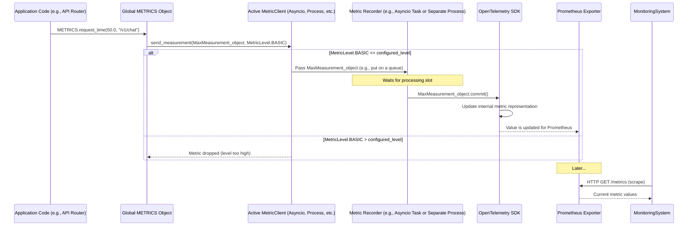

# Chapter 8: Telemetry and Metrics (`METRICS`, `MetricClient`)

Welcome to the final chapter of our core concepts tour! In [Chapter 7: EngineQueue](07_enginequeue_.md), we explored how different parts of `modular`, even across separate processes, communicate with each other. Now, with all these components working together, how do we know what's going on inside? Is the server running smoothly? Is it fast? Are there any bottlenecks?

This is where **Telemetry and Metrics** come into play. They are like the flight data recorder and cockpit instruments of an airplane, constantly logging vital statistics and displaying real-time performance indicators to the crew (the server operators).

## What Problem Do Telemetry and Metrics Solve?

Imagine you're running `modular` to serve a popular AI model. Users start reporting that it's sometimes slow. How do you figure out why?
*   Is the server getting too many requests?
*   Is the AI model itself taking a long time for certain prompts?
*   Is the [KV Cache Management](06_kv_cache_management_.md) struggling?
*   Are prompts waiting too long in the [EngineQueue](07_enginequeue_.md)?

Without data, you're just guessing. Telemetry and metrics provide this crucial data, giving you **observability** into the server's operation. `modular`'s telemetry system collects and reports various metrics like:
*   Request counts and error rates.
*   How long requests take to process (latency).
*   How fast tokens are being generated.
*   How well the KV cache is being utilized.
*   The number of requests waiting in queues.

This information is vital for understanding performance, debugging issues, and making informed decisions about scaling or optimizing the service.

## Key Concepts: Understanding the Instruments

Let's look at the main components of `modular`'s telemetry system:

### 1. Metrics: The Vital Signs

Metrics are specific, quantifiable measurements of the server's behavior. For example:
*   `maxserve.request_count`: A counter for how many HTTP requests have been received.
*   `maxserve.request_time`: A histogram (a way to track distribution of values) for how long requests take.
*   `maxserve.itl`: A histogram for "inter-token latency," or how long it takes to generate each subsequent token.
*   `maxserve.cache.num_used_blocks`: A counter for how many KV cache blocks are currently in use.

`modular` defines a set of these metrics (in `src/max/serve/telemetry/metrics.py` inside the `SERVE_METRICS` dictionary).

### 2. OpenTelemetry (OTEL): A Common Language for Metrics

Instead of inventing its own way to define and collect metrics, `modular` uses **OpenTelemetry (OTEL)**. OTEL is an open standard for collecting telemetry data (metrics, logs, and traces). Using OTEL means `modular`'s metrics can be easily understood and processed by many different monitoring tools.

### 3. Exporters: Sending Metrics Out

Once metrics are collected, they need to be sent somewhere to be viewed and analyzed. `modular` can **export** these OTEL metrics to various systems. A common one is **Prometheus**.
*   **Prometheus**: A popular open-source monitoring system. `modular` can expose an HTTP endpoint (usually on a different port, e.g., `8001`, configured by `metrics_port` in [Settings (`Settings` class)](01_settings___settings__class__.md)) that Prometheus can "scrape" (read from) periodically to collect the latest metric values.

### 4. `METRICS`: The Easy Button for Recording

Inside the `modular` code, when something interesting happens that should be recorded (like a request finishing), developers don't usually interact with OTEL directly. Instead, they use a global object called `METRICS`.

```python
# Simplified from: src/max/serve/telemetry/metrics.py
# (This object is created and made globally available)
# METRICS = _AsyncMetrics() 

# Example usage elsewhere in code:
# METRICS.request_count(responseCode=200, urlPath="/v1/chat/completions")
# METRICS.request_time(value=55.3, urlPath="/v1/chat/completions") # value in ms
```
This `METRICS` object (an instance of `_AsyncMetrics`) provides simple methods like `request_count()` or `request_time()` to record observations.

### 5. `MetricClient`: The Delivery Service

The `METRICS` object itself doesn't do the raw recording. It delegates this to a `MetricClient`. The `MetricClient` is responsible for taking the metric observation and actually processing it according to the configured method.

### 6. Recording Methods: How Metrics are Processed

Sending metrics can take a tiny bit of time. To minimize any performance impact on the main server operations, `modular` supports different ways to record metrics, configured by the `metric_recording` setting (from [Settings (`Settings` class)](01_settings___settings__class__.md)):

*   `MetricRecordingMethod.NOOP`: "No Operation." Metrics are not recorded at all. Useful for maximum performance if metrics aren't needed.
*   `MetricRecordingMethod.SYNC`: "Synchronous." Metrics are recorded immediately in the same thread. Simplest, but can have a small performance impact.
*   `MetricRecordingMethod.ASYNCIO`: Metrics are put into an `asyncio` queue and processed by a separate `asyncio` task in the same process. This offloads the recording work from the main request path.
*   `MetricRecordingMethod.PROCESS`: Metrics are sent to a completely separate dedicated process for recording. This offers the most isolation but is more complex.

The default is usually `ASYNCIO`, offering a good balance.

### 7. Metric Levels: Controlling Detail

Some metrics are cheap to collect (e.g., incrementing a counter), while others might be more expensive or generate a lot of data. The `metric_level` setting (from [Settings (`Settings` class)](01_settings___settings__class__.md)) controls how much detail is captured:

*   `MetricLevel.NONE`: No metrics (similar to `NOOP` recording).
*   `MetricLevel.BASIC`: Only essential, low-impact metrics are recorded.
*   `MetricLevel.DETAILED`: More granular metrics are recorded, which might have a slight performance cost.

This allows operators to choose the trade-off between observability detail and performance.

## How `modular` Uses Telemetry

For the most part, as an end-user or even a developer working on a specific part of `modular`, you benefit from metrics automatically. Key components are already "instrumented" to record relevant data.

For example:
*   When the [Serving API Layer (FastAPI App & Routers)](02_serving_api_layer__fastapi_app___routers__.md) handles a request, it automatically records things like request count and processing time.
*   The [LLM Pipeline Orchestrator (`TokenGeneratorPipeline`)](03_llm_pipeline_orchestrator___tokengeneratorpipeline___.md) records time-to-first-token and inter-token latency.
*   The [Scheduler (`TokenGenerationScheduler`, `EmbeddingsScheduler`)](05_scheduler___tokengenerationscheduler____embeddingsscheduler___.md) records batch sizes and [KV Cache Management](06_kv_cache_management_.md) statistics like cache hit rates.

**Operators** would typically:
1.  Ensure `disable_telemetry` is `False` in their [Settings (`Settings` class)](01_settings___settings__class__.md).
2.  Set `metric_recording` and `metric_level` as desired.
3.  Configure a Prometheus server (or similar tool) to scrape the `/metrics` endpoint on the `metrics_port` (e.g., `http://<modular_host>:8001/metrics`).
4.  Use Prometheus's query language (PromQL) and visualization tools (like Grafana) to create dashboards and alerts based on these metrics.

For example, an operator might create a graph of `maxserve.request_time` to monitor API latency, or `maxserve.num_requests_queued` to see if the server is falling behind.

## Under the Hood: The Journey of a Metric

Let's trace what happens when a metric is recorded, for instance, when a request finishes:



1.  **Observation**: Code in `modular` (e.g., an API endpoint handler) observes an event. It calls a method on the global `METRICS` object, like `METRICS.request_time(value_ms, path)`.
2.  **`METRICS` Object (`_AsyncMetrics`)**:
    *   The `METRICS` object (an instance of `_AsyncMetrics` from `src/max/serve/telemetry/metrics.py`) receives this call.
    *   It creates a `MaxMeasurement` dataclass instance. This object holds the metric name (e.g., "maxserve.request_time"), the observed value, any attributes (like the URL path), and the current timestamp.
    *   It then calls `self.client.send_measurement(measurement_object, metric_level_of_this_metric)`. The `self.client` is the currently active `MetricClient`.

3.  **`MetricClient` (`send_measurement`)**:
    *   The active `MetricClient` (e.g., `AsyncioMetricClient`, `ProcessMetricClient`, `SyncClient`, or `NoopClient`) gets the `MaxMeasurement`.
    *   It first checks if the `metric_level_of_this_metric` (e.g., `MetricLevel.BASIC`) is less than or equal to the globally configured `metric_level` (from [Settings (`Settings` class)](01_settings___settings__class__.md)). If not, the metric is dropped.
    *   If the level is appropriate, the client handles the measurement based on its type:
        *   `NoopClient`: Does nothing.
        *   `SyncClient`: Directly calls `measurement_object.commit()`.
        *   `AsyncioMetricClient`: Puts the `measurement_object` onto an `asyncio.Queue`. A background `asyncio` task will later pick it up and call `commit()`. (See `AsyncioMetricClient` in `src/max/serve/telemetry/asyncio_controller.py`)
        *   `ProcessMetricClient`: Sends the `measurement_object` (possibly batched) via a `multiprocessing.Queue` to a separate telemetry worker process. That process will then call `commit()`. (See `ProcessMetricClient` in `src/max/serve/telemetry/process_controller.py`)

4.  **`MaxMeasurement.commit()`**:
    *   This method (defined in `src/max/serve/telemetry/metrics.py`) is where the metric observation finally interacts with the OpenTelemetry SDK.
    *   It looks up the OTEL "instrument" (like a Counter or Histogram) corresponding to `self.instrument_name` from the `SERVE_METRICS` dictionary.
    *   It creates an OTEL `Measurement` object with the value, timestamp, and attributes.
    *   It then calls the OTEL instrument's internal consumer to record this `Measurement`.

5.  **OpenTelemetry SDK & Exporter**:
    *   The OTEL SDK updates its internal representation of the metric.
    *   If a Prometheus exporter is configured (via `configure_metrics` in `src/max/serve/telemetry/common.py`), this exporter makes the latest metric values available on an HTTP endpoint (e.g., `/metrics` on port `8001`).
    *   External systems like Prometheus can then scrape this endpoint.

### Key Code Snippets:

**1. Settings for Metrics (from `src/max/serve/config.py`)**
These settings from [Chapter 1: Settings (`Settings` class)](01_settings___settings__class__.md) control telemetry behavior.
```python
# From: src/max/serve/config.py
class MetricLevel(IntEnum):
    NONE = 0
    BASIC = 10
    DETAILED = 20

class MetricRecordingMethod(Enum):
    NOOP = "NOOP"
    SYNC = "SYNC"
    ASYNCIO = "ASYNCIO"
    PROCESS = "PROCESS"

class Settings(BaseSettings):
    # ... other settings ...
    metrics_port: int = Field(default=8001, ...)
    disable_telemetry: bool = Field(default=False, ...)
    metric_recording: MetricRecordingMethod = Field(default=MetricRecordingMethod.ASYNCIO, ...)
    metric_level: MetricLevel = Field(default=MetricLevel.BASIC, ...)
    # ...
```
This shows how metric levels and recording methods are defined as configurable options.

**2. The Global `METRICS` Object (from `src/max/serve/telemetry/metrics.py`)**
This is the primary interface for code to record metrics.
```python
# Simplified from: src/max/serve/telemetry/metrics.py
class _AsyncMetrics:
    def __init__(self):
        self.client: MetricClient = NoopClient() # Default, configured later

    def configure(self, client: MetricClient) -> None:
        self.client = client

    def request_count(self, responseCode: int, urlPath: str) -> None:
        self.client.send_measurement(
            MaxMeasurement(
                "maxserve.request_count", 1, {"code": f"{responseCode:d}", "path": urlPath}
            ),
            MetricLevel.BASIC, # This metric is considered 'BASIC'
        )
    # ... other methods like request_time, ttft, etc. ...

METRICS = _AsyncMetrics() # The global instance
```
Application code calls methods like `METRICS.request_count()`. This method creates a `MaxMeasurement` and passes it to the configured `MetricClient`.

**3. `MaxMeasurement` Dataclass (from `src/max/serve/telemetry/metrics.py`)**
This holds the data for a single metric observation.
```python
# Simplified from: src/max/serve/telemetry/metrics.py
@dataclass
class MaxMeasurement:
    instrument_name: str
    value: Union[float, int]
    attributes: Optional[dict[str, str]] = None
    time_unix_nano: int = field(default_factory=time.time_ns)

    def commit(self):
        instrument = SERVE_METRICS[self.instrument_name] # Get OTEL instrument
        # ... (unwrap proxy instrument if necessary) ...
        # ... (create OTEL Measurement object `m`) ...
        # consumer = instrument._measurement_consumer
        # consumer.consume_measurement(m) # Record with OTEL
        logger.debug(f"Committed measurement for {self.instrument_name}")
```
The `commit()` method is the bridge to the OpenTelemetry SDK.

**4. `MetricClient` and its Implementations (from `src/max/serve/telemetry/metrics.py`)**
This defines how measurements are handled.
```python
# Simplified from: src/max/serve/telemetry/metrics.py
class MetricClient(abc.ABC):
    @abc.abstractmethod
    def send_measurement(self, metric: MaxMeasurement, level: MetricLevel) -> None:
        pass
    # ... cross_process_factory omitted for brevity ...

class NoopClient(MetricClient):
    def send_measurement(self, m: MaxMeasurement, level: MetricLevel) -> None:
        pass # Does nothing

class SyncClient(MetricClient):
    def __init__(self, settings: Settings):
        self.level = settings.metric_level # Configured detail level

    def send_measurement(self, m: MaxMeasurement, level: MetricLevel) -> None:
        if level > self.level: # Check if this metric's level is too detailed
            return
        m.commit() # Commit synchronously
```
The `AsyncioMetricClient` and `ProcessMetricClient` (found in `asyncio_controller.py` and `process_controller.py` respectively) would put `m` onto a queue for later processing of `m.commit()`.

**5. Starting the Telemetry Consumer (from `src/max/serve/pipelines/telemetry_worker.py`)**
This function, usually called during server startup, selects and starts the correct `MetricClient` based on settings.
```python
# Simplified from: src/max/serve/pipelines/telemetry_worker.py
@asynccontextmanager
async def start_telemetry_consumer(
    settings: Settings,
) -> AsyncGenerator[MetricClient, None]:
    method = settings.metric_recording
    if method == MetricRecordingMethod.NOOP:
        yield NoopClient()
    elif method == MetricRecordingMethod.SYNC:
        yield SyncClient(settings)
    elif method == MetricRecordingMethod.ASYNCIO:
        # async with start_asyncio_consumer(settings) as controller:
        #    yield controller.Client(settings)
        pass # Simplified
    elif method == MetricRecordingMethod.PROCESS:
        # async with start_process_consumer(settings) as controller:
        #    yield controller.Client(settings)
        pass # Simplified
    # ...
```
The chosen client is then passed to `METRICS.configure(chosen_client)`.

**6. Configuring OTEL Exporters (from `src/max/serve/telemetry/common.py`)**
This function sets up OpenTelemetry to use the Prometheus exporter.
```python
# Simplified from: src/max/serve/telemetry/common.py
def configure_metrics(settings: Settings):
    egress_enabled = not settings.disable_telemetry
    meterProviders: list[MetricReader] = [PrometheusMetricReader(True)] # For /metrics
    if egress_enabled:
        # Also add OTLPMetricExporter for remote telemetry system
        # meterProviders.append(PeriodicExportingMetricReader(OTLPMetricExporter(...)))
        pass
    set_meter_provider(MeterProvider(meterProviders, metrics_resource))
    # ... (logging setup) ...
```
This sets up the system so OTEL metrics can be scraped by Prometheus. If `settings.disable_telemetry` is false and an OTLP endpoint is configured, metrics might also be pushed to a remote Modular telemetry service.

## Conclusion

The Telemetry and Metrics system (`METRICS`, `MetricClient`) is crucial for providing observability into `modular`'s operations. It uses the OpenTelemetry standard to collect vital statistics about request handling, model performance, and resource utilization. By exposing these metrics (often via Prometheus), operators can monitor the server's health, diagnose issues, and optimize performance. With configurable recording methods and detail levels, `modular` balances the need for detailed insights with the desire for minimal performance overhead.

This concludes our journey through the core abstractions of the `modular` serving application! You've seen how [Settings (`Settings` class)](01_settings___settings__class__.md) configure the server, how the [Serving API Layer (FastAPI App & Routers)](02_serving_api_layer__fastapi_app___routers__.md) handles requests, how the [LLM Pipeline Orchestrator (`TokenGeneratorPipeline`)](03_llm_pipeline_orchestrator___tokengeneratorpipeline___.md) manages model interactions, the role of the [Model Worker](04_model_worker_.md) and its [Scheduler (`TokenGenerationScheduler`, `EmbeddingsScheduler`)](05_scheduler___tokengenerationscheduler____embeddingsscheduler___.md), the importance of [KV Cache Management](06_kv_cache_management_.md), the communication facilitated by the [EngineQueue](07_enginequeue_.md), and finally, how Telemetry keeps us informed. We hope this tour has given you a solid foundation for understanding and working with `modular`!

---

Generated by [AI Codebase Knowledge Builder](https://github.com/The-Pocket/Tutorial-Codebase-Knowledge)