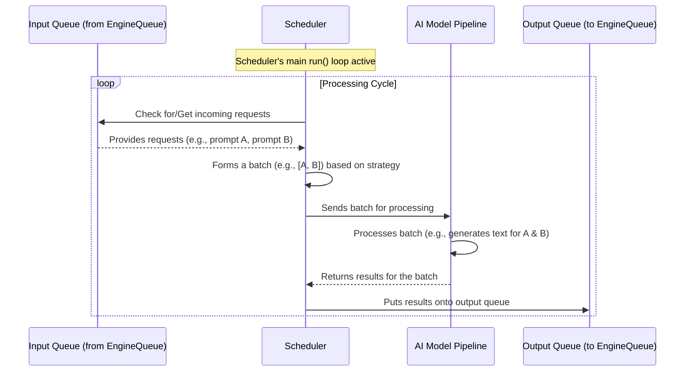

# Chapter 5: Scheduler (`TokenGenerationScheduler`, `EmbeddingsScheduler`)

In [Chapter 4: Model Worker](04_model_worker_.md), we learned about the Model Worker, the dedicated workshop where the AI model does its heavy lifting. We saw that it receives requests from the [EngineQueue](07_enginequeue_.md). But how does the Model Worker decide *when* and *how* to feed these requests to the AI model? Does it process them one by one? Or is there a smarter way?

That's where the **Scheduler** comes in! It's like an intelligent traffic controller or a theme park ride operator working *inside* the Model Worker. Its main job is to make sure the AI model (our star attraction) is used as efficiently as possible.

## What Problem Does the Scheduler Solve?

Imagine our AI model is like a super-fast, super-powerful rollercoaster.
*   If we send only one person on the rollercoaster at a time, a lot of the seats will be empty. It's not very efficient!
*   If we wait too long to fill the rollercoaster, people in line get impatient.

The Scheduler's job is to gather individual requests (people wanting to ride the rollercoaster) and group them into **optimal batches** (filling up the rollercoaster carts efficiently) before sending them to the AI model for processing. This "batching" is crucial for:
*   **Maximizing GPU Utilization**: Modern AI models, especially those running on GPUs, perform much better when they process multiple pieces of data at once. Running one request at a time can leave the GPU underutilized.
*   **Improving Throughput**: By processing requests in batches, the overall number of requests handled per second (throughput) increases significantly.

Think of the Scheduler as a theme park ride operator. They don't start the ride with just one person in a 20-seat cart. They try to fill the cart (or a good portion of it) to make each run worthwhile. Similarly, the Scheduler groups incoming requests based on things like how many requests are waiting, how long they've been waiting, or how "big" each request is (e.g., how many tokens need processing).

## Meet the Schedulers: `TokenGenerationScheduler` and `EmbeddingsScheduler`

`modular` has different types of AI tasks, and so it has specialized Schedulers:

1.  **`TokenGenerationScheduler`**: This scheduler is used when the AI model's job is to generate text (like writing a story or answering a question). It has specific strategies for:
    *   **Context Encoding (CE)**: Processing the initial prompt (e.g., "Tell me a story about a dragon"). This often involves processing many tokens at once.
    *   **Token Generation (TG)**: Generating the subsequent words or tokens of the story, often one or a few at a time, repeatedly.
    The `TokenGenerationScheduler` is smart about forming batches for both these phases.

2.  **`EmbeddingsScheduler`**: This scheduler is used when the AI model's job is to calculate embeddings (numerical representations of text, useful for tasks like semantic search). The requests are typically more straightforward: take some text, produce a list of numbers.

Both schedulers operate on the same core principle: **batch requests efficiently.**

### How Schedulers are Created

Remember in [Chapter 4: Model Worker](04_model_worker_.md), we saw the `model_worker_run_v3` function inside the Model Worker process? That's where the appropriate scheduler is created.

```python
# Simplified from: src/max/serve/pipelines/model_worker.py

# (Inside model_worker_run_v3)
# ...
# pipeline = model_factory() # This loads the AI model (TokenGenerator or EmbeddingsGenerator)

scheduler: Scheduler # This will hold our chosen scheduler
if isinstance(pipeline, TokenGenerator):
    # If it's a text-generating model, use TokenGenerationScheduler
    scheduler = _create_token_generation_scheduler(
        pipeline, pc, pipeline_config, queues
    )
elif isinstance(pipeline, EmbeddingsGenerator):
    # If it's an embeddings model, use EmbeddingsScheduler
    scheduler = _create_embeddings_scheduler(
        pipeline, pc, pipeline_config, queues
    )
else:
    raise ValueError(f"Invalid pipeline type: {type(pipeline)}")

# ...
# pc.set_started() # Signal that the worker is ready
# scheduler.run()  # Start the scheduler's main loop!
# ...
```
This code snippet shows that based on the type of AI model (`pipeline`) loaded, the Model Worker creates either a `TokenGenerationScheduler` or an `EmbeddingsScheduler`. The `pipeline_config` (which comes from [Settings (`Settings` class)](01_settings___settings__class__.md)) and `queues` (parts of the [EngineQueue](07_enginequeue_.md) for communication) are passed to configure the scheduler.

Once created, `scheduler.run()` is called. This starts the scheduler's main job: continuously looking for requests, batching them, and sending them to the AI model.

## The Scheduler's Main Loop: A Day in the Life

Let's imagine we're the `TokenGenerationScheduler`. Here's a simplified version of what our `run()` loop might do:

1.  **Check for New Riders (Requests)**: We look at our `request_q` (the part of the [EngineQueue](07_enginequeue_.md) where new requests arrive from the [LLM Pipeline Orchestrator (`TokenGeneratorPipeline`)](03_llm_pipeline_orchestrator___tokengeneratorpipeline___.md)). Are there any people waiting in line?

2.  **Decide on the Next Cart (Batch Formation)**:
    *   If there are requests for **Context Encoding** (processing new prompts), we might try to group several of them. We might wait a short time (a `batch_timeout`) to see if more arrive, or until we have enough to fill a "batch" up to `max_batch_size_ce`.
    *   If there are requests that are already part-way through **Token Generation** (generating the next word of an ongoing story), we gather these.
    *   The scheduler uses its configuration (like `TokenGenerationSchedulerConfig`) to make these decisions. For example, `target_tokens_per_batch_ce` helps decide how many total prompt tokens to aim for in a context encoding batch.

3.  **Load the Cart (Prepare the Batch)**: We select a group of requests to form the current batch. This is done by methods like `_create_batch_to_execute()`.

4.  **Start the Ride (Send to Model)**: We send this batch of requests to the actual AI model (`self.pipeline.next_token(...)` for text generation or `self.pipeline.encode(...)` for embeddings).

5.  **Collect Souvenirs (Get Results)**: The AI model processes the batch and produces results (e.g., the next set of generated tokens for each request in the batch).

6.  **Guide Riders to Exit (Send Results Back)**: We take these results and put them onto our `response_q` (another part of the [EngineQueue](07_enginequeue_.md)), so they can be sent back to the [LLM Pipeline Orchestrator (`TokenGeneratorPipeline`)](03_llm_pipeline_orchestrator___tokengeneratorpipeline___.md) and eventually to the user.

7.  **Repeat!**: We go back to step 1 and do this all over again, continuously.

This loop ensures a steady flow of efficiently batched requests to the AI model.

### Visualizing the Scheduler's Role

Here's a diagram showing the Scheduler at work inside the Model Worker:



## Under the Hood: A Peek into `TokenGenerationScheduler`

Let's look at a simplified version of how the `TokenGenerationScheduler` might work, focusing on its `run` method and how it creates and schedules batches. The actual code is in `src/max/serve/pipelines/scheduler.py`.

```python
# Simplified from: src/max/serve/pipelines/scheduler.py

class TokenGenerationScheduler(Scheduler):
    def __init__(
        self,
        # ... process_control, scheduler_config, pipeline, queues ...
        paged_manager: Optional[PagedKVCacheManager] = None, # For KV Cache
    ):
        # self.scheduler_config = scheduler_config (stores max_batch_size_tg, etc.)
        # self.pipeline = pipeline (the AI model like TokenGenerator)
        # self.request_q = queues["REQUEST"] (where new requests arrive)
        # self.response_q = queues["RESPONSE"] (where results are sent)
        # self.active_batch = {} (requests currently being processed for TG)
        # self.paged_manager = paged_manager (manages KV Cache, see Chapter 6)
        # ...
        pass

    def run(self):
        # Main loop: continuously process requests
        while True: # Simplified; actual loop checks for cancellation
            # self.pc.beat() # Heartbeat to show it's alive

            # 1. Decide what kind of batch to make next (CE or TG)
            # and gather requests for it.
            batch_to_execute: SchedulerOutput = self._create_batch_to_execute()
            # SchedulerOutput contains the batch_inputs, batch_type (CE/TG), etc.

            if batch_to_execute.batch_size == 0:
                # No requests to process right now, maybe sleep briefly
                time.sleep(0.001) # Small delay
                continue

            # 2. Schedule the batch on the AI model
            self._schedule(batch_to_execute) # This calls the model

            # ... (handle cancelled requests, logging, etc.) ...
```
*   The `__init__` method sets up the scheduler with its configuration, the AI model pipeline it will use, the communication queues, and a reference to the `paged_manager` for [KV Cache Management](06_kv_cache_management_.md) (more on this in the next chapter!).
*   The `run()` method is the heart.
    *   `_create_batch_to_execute()`: This internal method is responsible for looking at waiting requests and current `active_batch` (for ongoing token generation) and deciding what to run next. It considers `scheduler_config` parameters like `max_batch_size_ce`, `max_batch_size_tg`, `batch_timeout`, and `target_tokens_per_batch_ce`. It also interacts with the `paged_manager` to ensure there's enough KV Cache space.
    *   `_schedule()`: This method takes the `SchedulerOutput` (which contains the batch) and actually sends it to the AI model.

Let's look at a simplified `_schedule` method:
```python
# Simplified from: src/max/serve/pipelines/scheduler.py
# (Inside TokenGenerationScheduler class)

    def _schedule(self, sch_output: SchedulerOutput):
        # sch_output contains:
        # - sch_output.batch_inputs: the actual dictionary of requests for the model
        # - sch_output.batch_type: tells if it's ContextEncoding or TokenGeneration
        # - sch_output.num_steps: how many tokens to generate for TG

        batch_responses = {}
        if sch_output.batch_type == BatchType.ContextEncoding:
            # Processing initial prompts
            batch_responses = self.pipeline.next_token(
                sch_output.batch_inputs, # The batch of new prompts
                num_steps=sch_output.num_steps, # Usually 1 for CE
            )
            # ... logic to add these requests to self.active_batch if not done ...
        elif sch_output.batch_type == BatchType.TokenGeneration:
            # Generating subsequent tokens for ongoing requests
            batch_responses = self.pipeline.next_token(
                sch_output.batch_inputs, # The batch of active requests
                num_steps=sch_output.num_steps, # How many tokens to generate
            )
        
        # ... logic to handle terminated responses (remove from active_batch) ...

        # Send all responses back to the main process via the response_q
        self._stream_responses_to_frontend(batch_responses)
```
This shows that `_schedule` calls `self.pipeline.next_token()` with the batch. The `pipeline` is the `TokenGenerator` instance loaded in the Model Worker. The results (`batch_responses`) are then sent back using `_stream_responses_to_frontend()`, which puts them on the `response_q`.

The `EmbeddingsScheduler` has a simpler structure because it typically just encodes a batch of texts without the ongoing generation state:
```python
# Simplified from: src/max/serve/pipelines/scheduler.py

class EmbeddingsScheduler(Scheduler):
    # ... __init__ similar to TokenGenerationScheduler but with EmbeddingsSchedulerConfig ...

    def run(self):
        while True: # Simplified
            # ...
            batch_to_execute = self._create_batch_to_execute() # Gets requests from queue
            if len(batch_to_execute) == 0:
                time.sleep(0.001)
                continue

            # For embeddings, it's usually one call to encode the batch
            batch_responses = self.pipeline.encode(batch_to_execute)
            
            # Send responses back
            self.response_q.put_nowait([batch_responses]) # Note the list format
            # ...
```
Here, `_create_batch_to_execute` would pull items from `request_q` up to `max_batch_size` from `EmbeddingsSchedulerConfig`. Then, `self.pipeline.encode()` processes the whole batch.

### Batching Configuration

The behavior of these schedulers is heavily influenced by their configuration objects:
*   `TokenGenerationSchedulerConfig`: Defines things like `max_batch_size_tg` (max requests in a token generation batch), `max_batch_size_ce` (max requests in a context encoding batch), `batch_timeout` (how long to wait for more CE requests), and `target_tokens_per_batch_ce` (aim for this many total prompt tokens in a CE batch).
*   `EmbeddingsSchedulerConfig`: Simpler, mainly `max_batch_size`.

These configurations are derived from the overall application [Settings (`Settings` class)](01_settings___settings__class__.md) and `TokenGeneratorPipelineConfig`.

## Why is This Batching So Important for Performance?

AI models, especially large ones running on GPUs, are like massive parallel processors.
*   **High Latency, High Throughput**: Sending a single request to a GPU might have some unavoidable startup cost (latency). But once it's going, the GPU can perform calculations on many pieces of data simultaneously very quickly.
*   **Filling the Pipes**: Batching helps "fill the pipes" of the GPU, ensuring that its many processing units are kept busy. If you only send one piece of data, most of the GPU is idle.

The Scheduler's intelligent batching strategies aim to find the sweet spot: creating batches large enough to keep the GPU busy, but not waiting so long to form a batch that users experience high latency.

For `TokenGenerationScheduler`, it's even more nuanced. Context encoding (processing the initial prompt) can be very different from generating subsequent tokens. The scheduler tries to optimize both. For example, it might prioritize getting ongoing token generation (TG) requests through quickly if the KV cache (memory for past tokens) is getting full, as TG requests are generally smaller and faster per step.

## Conclusion

The Scheduler (`TokenGenerationScheduler` and `EmbeddingsScheduler`) is the unsung hero of performance within the [Model Worker](04_model_worker_.md). It acts as an intelligent traffic controller:
*   It **gathers** individual requests from the [EngineQueue](07_enginequeue_.md).
*   It **groups** them into optimal batches based on strategies and configuration.
*   It **dispatches** these batches to the AI model pipeline.
*   This batching is key to **maximizing GPU utilization** and overall application **throughput**.

By efficiently managing how requests are fed to the AI model, the Scheduler ensures that `modular` can serve many users quickly and make the most of its powerful hardware.

One crucial aspect that the `TokenGenerationScheduler` often interacts with is how the model remembers previous parts of a conversation or text. This involves something called a KV Cache. In the next chapter, we'll explore [Chapter 6: KV Cache Management](06_kv_cache_management_.md) and see how it plays a vital role in efficient text generation.

---

Generated by [AI Codebase Knowledge Builder](https://github.com/The-Pocket/Tutorial-Codebase-Knowledge)