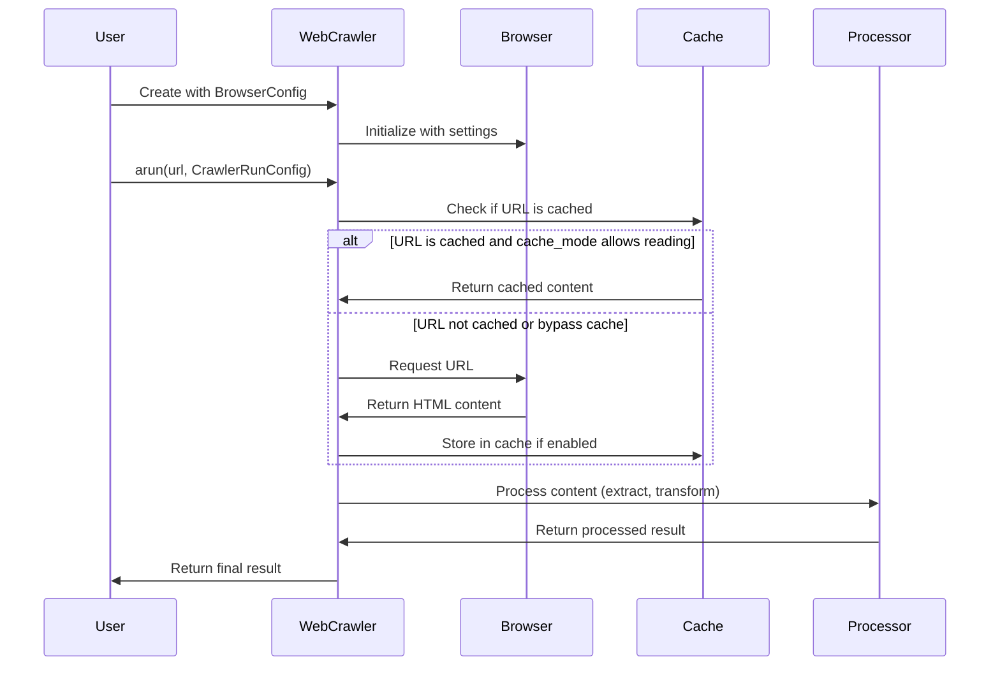

# Chapter 1: Configuration System

Welcome to the first chapter of our Crawl4AI tutorial! Today, we're going to learn about the Configuration System, which is the foundation for controlling how our web crawler works.

## What is the Configuration System?

Imagine you're setting up a smart camera to take photos of a building. First, you need to adjust the camera settings (like focus, zoom, and flash), and then you decide how to process the photos (like applying filters or cropping).

The Configuration System in Crawl4AI works in a similar way:

1. **BrowserConfig**: Like adjusting your camera settings, this configures the web browser that will visit websites
2. **CrawlerRunConfig**: Like choosing how to process your photos, this determines how the web content is processed after it's fetched

Let's explore how to use these configurations to control our web crawler!

## BrowserConfig: Setting Up Your Browser

The `BrowserConfig` class allows you to customize the browser that Crawl4AI will use to visit websites. Here's a simple example:

```python
from crawl4ai import BrowserConfig, AsyncWebCrawler

# Create a browser configuration
browser_config = BrowserConfig(
    browser_type="chromium",
    headless=True,
    user_agent="Mozilla/5.0 ..."
)

# Create a crawler with our browser configuration
crawler = AsyncWebCrawler(config=browser_config)
```

In this example, we're configuring:
- `browser_type`: We're using "chromium" (you could also use "firefox")
- `headless`: When set to True, the browser runs in the background without a visible window
- `user_agent`: This is how the browser identifies itself to websites

Think of `BrowserConfig` as setting up your tools before you start working.

## CrawlerRunConfig: Processing the Content

Once the browser has loaded a webpage, `CrawlerRunConfig` controls what happens next. This includes how content is extracted, transformed, and cached:

```python
from crawl4ai import CrawlerRunConfig
from crawl4ai.cache_context import CacheMode

# Create a crawler configuration
crawler_config = CrawlerRunConfig(
    cache_mode=CacheMode.ENABLED,
    screenshot=True,
    verbose=True
)
```

In this example:
- `cache_mode`: Determines if and how to use the cache (store previously visited pages)
- `screenshot`: Whether to capture a screenshot of the webpage
- `verbose`: Whether to provide detailed logging information

Think of `CrawlerRunConfig` as giving instructions to a photographer about what kind of photos you want.

## Putting It All Together: A Complete Example

Let's see how to use both configurations together:

```python
import asyncio
from crawl4ai import AsyncWebCrawler, BrowserConfig, CrawlerRunConfig
from crawl4ai.cache_context import CacheMode

async def crawl_website():
    # Set up the browser
    browser_config = BrowserConfig(browser_type="chromium", headless=True)
    
    # Set up the crawler behavior
    crawler_config = CrawlerRunConfig(cache_mode=CacheMode.ENABLED, screenshot=True)
    
    # Create and start the crawler
    async with AsyncWebCrawler(config=browser_config) as crawler:
        # Crawl a website with our configuration
        result = await crawler.arun(url="https://example.com", config=crawler_config)
        
        # Print the markdown content we extracted
        print(result.markdown)

# Run the async function
asyncio.run(crawl_website())
```

This code:
1. Sets up a headless Chromium browser
2. Configures the crawler to use caching and take screenshots
3. Creates a crawler with our browser configuration
4. Runs the crawler on example.com using our crawler configuration
5. Prints the extracted markdown content

## Understanding Cache Modes

One important aspect of configuration is controlling how caching works. The `CacheMode` enum offers several options:

```python
from crawl4ai.cache_context import CacheMode

# Use the cache (read and write)
config = CrawlerRunConfig(cache_mode=CacheMode.ENABLED)

# Don't use the cache at all
config = CrawlerRunConfig(cache_mode=CacheMode.DISABLED)

# Only read from cache, don't write
config = CrawlerRunConfig(cache_mode=CacheMode.READ_ONLY)
```

Caching can greatly improve performance by avoiding unnecessary repeated downloads of the same content.

## What Happens Under the Hood?

To understand how these configurations work together, let's look at the flow of a typical crawl operation:



Let's explore the implementation details:

When you create an `AsyncWebCrawler` with a `BrowserConfig`, the crawler initializes a browser instance with your specified settings:

```python
# From crawl4ai/async_webcrawler.py
def __init__(
    self,
    crawler_strategy: AsyncCrawlerStrategy = None,
    config: BrowserConfig = None,
    base_directory: str = str(
        os.getenv("CRAWL4_AI_BASE_DIRECTORY", Path.home())),
    thread_safe: bool = False,
    logger: AsyncLoggerBase = None,
    **kwargs,
):
    # Handle browser configuration
    browser_config = config or BrowserConfig()
    self.browser_config = browser_config
    
    # Initialize crawler strategy
    self.crawler_strategy = crawler_strategy or AsyncPlaywrightCrawlerStrategy(
        browser_config=browser_config,
        logger=self.logger,
        **params,
    )
```

Then, when you call `arun()` with a URL and `CrawlerRunConfig`, the crawler first checks if it should use a cached version:

```python
# Create cache context
cache_context = CacheContext(url, config.cache_mode, False)

# Try to get cached result if appropriate
if cache_context.should_read():
    cached_result = await async_db_manager.aget_cached_url(url)
```

If the content isn't cached or shouldn't be read from cache, the crawler retrieves it using the browser:

```python
async_response = await self.crawler_strategy.crawl(
    url,
    config=config,  # Pass the entire config object
)
```

Finally, the HTML content is processed according to your configuration:

```python
crawl_result: CrawlResult = await self.aprocess_html(
    url=url,
    html=html,
    extracted_content=extracted_content,
    config=config,
    screenshot_data=screenshot_data,
    pdf_data=pdf_data,
    verbose=config.verbose,
    is_raw_html=True if url.startswith("raw:") else False,
    redirected_url=async_response.redirected_url, 
    **kwargs,
)
```

## Common Configuration Options

Let's look at some common configuration options you might want to use:

### BrowserConfig Options

```python
browser_config = BrowserConfig(
    browser_type="chromium",  # "chromium" or "firefox"
    headless=True,            # Run without a visible window
    viewport_size=(1280, 720),  # Width and height of browser window
    user_agent="Custom User Agent",  # Browser identification
    timeout=30000,            # Timeout in milliseconds
    verbose=False             # Detailed logging
)
```

### CrawlerRunConfig Options

```python
from crawl4ai.extraction_strategy import SimpleExtractionStrategy
from crawl4ai.chunking_strategy import RegexChunking

crawler_config = CrawlerRunConfig(
    cache_mode=CacheMode.ENABLED,  # Cache behavior
    screenshot=True,               # Take screenshots
    pdf=False,                     # Generate PDF
    extraction_strategy=SimpleExtractionStrategy(),  # How to extract content
    chunking_strategy=RegexChunking(),  # How to chunk content
)
```

## Conclusion

In this chapter, we learned about the Configuration System in Crawl4AI, which consists of two main components:

1. **BrowserConfig**: Controls how the browser behaves when visiting websites
2. **CrawlerRunConfig**: Controls how the content is processed after it's fetched

By using these configurations together, you can customize how Crawl4AI interacts with websites and processes their content. This flexibility allows you to adapt the crawler to different use cases and requirements.

In the next chapter, [AsyncWebCrawler](02_asyncwebcrawler_.md), we'll dive deeper into how to use the AsyncWebCrawler class to fetch and process web content using the configurations we've learned about here.

---

Generated by [AI Codebase Knowledge Builder](https://github.com/The-Pocket/Tutorial-Codebase-Knowledge)