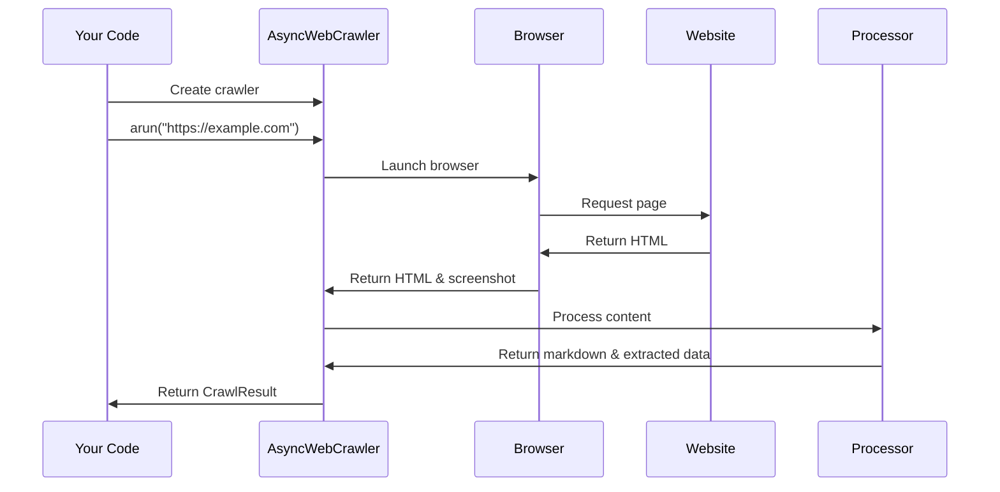

# Chapter 2: AsyncWebCrawler

In [Chapter 1: Configuration System](01_configuration_system_.md), we learned how to set up the configuration for our web crawler. Now, let's put those configurations to work with the `AsyncWebCrawler`, the main engine of the crawl4ai library!

## What is AsyncWebCrawler?

Imagine you want to automatically collect information from websites. You could manually visit each page, copy the text, save images, and organize everything—but that would take forever! The `AsyncWebCrawler` is like your personal assistant that does all this automatically and efficiently.

The "Async" part means it can work on multiple tasks simultaneously without waiting for each one to finish before starting the next, similar to how you might cook multiple dishes at once rather than one after another.

## Basic Usage: Crawling a Single Webpage

Let's start with a simple example. Say you want to extract content from a webpage and convert it to markdown format:

```python
import asyncio
from crawl4ai import AsyncWebCrawler

async def simple_crawl():
    async with AsyncWebCrawler() as crawler:
        result = await crawler.arun(url="https://example.com")
        print(result.markdown)  # Print the extracted markdown content

# Run the async function
asyncio.run(simple_crawl())
```

This code:
1. Creates an `AsyncWebCrawler` using a context manager (`async with`)
2. Crawls the URL "https://example.com"
3. Prints the extracted markdown content

The `async with` statement ensures the crawler is properly started and closed, even if errors occur.

## Using Configuration with AsyncWebCrawler

Remember the configurations we learned about in Chapter 1? Let's use them with our crawler:

```python
from crawl4ai import AsyncWebCrawler, BrowserConfig, CrawlerRunConfig
from crawl4ai.cache_context import CacheMode

async def configured_crawl():
    # Browser configuration
    browser_config = BrowserConfig(headless=True, browser_type="chromium")
    
    # Crawler run configuration
    run_config = CrawlerRunConfig(
        cache_mode=CacheMode.ENABLED,
        screenshot=True
    )
    
    async with AsyncWebCrawler(config=browser_config) as crawler:
        result = await crawler.arun(url="https://example.com", config=run_config)
        
    return result
```

Here, we:
1. Create a `BrowserConfig` for how the browser behaves
2. Create a `CrawlerRunConfig` for how the crawler processes content
3. Pass the browser config when creating the crawler
4. Pass the run config when crawling the URL

## Understanding Crawler Results

When you call `crawler.arun()`, it returns a `CrawlResult` object that contains all the extracted data:

```python
async def examine_result():
    async with AsyncWebCrawler() as crawler:
        result = await crawler.arun(url="https://example.com")
        
        # Access different parts of the result
        print(f"Markdown content: {result.markdown}")
        print(f"HTML content: {result.html}")
        print(f"Was crawl successful? {result.success}")
        
        # If you took a screenshot
        if result.screenshot:
            with open("screenshot.png", "wb") as f:
                f.write(result.screenshot)
```

The `result` object has many useful attributes:
- `markdown`: The page content converted to markdown format
- `html`: The original HTML of the page
- `success`: Whether the crawl was successful
- `screenshot`: Screenshot data (if configured)
- `links`: Dictionary of internal and external links found
- `media`: Dictionary of images, videos, and other media found

## Crawling Multiple Webpages

Often, you'll want to crawl multiple pages. The `AsyncWebCrawler` makes this efficient with the `arun_many` method:

```python
async def crawl_multiple():
    urls = [
        "https://example.com",
        "https://example.org",
        "https://example.net"
    ]
    
    async with AsyncWebCrawler() as crawler:
        results = await crawler.arun_many(urls=urls)
        
    for result in results:
        print(f"{result.url}: {len(result.markdown)} chars")
```

This crawls all three URLs concurrently, which is much faster than doing them one by one!

## Managing Crawler Lifecycle

While the context manager (`async with`) is recommended, you can also manage the crawler's lifecycle explicitly:

```python
async def explicit_lifecycle():
    crawler = AsyncWebCrawler()
    await crawler.start()  # Explicitly start the crawler
    
    # Use the crawler
    result = await crawler.arun(url="https://example.com")
    
    # Close when done
    await crawler.close()
    
    return result
```

This approach is useful for long-running applications where you want more control.

## Advanced Feature: Taking Screenshots

Want to capture what the webpage looks like? Just enable screenshots in your configuration:

```python
async def take_screenshot():
    run_config = CrawlerRunConfig(screenshot=True)
    
    async with AsyncWebCrawler() as crawler:
        result = await crawler.arun(
            url="https://example.com", 
            config=run_config
        )
        
        # Save the screenshot
        if result.screenshot:
            with open("example_screenshot.png", "wb") as f:
                f.write(result.screenshot)
```

This will save a PNG image of how the webpage looked during crawling.

## What Happens Under the Hood

When you use `AsyncWebCrawler`, a lot happens behind the scenes. Here's a simplified view:



1. When you call `arun()`, the crawler first checks if the URL is in the cache (if caching is enabled)
2. If not cached, it uses the Playwright library to launch a browser
3. The browser navigates to the URL and waits for the page to load
4. If configured, it takes a screenshot of the page
5. The HTML content is extracted and processed to generate markdown
6. All the extracted data is bundled into a `CrawlResult` and returned to you

## Implementation Details

Let's peek at some implementation details from the code you provided:

```python
# From async_webcrawler.py
async def arun(self, url: str, config: CrawlerRunConfig = None, **kwargs):
    # Auto-start if not ready
    if not self.ready:
        await self.start()
        
    config = config or CrawlerRunConfig()
    # ... [cache checking logic] ...
    
    # Fetch fresh content if needed
    if not cached_result:
        async_response = await self.crawler_strategy.crawl(
            url, config=config
        )
        
        # Process the HTML content
        crawl_result = await self.aprocess_html(
            url=url, html=async_response.html, 
            screenshot_data=async_response.screenshot,
            # ... [other parameters] ...
        )
        
    return CrawlResultContainer(crawl_result)
```

The `arun` method is the core of the crawler. It:
1. Makes sure the crawler is ready
2. Uses the configuration (or creates a default one)
3. Checks the cache for existing results
4. If needed, uses a crawler strategy to fetch content
5. Processes the HTML into a structured result
6. Returns everything wrapped in a container

The actual browser interaction is handled by the `crawler_strategy`, typically an `AsyncPlaywrightCrawlerStrategy` instance that uses the Playwright library to control a real browser.

## Conclusion

Now you understand the `AsyncWebCrawler`, the workhorse of the crawl4ai library! You've learned how to:
- Create and use an AsyncWebCrawler
- Configure its behavior
- Extract content from a single webpage
- Process multiple webpages efficiently
- Handle the results

The `AsyncWebCrawler` provides a high-level interface that hides the complexity of browser automation, network requests, and content extraction. It's like having a robot that visits websites for you and brings back organized information!

In the next chapter, [Content Extraction Pipeline](03_content_extraction_pipeline_.md), we'll dive deeper into how the crawler extracts and processes the content it collects. You'll learn how to customize this process to get exactly the content you need.

---

Generated by [AI Codebase Knowledge Builder](https://github.com/The-Pocket/Tutorial-Codebase-Knowledge)