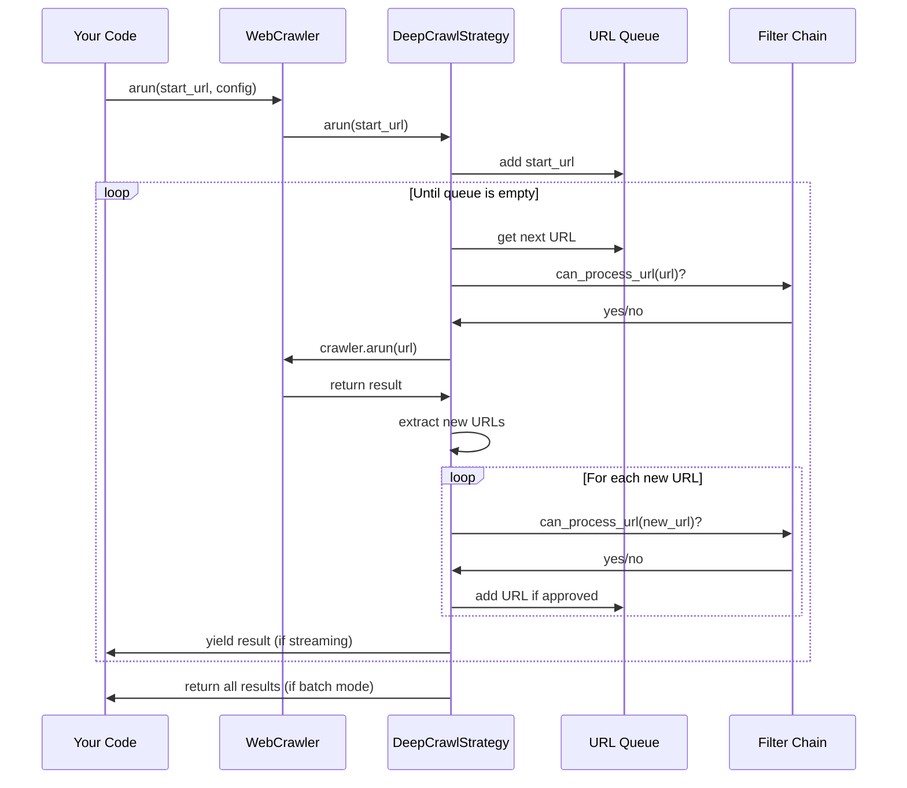

# Chapter 5: Deep Crawling System

In [Chapter 4: URL Filtering & Scoring](04_url_filtering___scoring_.md), we learned how to filter and prioritize URLs. Now, let's take the next step: exploring websites beyond a single page using the Deep Crawling System.

## What is a Deep Crawling System?

Imagine you're exploring a vast library. You could just look at one book (a single webpage), or you could navigate through the entire library systematically (deep crawling).

The Deep Crawling System is like your exploration strategy for that library. It answers questions like:

- Which doors should I go through first?
- How far should I venture from the entrance?
- Which rooms are most likely to contain what I'm looking for?

When crawling websites, these become decisions about:
- Which links to follow first
- How many pages deep to go
- When to stop exploring

Let's learn how to explore websites intelligently using `crawl4ai`!

## A Simple Example: Exploring a Documentation Site

Let's say you want to crawl the Python documentation site to collect all tutorial pages:

```python
from crawl4ai import AsyncWebCrawler, CrawlerRunConfig
from crawl4ai.deep_crawling import BFSDeepCrawlStrategy
from crawl4ai.deep_crawling.filters import DomainFilter

async def crawl_python_docs():
    # Create a strategy that explores up to 3 levels deep
    strategy = BFSDeepCrawlStrategy(
        max_depth=3,
        filter_chain=DomainFilter(allowed_domains=["docs.python.org"])
    )
    
    # Configure the crawler to use our strategy
    config = CrawlerRunConfig(deep_crawl_strategy=strategy)
    
    # Start crawling from the tutorials page
    async with AsyncWebCrawler() as crawler:
        results = await crawler.arun(
            url="https://docs.python.org/3/tutorial/",
            config=config
        )
        
    # Process the results
    for result in results:
        print(f"Page: {result.url}")
```

This code sets up a crawler that:
1. Starts at the Python tutorial page
2. Explores up to 3 links deep
3. Only stays within the docs.python.org domain
4. Returns all the pages it found

## Understanding Crawling Strategies

The Deep Crawling System offers different ways to explore a website, just like you'd have different strategies for exploring a city:

### 1. Breadth-First Search (BFS)

```python
from crawl4ai.deep_crawling import BFSDeepCrawlStrategy

bfs_strategy = BFSDeepCrawlStrategy(max_depth=2)
```

BFS is like exploring a city one block at a time, checking all streets on your current block before going to the next block. In web terms, it explores all links on the current page before going deeper.

### 2. Depth-First Search (DFS)

```python
from crawl4ai.deep_crawling import DFSDeepCrawlStrategy

dfs_strategy = DFSDeepCrawlStrategy(max_depth=2)
```

DFS is like following a single street as far as it goes before coming back to try the next street. In web terms, it follows each path to its maximum depth before trying other paths.

### 3. Best-First Search

```python
from crawl4ai.deep_crawling import BestFirstCrawlingStrategy
from crawl4ai.deep_crawling.scorers import KeywordRelevanceScorer

scorer = KeywordRelevanceScorer(keywords=["tutorial", "guide"])
best_first = BestFirstCrawlingStrategy(max_depth=2, url_scorer=scorer)
```

Best-First is like having a treasure map that guides you to the most promising areas first. It uses scorers to decide which links are most likely to have what you're looking for.

## Setting Crawling Boundaries

Just as you'd set limits on a real-world exploration, you need to set boundaries for your web crawler:

```python
# Limit by depth (how many clicks from the start page)
strategy = BFSDeepCrawlStrategy(max_depth=3)

# Limit by total pages
strategy = BFSDeepCrawlStrategy(max_depth=3, max_pages=100)

# Limit by domain
from crawl4ai.deep_crawling.filters import DomainFilter
filter_chain = DomainFilter(allowed_domains=["example.com"])
strategy = BFSDeepCrawlStrategy(max_depth=3, filter_chain=filter_chain)
```

These boundaries help keep your crawler focused and efficient.

## Streaming vs. Batch Processing

You can process crawled pages as they come in (streaming) or wait for all results (batch):

```python
# Streaming: Process pages as they're found
config = CrawlerRunConfig(deep_crawl_strategy=strategy, stream=True)
async with AsyncWebCrawler() as crawler:
    async for result in await crawler.arun(url="https://example.com", config=config):
        print(f"Just found: {result.url}")
```

Streaming is great when you want to start processing right away, without waiting for the entire crawl to finish.

## A Real-World Example: News Aggregator

Let's build a simple news aggregator that collects recent articles from a news site:

```python
from crawl4ai import AsyncWebCrawler, CrawlerRunConfig
from crawl4ai.deep_crawling import BestFirstCrawlingStrategy
from crawl4ai.deep_crawling.scorers import FreshnessScorer, KeywordRelevanceScorer
from crawl4ai.deep_crawling.filters import URLPatternFilter

async def crawl_news():
    # Create a scorer that prioritizes recent articles about technology
    scorer = FreshnessScorer(weight=0.7)
    
    # Exclude category pages and author pages
    filter = URLPatternFilter(patterns=["/author/*", "/category/*"], reverse=True)
    
    # Create a strategy that favors fresh content
    strategy = BestFirstCrawlingStrategy(
        max_depth=2,
        max_pages=10,  # Limit to 10 articles
        url_scorer=scorer,
        filter_chain=filter
    )
    
    # Start crawling
    config = CrawlerRunConfig(deep_crawl_strategy=strategy)
    async with AsyncWebCrawler() as crawler:
        results = await crawler.arun(url="https://news-site.com", config=config)
    
    return results
```

This crawler will prioritize the most recent articles and ignore pages like author profiles and category listings.

## What Happens Under the Hood

What actually happens when you start a deep crawl? Let's visualize the process:



This process repeats until either:
- The queue is empty (no more URLs to crawl)
- We've reached the maximum depth
- We've crawled the maximum number of pages

## Implementation Details

Let's look at how the BFS crawling strategy is implemented:

```python
# Simplified from crawl4ai/deep_crawling/bfs_strategy.py
async def _arun_stream(self, start_url, crawler, config):
    visited = set()
    current_level = [(start_url, None)]  # (url, parent_url)
    depths = {start_url: 0}

    while current_level and not self._cancel_event.is_set():
        next_level = []
        urls = [url for url, _ in current_level]
        
        # Crawl all URLs at the current level
        stream_gen = await crawler.arun_many(urls=urls, config=config)
        
        async for result in stream_gen:
            # Process each result
            url = result.url
            depth = depths.get(url, 0)
            result.metadata["depth"] = depth
            
            yield result
            
            # Discover new links for the next level
            if result.success:
                await self.link_discovery(
                    result, url, depth, visited, next_level, depths
                )
        
        # Move to the next level
        current_level = next_level
```

This implementation shows how the BFS strategy works:

1. It starts with a single URL at depth 0
2. It processes all URLs at the current depth
3. It extracts new links and adds them to the next level
4. It moves to the next level and repeats

The `link_discovery` method is where URLs are filtered:

```python
# Simplified from link_discovery method
async def link_discovery(self, result, source_url, current_depth, visited, next_level, depths):
    next_depth = current_depth + 1
    if next_depth > self.max_depth:
        return
        
    links = result.links.get("internal", [])
    
    for link in links:
        url = link.get("href")
        if url in visited:
            continue
            
        if not await self.can_process_url(url, next_depth):
            continue
            
        visited.add(url)
        next_level.append((url, source_url))
        depths[url] = next_depth
```

This method:
1. Checks if we've reached the maximum depth
2. Gets all the links from the current page
3. Filters out already visited URLs
4. Applies URL filters to decide which URLs to follow
5. Adds approved URLs to the next level

## Choosing the Right Strategy

Which strategy should you choose? Here's a quick guide:

- **BFS**: When you want a broad overview of a website, exploring many sections
  
- **DFS**: When you're looking for something specific and want to go deep into specific paths
  
- **Best-First**: When you have a good idea of what you're looking for and want to find the most relevant content first

## Advanced Usage: Combining Strategies

You can combine different aspects of the Deep Crawling System for more sophisticated crawling:

```python
from crawl4ai.deep_crawling import BestFirstCrawlingStrategy
from crawl4ai.deep_crawling.filters import FilterChain, DomainFilter, ContentTypeFilter
from crawl4ai.deep_crawling.scorers import CompositeScorer, KeywordScorer, FreshnessScorer

# Create multiple filters
domain_filter = DomainFilter(allowed_domains=["example.com"])
content_filter = ContentTypeFilter(allowed_types=["text/html"])
filter_chain = FilterChain([domain_filter, content_filter])

# Create multiple scorers
keyword_scorer = KeywordScorer(keywords=["python", "tutorial"])
freshness_scorer = FreshnessScorer()
composite_scorer = CompositeScorer([keyword_scorer, freshness_scorer])

# Combine them in a strategy
strategy = BestFirstCrawlingStrategy(
    max_depth=3,
    filter_chain=filter_chain,
    url_scorer=composite_scorer,
    max_pages=50
)
```

This creates a powerful crawler that stays within example.com, only crawls HTML pages, and prioritizes fresh content about Python tutorials.

## Working with Crawl Results

Once you've collected pages, you can do many things with the results:

```python
async def process_results(results):
    for result in results:
        # Access metadata about the crawl
        depth = result.metadata.get("depth", 0)
        parent = result.metadata.get("parent_url")
        
        # Process the content
        print(f"Page {result.url} at depth {depth}")
        print(f"Title: {result.title}")
        print(f"Content: {result.markdown[:100]}...")  # First 100 chars
        
        # Check for specific patterns
        if "download" in result.markdown.lower():
            print("Found a download page!")
```

Each result includes the page content, metadata about the crawl, and all the links that were found.

## Conclusion

The Deep Crawling System is a powerful tool that lets you explore websites systematically. By choosing the right strategy, setting appropriate boundaries, and configuring filters and scorers, you can efficiently find and extract exactly the content you need.

In this chapter, we've learned:
- How to set up different crawling strategies (BFS, DFS, Best-First)
- How to set boundaries on your crawling
- How to process results in real-time or in batch
- How the Deep Crawling System works under the hood

In the next chapter, [Caching System](06_caching_system_.md), we'll learn how to store and reuse crawled content to make our crawlers even more efficient.

---

Generated by [AI Codebase Knowledge Builder](https://github.com/The-Pocket/Tutorial-Codebase-Knowledge)