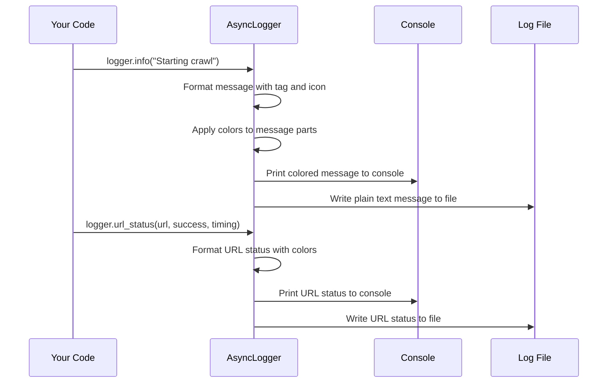

# Chapter 8: Async Logging Infrastructure

In [Chapter 7: Dispatcher Framework](07_dispatcher_framework_.md), we learned how to manage multiple crawling operations efficiently. Now, let's explore how to keep track of what's happening during these operations with the Async Logging Infrastructure.

## What is the Async Logging Infrastructure?

Imagine you're exploring a vast, dark cave system. Would you venture in without a flashlight and a way to leave breadcrumbs? Probably not! Similarly, when your crawler is exploring the web, you need a way to see what it's doing and track its progress.

The Async Logging Infrastructure is like your flashlight and breadcrumb system for web crawling:

- It shines a light on what's happening in real-time
- It leaves a trail of where you've been and what happened
- It alerts you when something goes wrong
- It helps you understand why your crawler is behaving a certain way

Let's see a simple example of how this works:

```python
from crawl4ai import AsyncWebCrawler, AsyncLogger

# Create a custom logger with colored output
logger = AsyncLogger(verbose=True)

# Use it with our crawler
async with AsyncWebCrawler(logger=logger) as crawler:
    result = await crawler.arun(url="https://example.com")
    
    # The logger will automatically show:
    # - When the crawler starts
    # - When a page is fetched
    # - When content is processed
    # - Any errors that occur
    # - When the operation completes
```

When you run this code, you'll see colorful, informative messages in your console showing exactly what's happening during the crawl!

## Understanding Log Levels

Just like how a news reporter might classify stories as "breaking news," "feature," or "update," the Async Logging Infrastructure uses different log levels to categorize messages:

```python
from crawl4ai.async_logger import LogLevel

# Different log levels from least to most severe
debug_level = LogLevel.DEBUG       # Detailed information for debugging
info_level = LogLevel.INFO         # General information about progress
success_level = LogLevel.SUCCESS   # Successful operations
warning_level = LogLevel.WARNING   # Something might be wrong
error_level = LogLevel.ERROR       # Something definitely went wrong
```

Each level is displayed in a different color to help you quickly identify what's happening:
- DEBUG is light black (for detailed but non-essential information)
- INFO is cyan (for regular progress updates)
- SUCCESS is green (for successful operations)
- WARNING is yellow (for potential issues)
- ERROR is red (for definite problems)

## Basic Logging: Your First Log Messages

Let's start with the basics - how to use the logger to display information:

```python
from crawl4ai import AsyncLogger

# Create a logger
logger = AsyncLogger()

# Log messages at different levels
logger.debug("Detailed information for troubleshooting")
logger.info("The crawler is starting")
logger.success("Successfully crawled the page")
logger.warning("The page took a long time to load")
logger.error("Failed to access the website")
```

Each of these methods displays a message with appropriate formatting and coloring. You'll see something like:

```
[DEBUG].... ⋯ Detailed information for troubleshooting 
[INFO]..... ℹ The crawler is starting 
[SUCCESS].. ✔ Successfully crawled the page 
[WARNING].. ⚠ The page took a long time to load 
[ERROR].... × Failed to access the website 
```

## Tracking URL Status

When crawling, you often want to know which URLs were successfully processed. The logger has a special method for this:

```python
# Log the status of a URL fetch
logger.url_status(
    url="https://example.com",
    success=True,
    timing=1.25,  # seconds
    tag="FETCH"
)
```

This produces a nicely formatted output like:

```
[FETCH].... ↓ https://example.com | ✓ | ⏱: 1.25s 
```

If a URL fails, you can log the error:

```python
# Log an error for a URL
logger.error_status(
    url="https://example.com",
    error="Connection refused",
    tag="ERROR"
)
```

This shows:

```
[ERROR].... × https://example.com | Error: Connection refused 
```

## Customizing Your Logger

Like customizing your news feed, you can customize how the logger displays information:

```python
# Create a customized logger
logger = AsyncLogger(
    log_file="crawl_logs.txt",     # Save logs to a file
    log_level=LogLevel.INFO,       # Only show INFO and above
    tag_width=12,                  # Width for the tag column
    verbose=True                   # Show output in console
)
```

This creates a logger that:
1. Saves all logs to a file called "crawl_logs.txt"
2. Only displays messages at INFO level or higher (INFO, SUCCESS, WARNING, ERROR)
3. Uses a 12-character width for the tag column
4. Shows all output in the console

## Tracking a Complete Crawl Operation

Now let's see a complete example of logging during a crawl operation:

```python
from crawl4ai import AsyncWebCrawler, AsyncLogger

async def log_complete_crawl():
    # Create a logger that saves to a file
    logger = AsyncLogger(log_file="crawl_log.txt")
    
    # Create a crawler with our logger
    async with AsyncWebCrawler(logger=logger) as crawler:
        # Log before we start
        logger.info("Starting crawl of example.com", tag="CRAWL")
        
        # Run the crawler
        result = await crawler.arun(url="https://example.com")
        
        # Log completion
        if result.success:
            logger.success(
                "Crawl complete with {words} words", 
                tag="COMPLETE",
                params={"words": len(result.markdown.split())}
            )
        else:
            logger.error(
                "Crawl failed: {error}", 
                tag="COMPLETE",
                params={"error": result.error_message}
            )
```

The logger is used at each step of the process, giving you a complete picture of what happened.

## Structured Logging with Parameters

Sometimes you want to include dynamic data in your log messages. The AsyncLogger makes this easy with parameter substitution:

```python
# Log with parameters
logger.info(
    message="Found {link_count} links on {url}",
    tag="LINKS",
    params={
        "link_count": len(result.links),
        "url": result.url
    },
    colors={
        "link_count": LogColor.GREEN,  # Highlight the count in green
        "url": LogColor.CYAN           # Show the URL in cyan
    }
)
```

This creates a message with colorized parts, making important information stand out!

## How the Logger Works Under the Hood

When you use the AsyncLogger, here's what happens behind the scenes:



The logger takes your message, formats it with tags, icons, and colors, then outputs it to the console and/or a file. It's like a news editor taking your story, adding headlines and formatting, then publishing it to different channels.

## Understanding the Implementation

Let's look at how the AsyncLogger is implemented:

```python
# From crawl4ai/async_logger.py (simplified)
class AsyncLogger(AsyncLoggerBase):
    def __init__(
        self,
        log_file=None,
        log_level=LogLevel.DEBUG,
        tag_width=10,
        verbose=True,
    ):
        self.log_file = log_file
        self.log_level = log_level
        self.tag_width = tag_width
        self.verbose = verbose
        self.console = Console()  # Rich console for colored output
```

The constructor sets up basic properties like where to log, what level to log at, and whether to show output in the console.

The main logging method handles formatting and output:

```python
# Core logging method (simplified)
def _log(self, level, message, tag, params=None, colors=None):
    # Skip if level is below our threshold
    if level.value < self.log_level.value:
        return
        
    # Format the message with parameters if provided
    if params:
        formatted_message = message.format(**params)
        # Apply colors to parameters if specified
        # ...
    else:
        formatted_message = message
        
    # Format the complete log line with tag and icon
    color = self.colors[level]
    log_line = f"[{color}]{self._format_tag(tag)} {self._get_icon(tag)} {formatted_message}[/{color}]"
    
    # Output to console if verbose
    if self.verbose:
        self.console.print(log_line)
        
    # Write to file if configured
    if self.log_file:
        self._write_to_file(log_line)
```

This method:
1. Checks if the log level is high enough to display
2. Formats the message with any parameters
3. Applies colors to specific parts if requested
4. Adds the tag and icon to the message
5. Outputs to the console and/or file

The specific logging methods like `info()` and `error()` are just convenient wrappers around this core method:

```python
def info(self, message, tag="INFO", **kwargs):
    """Log an info message."""
    self._log(LogLevel.INFO, message, tag, **kwargs)

def error(self, message, tag="ERROR", **kwargs):
    """Log an error message."""
    self._log(LogLevel.ERROR, message, tag, **kwargs)
```

## Using File Logging for Long-Running Crawls

For long-running crawls, you might want to save logs to a file for later analysis:

```python
from crawl4ai import AsyncLogger

# Create a logger that saves to a file
logger = AsyncLogger(
    log_file="crawls/my_project/crawler_log.txt",
    verbose=True  # Show in console AND save to file
)

# Use the logger with your crawler
# ...

# Later, you can examine the log file to see what happened
```

The log file contains all the messages in plain text format with timestamps:

```
[2023-04-15 14:32:45.123] [INFO] [INIT] Crawl4AI 1.0.0
[2023-04-15 14:32:46.456] [INFO] [FETCH] https://example.com | ✓ | ⏱: 0.85s
[2023-04-15 14:32:47.789] [SUCCESS] [COMPLETE] https://example.com | ✓ | ⏱: 2.25s
```

## Customizing Log Format with Colors and Icons

You can customize the icons and colors used by the logger:

```python
from crawl4ai import AsyncLogger
from crawl4ai.async_logger import LogLevel, LogColor

# Custom icons for different tags
custom_icons = {
    "CRAWL": "🕸️",
    "DATA": "📊",
    "FETCH": "📥"
}

# Custom colors for different log levels
custom_colors = {
    LogLevel.INFO: LogColor.CYAN,
    LogLevel.SUCCESS: LogColor.GREEN,
    LogLevel.ERROR: LogColor.MAGENTA  # Use magenta for errors
}

# Create logger with custom formatting
logger = AsyncLogger(
    icons=custom_icons,
    colors=custom_colors
)
```

This gives you complete control over how your logs look, making them more informative and easier to understand at a glance.

## Integrating with Your Crawler

When creating your crawler, you can pass your custom logger:

```python
from crawl4ai import AsyncWebCrawler, AsyncLogger

# Create a custom logger
logger = AsyncLogger(log_file="crawl_logs.txt")

# Pass it to the crawler
async with AsyncWebCrawler(logger=logger) as crawler:
    # The crawler will now use your logger for all messages
    result = await crawler.arun(url="https://example.com")
```

This ensures all crawler operations use your logger configuration, giving you consistent logging throughout your application.

## Real-World Example: Monitoring a Deep Crawl

Let's put everything together in a real-world example - monitoring a deep crawl of a website:

```python
from crawl4ai import AsyncWebCrawler, AsyncLogger, BFSDeepCrawlStrategy
from crawl4ai.async_logger import LogLevel

async def monitor_deep_crawl():
    # Create a detailed logger
    logger = AsyncLogger(
        log_file="deep_crawl.log",
        log_level=LogLevel.DEBUG,  # Capture everything
        verbose=True
    )
    
    # Set up a crawl strategy
    strategy = BFSDeepCrawlStrategy(max_depth=2, max_pages=10)
    
    # Create a crawler with our logger
    async with AsyncWebCrawler(logger=logger) as crawler:
        logger.info("Starting deep crawl of example.com", tag="DEEP")
        
        # Run the deep crawl
        results = await crawler.arun(
            url="https://example.com",
            config=strategy
        )
        
        # Log completion
        logger.success(
            "Deep crawl complete. Visited {page_count} pages", 
            tag="DEEP",
            params={"page_count": len(results)}
        )
```

This gives you a complete log of the deep crawl operation, showing each page visited, any errors encountered, and the final results.

## Conclusion

The Async Logging Infrastructure is your window into what your crawler is doing. Like a journalist documenting an expedition, it provides real-time updates, helps you track progress, and alerts you to any issues.

In this chapter, we've learned:
- How to create and customize a logger
- How to log messages at different levels
- How to track URL status and errors
- How to use structured logging with parameters
- How to save logs to files for later analysis
- How the logger works internally

With good logging, you can understand what your crawler is doing, diagnose problems quickly, and ensure your crawling operations are running smoothly.

In the next chapter, [API & Docker Integration](09_api___docker_integration_.md), we'll learn how to expose your crawler as an API and run it in containers, making it easier to deploy and integrate with other systems.

---

Generated by [AI Codebase Knowledge Builder](https://github.com/The-Pocket/Tutorial-Codebase-Knowledge)