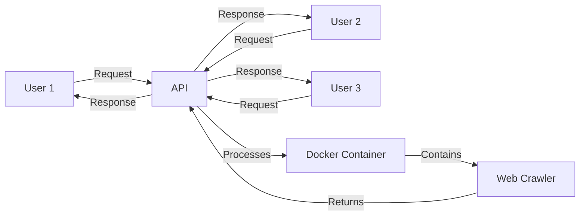
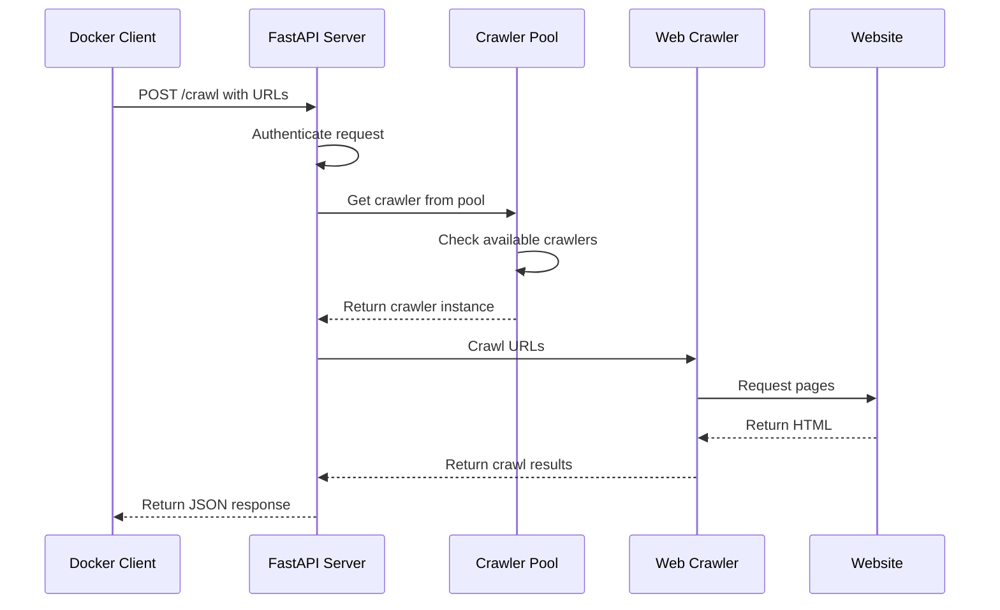

# Chapter 9: API & Docker Integration

In [Chapter 8: Async Logging Infrastructure](08_async_logging_infrastructure_.md), we learned how to track what our crawler is doing. Now, let's explore how to share our crawler with others by turning it into a service that can be accessed over a network!

## What is API & Docker Integration?

Imagine you've built a helpful robot (your crawler) that can gather information from websites. Initially, this robot lives only in your house and only you can use it. But what if your friends and family also want to use your robot? You could:

1. Make copies of the robot for everyone (inefficient)
2. Set up a "robot service center" where people can call in their requests (better!)

The API & Docker Integration in crawl4ai is like setting up that service center:

- The **API** (Application Programming Interface) is like a receptionist who takes requests from callers and passes them to your robot
- **Docker** is like a standardized shipping container that lets you easily move and set up your robot service center anywhere

This means instead of everyone needing to install and run crawl4ai themselves, they can simply send requests to your service!



## Getting Started with the Docker Client

Let's start by seeing how to connect to a crawler service that's already running. The `Crawl4aiDockerClient` makes this easy:

```python
from crawl4ai import Crawl4aiDockerClient

async def simple_crawl():
    # Connect to the crawler service
    async with Crawl4aiDockerClient() as client:
        # Authenticate (required for security)
        await client.authenticate("your@email.com")
        
        # Crawl a website
        result = await client.crawl(["https://example.com"])
        
        # Use the result
        print(result.markdown)
```

This code:
1. Creates a client that connects to a crawl4ai service
2. Authenticates with the service using your email
3. Sends a request to crawl example.com
4. Prints the markdown content from the result

It's like calling the robot service center, identifying yourself, asking the robot to visit a website, and getting back what it found!

## Using Configuration with the Docker Client

Just like the local crawler we used in earlier chapters, you can customize how the remote crawler works:

```python
from crawl4ai import Crawl4aiDockerClient, BrowserConfig, CrawlerRunConfig

async def configured_crawl():
    # Create configurations
    browser_config = BrowserConfig(headless=True)
    crawler_config = CrawlerRunConfig(screenshot=True)
    
    async with Crawl4aiDockerClient() as client:
        await client.authenticate("your@email.com")
        
        # Use configurations with the crawl
        result = await client.crawl(
            urls=["https://example.com"],
            browser_config=browser_config,
            crawler_config=crawler_config
        )
```

This allows you to tell the remote crawler exactly how to behave, just like you would with a local crawler!

## Streaming Results for Faster Processing

If you're crawling multiple URLs, you can process the results as they come in, rather than waiting for all of them to finish:

```python
async def stream_results():
    async with Crawl4aiDockerClient() as client:
        await client.authenticate("your@email.com")
        
        # Enable streaming in the configuration
        config = CrawlerRunConfig(stream=True)
        
        # Get a streaming generator
        results = await client.crawl(
            urls=["https://example.com", "https://example.org"],
            crawler_config=config
        )
        
        # Process results as they arrive
        async for result in results:
            print(f"Just received: {result.url}")
```

This is like getting updates from the robot as it explores each website, rather than waiting for it to explore all websites before reporting back.

## Setting Up Your Own Crawler Service

Now, let's look at how to set up your own crawler service using Docker and FastAPI. This is a bit more advanced, but we'll break it down:

1. First, you need to have Docker installed on your computer or server
2. Then, you can create a Docker container with crawl4ai and its API server
3. Finally, you start the container to make the service available

Here's a simple example using Docker Compose (a tool for defining and running Docker applications):

```yaml
# docker-compose.yml
version: '3'
services:
  crawl4ai:
    image: crawl4ai/service:latest
    ports:
      - "8000:8000"
    environment:
      - ALLOWED_EMAIL_DOMAINS=example.com,gmail.com
```

This configuration:
1. Uses the pre-built `crawl4ai/service` Docker image
2. Maps port 8000 on your computer to port 8000 in the container
3. Sets an environment variable to control which email domains can authenticate

To start the service, you would run:

```bash
docker-compose up -d
```

Now your crawler service is running and can be accessed at `http://localhost:8000`!

## Understanding the API Endpoints

The FastAPI server provides several endpoints for different functions:

```python
# Available endpoints
/token              # Authenticate and get an access token
/crawl              # Crawl URLs and get results
/crawl/stream       # Stream crawl results as they complete
/md                 # Generate markdown from a URL
/llm                # Use LLM to process content from a URL
/schema             # Get configuration schemas
```

Each endpoint serves a specific purpose:
- `/token` is for authentication
- `/crawl` is for basic crawling
- `/crawl/stream` is for streaming crawl results
- `/md` is for directly getting markdown from a URL
- `/llm` is for using AI models to process web content
- `/schema` returns information about configuration options

## What Happens Under the Hood

Let's look at what happens when you send a request to crawl a website:



1. The client sends a request to the `/crawl` endpoint with URLs to crawl
2. The server authenticates the request using the provided token
3. The server gets a crawler from the crawler pool (which manages browser instances)
4. The crawler fetches the requested URLs
5. The server formats the results and returns them to the client

## Crawler Pool: Efficient Resource Management

One of the most important parts of the API server is the crawler pool, which efficiently manages browser instances:

```python
# Simplified crawler pool code
async def get_crawler(cfg: BrowserConfig) -> AsyncWebCrawler:
    sig = _sig(cfg)  # Create a unique signature for this config
    
    async with LOCK:
        # Return existing crawler if available
        if sig in POOL:
            LAST_USED[sig] = time.time()
            return POOL[sig]
            
        # Create new crawler if memory allows
        if psutil.virtual_memory().percent < MEM_LIMIT:
            crawler = AsyncWebCrawler(config=cfg)
            await crawler.start()
            POOL[sig] = crawler
            LAST_USED[sig] = time.time()
            return crawler
```

The crawler pool:
1. Reuses existing crawler instances when possible
2. Creates new instances when needed (if memory allows)
3. Tracks when each crawler was last used
4. Closes idle crawlers to free up resources

This is like having a team of robots that are put to sleep when not in use, and woken up when needed!

## Authentication and Security

Security is important for any web service. The API server includes authentication to ensure only authorized users can access it:

```python
@app.post("/token")
async def get_token(req: TokenRequest):
    # Check if email domain is allowed
    if not verify_email_domain(req.email):
        raise HTTPException(400, "Invalid email domain")
        
    # Create a JWT token for the user
    token = create_access_token({"sub": req.email})
    
    return {
        "email": req.email, 
        "access_token": token, 
        "token_type": "bearer"
    }
```

This endpoint:
1. Verifies that the user's email domain is in the allowed list
2. Creates a token (like a temporary ID card) for the user
3. Returns the token, which must be included in subsequent requests

## Rate Limiting: Preventing Overuse

To prevent any single user from overwhelming the service, the API includes rate limiting:

```python
@app.post("/crawl")
@limiter.limit(config["rate_limiting"]["default_limit"])
async def crawl(request: Request, crawl_request: CrawlRequest):
    # Rate limiting is applied by the decorator above
    # ...process the crawl request...
```

This decorator ensures that each user can only make a certain number of requests per time period, like limiting how many calls a person can make to your robot service center in an hour.

## Creating a Complete Crawl Service

Putting it all together, here's how you would create a complete crawl service:

1. Set up the FastAPI server with all the endpoints
2. Configure authentication, rate limiting, and security
3. Create the crawler pool for efficient resource management
4. Start the server in a Docker container

The `server.py` file in the code snippets shows a complete implementation of this service.

## Real-World Example: Content Processing Service

Let's see a real-world example of setting up a content processing service:

```python
from crawl4ai import Crawl4aiDockerClient, CrawlerRunConfig
from fastapi import FastAPI, HTTPException

app = FastAPI()

@app.get("/process/{url:path}")
async def process_url(url: str, query: str = None):
    try:
        async with Crawl4aiDockerClient() as client:
            await client.authenticate("service@example.com")
            
            config = CrawlerRunConfig()
            if query:
                # Use LLM processing if query is provided
                config = CrawlerRunConfig(
                    extraction_strategy="llm",
                    instruction=query
                )
                
            result = await client.crawl([url], crawler_config=config)
            return {"content": result.markdown, "url": url}
            
    except Exception as e:
        raise HTTPException(500, str(e))
```

This example creates a simple API that uses the crawl4ai service to process URLs and optionally extract specific information based on a query.

## Conclusion

The API & Docker Integration in crawl4ai transforms your crawler from a local tool into a powerful service that can be accessed from anywhere. By wrapping the crawler in a Docker container and exposing it through a FastAPI server, you make it available to multiple users and applications.

In this chapter, we've learned:
- How to connect to a crawler service using the Docker client
- How to configure and customize remote crawling operations
- How to stream results for faster processing
- How to set up your own crawler service using Docker
- How the server manages resources with the crawler pool
- How authentication and rate limiting protect the service

This chapter completes our exploration of the crawl4ai library. You now have all the knowledge you need to build powerful web crawling applications, from simple scripts to full-featured services!

Remember that with great power comes great responsibility - always respect robots.txt rules, rate limits, and privacy considerations when crawling websites.

Thank you for joining this crawl4ai tutorial journey!

---

Generated by [AI Codebase Knowledge Builder](https://github.com/The-Pocket/Tutorial-Codebase-Knowledge)