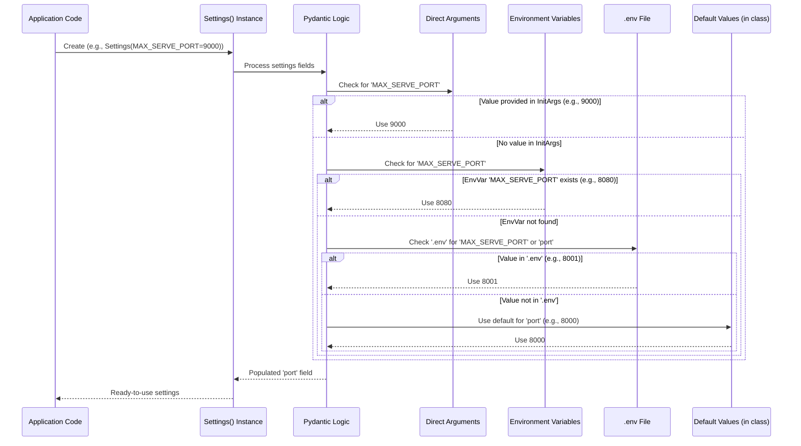

# Chapter 1: Settings (`Settings` class)

Welcome to the `modular` tutorial! We're excited to help you understand how this powerful serving application works, piece by piece. In this first chapter, we'll dive into one of the most fundamental concepts: the **`Settings` class**.

Imagine you're about to launch a new web application. You might need to decide:
*   "What web address (host) and port number should it use?"
*   "How much detail should its logs show?"
*   "Should it offer an OpenAI-compatible API, or perhaps a SageMaker one?"

Changing these kinds of parameters directly in the main code can be messy and error-prone, especially as the application grows. This is where the `Settings` class comes in!

## What Problem Do `Settings` Solve?

The `Settings` class acts as the **central control panel** for the entire `modular` serving application. Think of it like the main dashboard of a complex machine, like a spaceship. This dashboard has various dials and switches that allow an operator (that's you!) to adjust how the machine runs without needing to open up the engine and rewire things.

For example, you might want to:
*   Run the server on port `8080` instead of the default `8000`.
*   Tell the application to expose only an OpenAI-compatible API.
*   Increase the logging detail to help debug an issue.

The `Settings` class allows you to make these kinds of adjustments easily and safely.

## Meet the `Settings` Class

At its core, the `Settings` class (found in `src/max/serve/config.py`) uses a popular Python library called Pydantic. Pydantic helps define what settings are available, what types they should be (e.g., a number, text, a list), and ensures that any values you provide are valid.

These settings can be loaded from a few places:
1.  **Environment Variables:** These are variables set in your system's environment (e.g., `MAX_SERVE_PORT=8080`).
2.  **A `.env` file:** This is a special file (literally named `.env`) you can create in your project directory to list your settings.
3.  **Directly in code:** When the application starts, it can provide default values or override others.

Let's look at some key aspects.

### Defining a Setting

Here's a simplified peek at how settings like the server host and port are defined within the `Settings` class:

```python
# From: src/max/serve/config.py
from pydantic import Field
from pydantic_settings import BaseSettings, SettingsConfigDict

class Settings(BaseSettings):
    # This tells Pydantic where to look for a .env file
    # and to allow other environment variables not explicitly defined here.
    model_config = SettingsConfigDict(
        env_file=".env",
        extra="allow",
    )

    # Server host configuration
    host: str = Field(
        description="Hostname to use",
        default="0.0.0.0",  # Default if not specified elsewhere
        alias="MAX_SERVE_HOST" # Environment variable to look for
    )
    # Server port configuration
    port: int = Field(
        description="Port to use",
        default=8000,      # Default if not specified elsewhere
        alias="MAX_SERVE_PORT" # Environment variable to look for
    )
    # ... many other settings for logging, model workers, etc. ...
```

In this snippet:
*   `host: str` means the `host` setting is expected to be a string (text).
*   `default="0.0.0.0"` means if you don't specify a host, it will use "0.0.0.0".
*   `alias="MAX_SERVE_HOST"` means Pydantic will look for an environment variable named `MAX_SERVE_HOST` to get the value for `host`. The `Settings` class internally uses `host`, but externally (like in environment variables), you'd use `MAX_SERVE_HOST`.

### Automatic Validation

Pydantic is smart! If you try to set `port` to a text value like `"eight-thousand"`, Pydantic will raise an error because it expects an integer (`int`). The `Settings` class can also have custom validation. For example, it checks if the chosen port is already in use:

```python
# From: src/max/serve/config.py
# (Inside the Settings class)
    @field_validator("port") # This function validates the 'port' field
    def validate_port(cls, port: int):
        # (Simplified: code to check if port is available)
        # If port is in use, it raises a ValueError.
        # Otherwise, it returns the port.
        # ...
        return port
```
This helps catch configuration mistakes early on.

### Different Types of Settings

Settings aren't just numbers and text. They can be more complex, like a list of API types to enable:

```python
# From: src/max/serve/config.py
from enum import Enum

class APIType(Enum): # Defines allowed API types
    KSERVE = "kserve"
    OPENAI = "openai"
    SAGEMAKER = "sagemaker"

class Settings(BaseSettings):
    # ... other settings ...
    api_types: list[APIType] = Field(
        description="List of exposed API types.",
        default=[APIType.OPENAI, APIType.SAGEMAKER] # Default is a list
    )
    # ...
```
Here, `api_types` is expected to be a list, and each item in the list must be one of the predefined `APIType` values.

## How to Use and Change Settings

Let's say you want to change the server port from the default `8000` to `8080`. You have a few ways to do this:

**1. Using Environment Variables:**
Before running your application, you can set an environment variable in your terminal:
```bash
export MAX_SERVE_PORT=8080
# Now run your modular application
```
When the `Settings` class is initialized, it will pick up `MAX_SERVE_PORT` and use `8080` for the port.

**2. Using a `.env` file:**
Create a file named `.env` in the root directory of your `modular` project and add the line:
```
MAX_SERVE_PORT=8080
```
or you can also use the attribute name directly:
```
port=8080
```
The `Settings` class will automatically read this file when the application starts.

**3. Initializing `Settings` in Code (Less Common for End-Users):**
Sometimes, settings are specified when the `Settings` object is created directly in the code. This is often used for internal defaults or specific configurations within the application's entrypoints.

```python
# Simplified from: src/max/entrypoints/cli/serve.py
from max.serve.config import Settings

# When starting the server, 'modular' might initialize settings like this:
# This particular setting 'MAX_SERVE_USE_HEARTBEAT' is an example;
# it would override any environment or .env file setting for this specific run.
settings_object = Settings(MAX_SERVE_USE_HEARTBEAT=False)

print(f"Host: {settings_object.host}") # Will show host from env/.env/default
print(f"Port: {settings_object.port}") # Will show port from env/.env/default
print(f"Use Heartbeat: {settings_object.use_heartbeat}") # Will show False
```

**Accessing Settings in the Application:**
Once the `Settings` object is created and populated, other parts of the `modular` application can access these values. For example, when the API server is being set up:

```python
# Simplified from: src/max/serve/api_server.py
from max.serve.config import Settings # Assume Settings class is defined

def configure_my_server(current_settings: Settings):
    # The application uses the loaded settings
    host_to_use = current_settings.host
    port_to_use = current_settings.port
    print(f"Server will run on: http://{host_to_use}:{port_to_use}")
    # ... actual server setup using these values ...

# When the application starts:
app_settings = Settings() # Loads from .env, environment variables, or defaults
configure_my_server(app_settings)
```
If you had set `MAX_SERVE_PORT=8080`, the output would be:
```
Server will run on: http://0.0.0.0:8080
```
(Assuming `host` remained its default "0.0.0.0").

## Under the Hood: How `Settings` Are Loaded

When you create an instance of the `Settings` class (e.g., `my_settings = Settings()`), Pydantic performs a sequence of steps to determine the final value for each setting:

1.  **Direct Initialization:** If values are passed directly when creating the `Settings` object (e.g., `Settings(MAX_SERVE_PORT=9000)`), these take the highest precedence for those specific settings.
2.  **Environment Variables:** Pydantic then checks for environment variables that match the `alias` defined for each field (e.g., `MAX_SERVE_HOST`, `MAX_SERVE_PORT`). If found, these override values from the `.env` file and defaults.
3.  **`.env` File:** If not found in environment variables, Pydantic looks for the setting in the `.env` file (specified by `model_config = SettingsConfigDict(env_file=".env", ...)`). It can match either the alias (e.g., `MAX_SERVE_PORT=8001`) or the field name directly (e.g., `port=8001`).
4.  **Default Values:** If the setting isn't found in any of the above, the `default` value specified in the class definition is used (e.g., `default=8000` for `port`).
5.  **Validation:** After a value is determined, any associated validators (like `validate_port`) are run.

Here's a simplified diagram illustrating this loading process:



The actual `Settings` class is defined in `src/max/serve/config.py`. It inherits from `BaseSettings` provided by `pydantic-settings`, which gives it all this powerful loading and validation capability.

```python
# From: src/max/serve/config.py
from pydantic_settings import BaseSettings, SettingsConfigDict

class Settings(BaseSettings):
    # This 'model_config' is crucial.
    # It tells Pydantic to look for a ".env" file and
    # to use an empty prefix for environment variables by default
    # (so 'MAX_SERVE_HOST' maps to 'host', not 'SOMETHING_host').
    model_config = SettingsConfigDict(
        env_file=".env",
        env_prefix="", # For aliases like MAX_SERVE_HOST
        extra="allow", # Allow other env vars not listed here
        populate_by_name=False, # Important for alias behavior
    )

    # Example of a setting:
    host: str = Field(
        default="0.0.0.0",
        alias="MAX_SERVE_HOST" # Matches env var MAX_SERVE_HOST
    )
    # ... other settings definitions
```
When code like `settings = Settings()` is executed (as seen in `src/max/serve/api_server.py`'s `main` function or `src/max/entrypoints/cli/serve.py`'s `serve_pipeline`), Pydantic does its magic to collect all the values.

## Common Settings You Might Tweak

While there are many settings, here are a few common ones you might interact with:

*   `host` (Env: `MAX_SERVE_HOST`): The IP address the server listens on (e.g., "0.0.0.0" for all available interfaces, "127.0.0.1" for localhost).
*   `port` (Env: `MAX_SERVE_PORT`): The port number the server uses (e.g., `8000`).
*   `api_types`: A list specifying which API styles to enable (e.g., `[APIType.OPENAI, APIType.SAGEMAKER]`). You could set this via an environment variable like `MAX_SERVE_API_TYPES='["openai"]'` (note the string representation of a list).
*   `logs_console_level` (Env: `MAX_SERVE_LOGS_CONSOLE_LEVEL`): Controls the verbosity of logs printed to your console (e.g., "INFO", "DEBUG", "WARNING").
*   `disable_telemetry` (Env: `MAX_SERVE_DISABLE_TELEMETRY`): A boolean (`True` or `False`) to turn off remote telemetry.

## Conclusion

You've now learned about the `Settings` class, the central control panel for the `modular` application! You've seen how it allows for flexible configuration through environment variables, `.env` files, or code defaults, all validated by the power of Pydantic. This system ensures that you can tailor the application's behavior to your needs without modifying its core code.

With this foundation in how the application is configured, you're ready to explore how these settings are put to use. In the next chapter, we'll look at the [Serving API Layer (FastAPI App & Routers)](02_serving_api_layer__fastapi_app___routers__.md), which is responsible for handling incoming requests based on these configurations.

---

Generated by [AI Codebase Knowledge Builder](https://github.com/The-Pocket/Tutorial-Codebase-Knowledge)