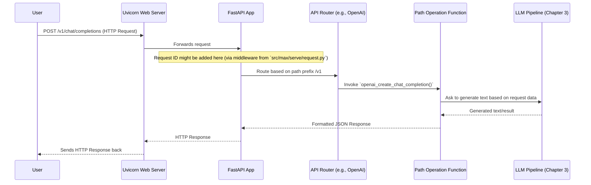

# Chapter 2: Serving API Layer (FastAPI App & Routers)

Welcome back! In [Chapter 1: Settings (`Settings` class)](01_settings___settings__class__.md), we explored how the `modular` application is configured using the `Settings` class. We learned how to adjust things like the server port or which API types to enable. Now, let's see how `modular` actually *uses* these settings to listen for and understand requests from the outside world.

This chapter focuses on the **Serving API Layer**, the very front door of our application.

## What Problem Does the API Layer Solve?

Imagine you want `modular` to generate some text based on a prompt, or you need it to calculate embeddings for a sentence. How do you tell `modular` what you want? You can't just shout at your computer! You need a structured way to send your request and get a response.

This is where the Serving API Layer comes in. It's like the **reception desk and main switchboard operator** in a large office building:
*   It **listens** for incoming "calls" (which are HTTP requests from users or other programs).
*   It **understands** what the caller wants by looking at the "extension" they dialed (the URL path, e.g., `/v1/chat/completions`).
*   It **directs** the call to the correct department or person (an internal function that can handle the request).
*   Finally, it **sends back** a reply (an HTTP response, like the generated text).

The `modular` API layer is built using a popular Python framework called **FastAPI**. It's designed to be flexible and can speak different "languages" or API styles, such as those used by OpenAI, KServe, or AWS SageMaker. This means you can often use existing tools and client libraries that already know how to talk in these styles.

## Key Components of the API Layer

Let's break down the main parts of this "reception and switchboard" system:

### 1. FastAPI: The Super-Efficient Receptionist

FastAPI is a modern, high-performance web framework for building APIs with Python. Think of it as a highly skilled and efficient receptionist. It handles many of the complex, low-level details of web communication for us, such as:
*   Understanding incoming HTTP requests (e.g., `GET`, `POST`).
*   Validating incoming data (e.g., ensuring a required field is present).
*   Converting Python data into JSON to send back in responses.
*   Generating interactive API documentation automatically.

`modular` uses FastAPI to build its entire API surface.

### 2. The Main `app`: The Central Hub

At the heart of the API layer is the main FastAPI application instance, often referred to simply as `app`. This is like the central hub of the reception area. All incoming requests arrive here first.

In `modular`, this `app` object is created and configured primarily in `src/max/serve/api_server.py`. It's where various settings (from [Chapter 1: Settings (`Settings` class)](01_settings___settings__class__.md)) are applied, middleware (special request/response handlers) are added, and different API "wings" (Routers) are connected.

```python
# Simplified from: src/max/serve/api_server.py
from fastapi import FastAPI
from max.serve.config import Settings # We learned about this in Chapter 1!

# This function sets up and returns the main FastAPI app
def fastapi_app(
    settings: Settings,
    # ... other parameters for pipeline setup ...
) -> FastAPI:
    # Create the main application instance
    app = FastAPI(title="MAX Serve")

    # ... (other setup like middleware, /version endpoint) ...

    # We'll see how routers are added soon!
    return app
```
This code snippet shows the basic creation of the FastAPI `app`. This `app` object will then be "run" by a web server like Uvicorn to start listening for requests.

### 3. Routers: The Departmental Switchboards

Imagine our office building has different departments, each specializing in a certain type of work: one for OpenAI-style requests, one for KServe, and another for SageMaker. In FastAPI, `APIRouter` objects (or simply "routers") help organize these different "departments."

A router groups together related API endpoints (specific tasks or functions). For example, all endpoints related to the OpenAI API (like `/v1/chat/completions` or `/v1/embeddings`) would be managed by an OpenAI-specific router.

`modular` uses routers to support multiple API standards. The [Settings (`Settings` class)](01_settings___settings__class__.md) we discussed in Chapter 1 determine which of these routers are activated. If you configure `api_types` to include `OPENAI`, then the OpenAI router will be wired into the main `app`.

```python
# Simplified from: src/max/serve/api_server.py
# (inside the fastapi_app function)
from max.serve.config import APIType # From Settings
from max.serve.router import kserve_routes, openai_routes, sagemaker_routes

# A mapping from API type to its router module
ROUTES = {
    APIType.KSERVE: kserve_routes,
    APIType.OPENAI: openai_routes,
    APIType.SAGEMAKER: sagemaker_routes,
}

# Inside the fastapi_app function:
# for api_type_enabled in settings.api_types:
#     router_module = ROUTES[api_type_enabled]
#     app.include_router(router_module.router) # Adds the router to the app
```
This shows how, based on your configuration, the appropriate routers (like `openai_routes.router`) are "plugged into" the main `app`.

### 4. Endpoints (Paths & Operations): The Specific Service Desks

Within each router (department), there are specific "desks" or "services" offered. These are called **endpoints**. An endpoint is defined by:
*   A **Path**: The specific URL part after the main address (e.g., `/chat/completions`).
*   An **HTTP Method** (or Operation): What you want to do (e.g., `POST` to send data, `GET` to retrieve data).

For example, to ask `modular` for a chat completion using the OpenAI API style, you would send a `POST` request to the path `/v1/chat/completions`. The API layer uses the path and method to find the exact Python function that should handle this request.

Here's how an endpoint might look within a router (e.g., `src/max/serve/router/openai_routes.py`):

```python
# Simplified from: src/max/serve/router/openai_routes.py
from fastapi import APIRouter, Request

# This router handles all paths starting with /v1
router = APIRouter(prefix="/v1")

# This function handles POST requests to /v1/chat/completions
@router.post("/chat/completions")
async def openai_create_chat_completion(request: Request):
    # Logic to handle the chat completion request goes here
    # For example, get data from 'request', call the model, format response
    # response_data = {"id": "chatcmpl-123", "choices": [...]}
    # return response_data
    print(f"Handling chat completion for request ID: {request.state.request_id}")
    return {"message": "Chat completion response (simplified)"}
```
The `@router.post("/chat/completions")` part is a decorator. It tells FastAPI that the `openai_create_chat_completion` function should be called whenever a `POST` request arrives for the `/v1/chat/completions` path.

## Example: Requesting a Chat Completion

Let's walk through what happens when you (or an application) want to generate text using `modular`, assuming it's configured to serve an OpenAI-compatible API:

1.  **You send a request**: You might use a tool like `curl` or a Python script to send an HTTP `POST` request to `http://<server_address>:<port>/v1/chat/completions`. This request includes your prompt and other parameters in a JSON format.

    ```bash
    # Example using curl (if the server is running on localhost:8000)
    curl -X POST http://localhost:8000/v1/chat/completions \
         -H "Content-Type: application/json" \
         -d '{
               "model": "my-model-name",
               "messages": [{"role": "user", "content": "Hello, world!"}]
             }'
    ```
    If you run this (and `modular` is running with a model), you'd get a JSON response back.

2.  **The API Layer receives it**: The `modular` server, listening on the configured host and port (thanks to [Settings (`Settings` class)](01_settings___settings__class__.md)), receives this HTTP request.

3.  **FastAPI takes over**: The main FastAPI `app` instance gets the request.

4.  **Routing to the right department**:
    *   FastAPI sees the path starts with `/v1`. It knows the `openai_routes` router handles `/v1` paths.
    *   The `openai_routes` router then looks at the rest of the path: `/chat/completions` and the method `POST`.

5.  **Calling the right function**: It finds the `openai_create_chat_completion` function (or a similar one) that's decorated to handle this specific path and method.

6.  **Processing the request**: The `openai_create_chat_completion` function executes.
    *   It extracts the data (your prompt) from the request.
    *   It then typically calls another major component, the [LLM Pipeline Orchestrator (`TokenGeneratorPipeline`)](03_llm_pipeline_orchestrator___tokengeneratorpipeline___.md), to do the actual text generation (we'll learn about this in the next chapter!).

7.  **Sending the response**: Once the [LLM Pipeline Orchestrator (`TokenGeneratorPipeline`)](03_llm_pipeline_orchestrator___tokengeneratorpipeline___.md) returns the generated text, the `openai_create_chat_completion` function formats it into an OpenAI-compatible JSON response and returns it. FastAPI then sends this HTTP response back to you.

## Under the Hood: The Journey of a Request

Let's visualize the path of a request:



Key steps in code:

1.  **Server Setup (`src/max/serve/api_server.py` or `src/max/entrypoints/cli/serve.py`)**:
    The FastAPI `app` needs to be run by an ASGI server like Uvicorn. The [Settings (`Settings` class)](01_settings___settings__class__.md) provide the host and port.

    ```python
    # Simplified from src/max/serve/api_server.py
    from uvicorn import Config, Server
    # from max.serve.config import Settings # Defined in Chapter 1
    # from max.serve.api_server import fastapi_app # Our app factory

    # settings = Settings() # Load configuration
    # app_instance = fastapi_app(settings, ...) # Create the FastAPI app

    # Create Uvicorn config
    # config = Config(app=app_instance, host=settings.host, port=settings.port)
    # server = Server(config)
    # # server.serve() # This starts listening for requests!
    ```
    This Uvicorn server is what makes your FastAPI application accessible over the network.

2.  **Application Lifespan (`src/max/serve/api_server.py`)**:
    FastAPI has a concept called "lifespan" events, which are functions that run at startup and shutdown. `modular` uses this to initialize critical components, like the [LLM Pipeline Orchestrator (`TokenGeneratorPipeline`)](03_llm_pipeline_orchestrator___tokengeneratorpipeline___.md), and make them available to request handlers.

    ```python
    # Simplified from: src/max/serve/api_server.py
    from contextlib import asynccontextmanager
    from fastapi import FastAPI
    # from max.serve.pipelines.llm import TokenGeneratorPipeline

    @asynccontextmanager
    async def lifespan(app: FastAPI, settings, serving_settings):
        # ... (setup telemetry, workers etc.) ...
        # pipeline = TokenGeneratorPipeline(...) # Initialize the pipeline
        # app.state.pipeline = pipeline # Make pipeline accessible in requests
        print("Server starting up, pipeline getting ready...")
        yield # The app runs while yield is active
        print("Server shutting down...")

    # When creating the app:
    # app = FastAPI(lifespan=partial(lifespan, ...))
    ```
    The `app.state.pipeline` makes the pipeline object (which does the heavy lifting for text generation) easily accessible within your endpoint functions like `openai_create_chat_completion`.

3.  **Request Handling in an Endpoint (`src/max/serve/router/openai_routes.py`)**:
    Once a request reaches an endpoint function, it can access shared state (like the pipeline) and process the request.

    ```python
    # Simplified from: src/max/serve/router/openai_routes.py
    from fastapi import Request
    # from max.serve.pipelines.llm import TokenGeneratorPipeline

    # @router.post("/chat/completions")
    async def openai_create_chat_completion(request: Request):
        # request_data = await request.json() # Get JSON from POST body
        # pipeline: TokenGeneratorPipeline = request.app.state.pipeline

        # prompt = request_data["messages"][0]["content"]
        # generated_text = await pipeline.generate_text(prompt) # Imaginary method

        # return {"choices": [{"message": {"content": generated_text}}]}
        # Actual logic is more complex, involves TokenGeneratorRequest, etc.
        return {"message": "Simplified response from chat completion"}
    ```
    This shows the basic flow: get data from the `request`, use the `pipeline` from `request.app.state`, and return a response. The actual implementation in `modular` is more detailed to handle streaming, various parameters, and error conditions.

## Conclusion

You've now seen how the Serving API Layer acts as the front door for `modular`. Using FastAPI, it defines clear entry points (endpoints like `/v1/chat/completions`) and uses routers to organize these endpoints based on API styles (OpenAI, KServe, etc.). This layer takes the configuration from the [Settings (`Settings` class)](01_settings___settings__class__.md) to decide which APIs to expose and on which host/port to listen.

Essentially, this layer is responsible for:
*   **Receiving** HTTP requests.
*   **Understanding** what the request is for (based on URL and HTTP method).
*   **Directing** the request to the correct internal handler function.
*   **Sending back** an HTTP response.

But what happens *inside* those handler functions? How does `modular` actually process a request to generate text or embeddings once the API layer has handed it off? That's the job of the [LLM Pipeline Orchestrator (`TokenGeneratorPipeline`)](03_llm_pipeline_orchestrator___tokengeneratorpipeline___.md), which we'll dive into in the next chapter!

---

Generated by [AI Codebase Knowledge Builder](https://github.com/The-Pocket/Tutorial-Codebase-Knowledge)