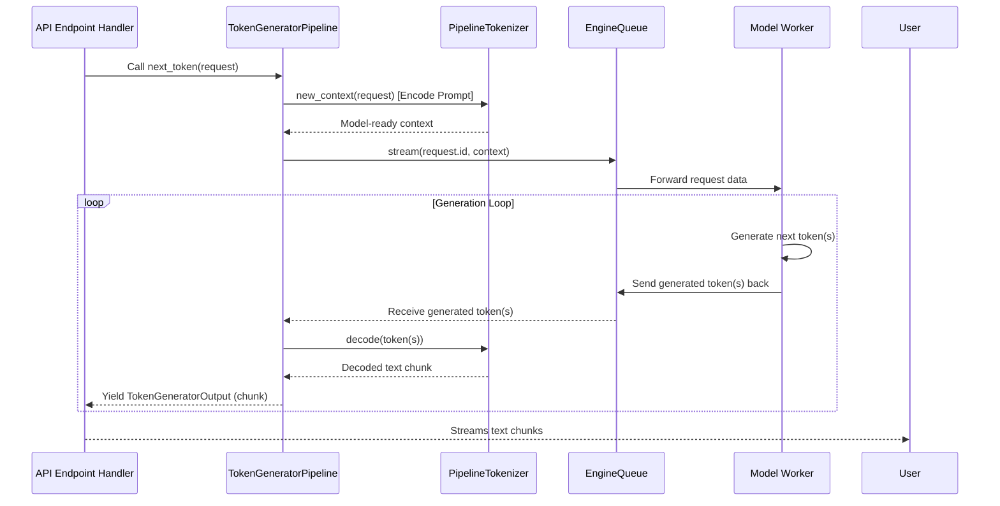

# Chapter 3: LLM Pipeline Orchestrator (`TokenGeneratorPipeline`)

In [Chapter 2: Serving API Layer (FastAPI App & Routers)](02_serving_api_layer__fastapi_app___routers__.md), we saw how `modular` receives requests from the outside world, like a receptionist directing calls. But once a request like "tell me a story about a brave knight" arrives, who actually takes that request, gets it ready for the language model, and makes sure the story comes back?

That's where the **`TokenGeneratorPipeline`** comes in! It's the general manager for a specific language model.

## What Problem Does the `TokenGeneratorPipeline` Solve?

Imagine you've asked `modular` to write that story. The API Layer has accepted your request. Now what?
*   Your request ("tell me a story...") is in human language. The AI model doesn't understand English directly; it understands "tokens" (like special code words or numbers).
*   The AI model itself is a powerful but specialized piece of machinery (the [Model Worker](04_model_worker_.md), which we'll cover later). It needs to be told exactly what to do and how.
*   Once the model starts generating the story, it might produce it word by word (or token by token). Someone needs to collect these pieces and send them back to you, either as they come or all at once.

The `TokenGeneratorPipeline` acts like an **assembly line manager** for this whole process. It takes the raw material (your prompt), ensures it's correctly prepared, sends it to the machinery (the model worker), and then makes sure the finished product (the generated story) is delivered efficiently.

It handles:
1.  **Preparation**: Using a "tokenizer" to translate your human-language prompt into model-understandable tokens.
2.  **Coordination**: Sending this prepared request to the correct [Model Worker](04_model_worker_.md) via an [EngineQueue](07_enginequeue_.md) (think of it as a high-tech conveyor belt).
3.  **Delivery**: Streaming the model's answer back token by token, or as a complete response.

## Meet the `TokenGeneratorPipeline`

The `TokenGeneratorPipeline` is the central orchestrator for getting text from a Large Language Model (LLM). Let's look at its key collaborators:

*   **Tokenizer (`PipelineTokenizer`)**: This is like a specialized translator. It converts human-readable text (your prompt) into a sequence of numbers (tokens) that the LLM can understand. It also does the reverse: converts tokens from the LLM back into human-readable text.
*   **EngineQueue**: This is a communication channel. The `TokenGeneratorPipeline` places the tokenized request into this queue, and the [Model Worker](04_model_worker_.md) picks it up from there. It's also used to send generated tokens back from the worker.
*   **Model Worker**: This is the component that actually runs the LLM to generate new tokens based on the input. We'll explore this in [Chapter 4: Model Worker](04_model_worker_.md).

### How It's Set Up

In [Chapter 2: Serving API Layer (FastAPI App & Routers)](02_serving_api_layer__fastapi_app___routers__.md), we saw that the main FastAPI `app` has a "lifespan" function. This is where the `TokenGeneratorPipeline` is typically created and made available to the API endpoint handlers.

```python
# Simplified from: src/max/serve/api_server.py

# (inside the `lifespan` async context manager)
# ...
pipeline: TokenGeneratorPipeline = TokenGeneratorPipeline(
    model_name="my-cool-model", # Name of the model being served
    tokenizer=my_tokenizer,      # The translator we talked about
    engine_queue=engine_queue,   # The conveyor belt to the Model Worker
)
app.state.pipeline = pipeline # Make it accessible to API endpoints
# ...
```
This means that when an API endpoint (like `/v1/chat/completions`) needs to generate text, it can access this `pipeline` object.

### Receiving a Request and Generating Text

When an API endpoint (like `openai_create_chat_completion` from `src/max/serve/router/openai_routes.py`) receives a user's request, it prepares a `TokenGeneratorRequest` object. This object is like a work order for the pipeline.

Let's look at what's in a `TokenGeneratorRequest`:
```python
# Simplified from: src/max/pipelines/core/interfaces/text_generation.py
@dataclass(frozen=True)
class TokenGeneratorRequest:
    id: str                # A unique ID for this specific request
    model_name: str        # Which model to use
    messages: Optional[list[TokenGeneratorRequestMessage]] = None # For chat prompts
    prompt: Union[str, Sequence[int], None] = None # For simple prompts
    max_new_tokens: Optional[int] = None # How many tokens to generate at most
    # ... other fields like timestamp, tools, etc.
```
This `TokenGeneratorRequest` contains all the information the pipeline needs.

The API endpoint then calls a method on the `TokenGeneratorPipeline`, usually `next_token()` for streaming responses or `all_tokens()` for a complete response.

```python
# Simplified example of how an API route might use the pipeline
# (Inspired by src/max/serve/router/openai_routes.py)

# async def openai_create_chat_completion(request: Request):
    # ... (code to parse user's HTTP request into `my_chat_request_data`) ...

    # pipeline is taken from request.app.state.pipeline
    # pipeline: TokenGeneratorPipeline = request.app.state.pipeline

    # 1. Create the work order (TokenGeneratorRequest)
    token_gen_request = TokenGeneratorRequest(
        id="unique_req_abc123",
        model_name=pipeline.model_name,
        messages=[{"role": "user", "content": "Tell me a short story."}],
        max_new_tokens=50
    )

    # 2. Ask the pipeline to generate text (streaming token by token)
    # response_stream = pipeline.next_token(token_gen_request)
    
    # async for generated_output_chunk in response_stream:
    #     # generated_output_chunk is a TokenGeneratorOutput
    #     print(generated_output_chunk.decoded_token, end="")
    #     # In a real server, this would be sent back to the user over HTTP
    # Output (example, token by token):
    # "Once "
    # "upon "
    # "a "
    # "time"
    # ", "
    # "in "
    # "a "
    # # ... and so on
```

The `pipeline.next_token()` method returns an "async generator." This means it yields `TokenGeneratorOutput` objects one by one as the model produces them.

Let's see what a `TokenGeneratorOutput` looks like:
```python
# Simplified from: src/max/serve/pipelines/llm.py
@dataclass(frozen=True)
class TokenGeneratorOutput:
    decoded_token: str # The actual text part generated in this step
    # ... other fields like log probabilities, token counts, etc.
```
Each `TokenGeneratorOutput` contains a piece of the generated text (`decoded_token`).

## Under the Hood: The Journey of a Prompt

So, what happens inside the `TokenGeneratorPipeline` when its `next_token()` method is called?

1.  **Context Creation**: The pipeline first uses its `tokenizer` to create a "context" from the `TokenGeneratorRequest`. This involves converting the prompt messages or text into the initial set of tokens the model needs. This step uses the `tokenizer.new_context()` method.
    *   *Analogy*: The assembly line manager gives the raw materials (your prompt) to a specialist (tokenizer) who prepares them (converts to tokens) for the main machine.

2.  **Sending to `EngineQueue`**: The request (now in a model-understandable format, often part of the "context") is put into the `EngineQueue`. This queue acts as a buffer and a communication channel to the [Model Worker](04_model_worker_.md).
    *   *Analogy*: The prepared materials are placed on a conveyor belt (`EngineQueue`) leading to the main processing machinery ([Model Worker](04_model_worker_.md)).

3.  **Model Processing (by Model Worker)**: The [Model Worker](04_model_worker_.md) (running in a separate process or thread) picks up the request from the `EngineQueue`. It runs the LLM to generate the next token(s).
    *   *Analogy*: The machinery processes the materials and produces a part of the finished product.

4.  **Receiving from `EngineQueue`**: The generated token(s) are sent back by the [Model Worker](04_model_worker_.md) through the `EngineQueue` to the `TokenGeneratorPipeline`.
    *   *Analogy*: The finished part comes back on another conveyor belt.

5.  **Decoding**: The `TokenGeneratorPipeline` receives these raw generated tokens. It uses its `tokenizer` again, this time to `decode()` the tokens back into human-readable text.
    *   *Analogy*: The manager takes the finished part and asks the translator (tokenizer) to convert it back into something the customer understands.

6.  **Yielding Output**: The decoded text (and other info) is packaged into a `TokenGeneratorOutput` object and "yielded" back to the caller (the API endpoint). If it's a streaming request, this happens for each new piece of text generated.

7.  **Repetition**: Steps 3-6 repeat until the model finishes generating (e.g., it reaches `max_new_tokens`, generates an "end-of-sequence" token, or a stop phrase is detected).

Here's a simplified diagram of this flow:



### Diving into the Code (`src/max/serve/pipelines/llm.py`)

Let's look at a very simplified structure of the `TokenGeneratorPipeline` and its `next_token` method:

```python
# Simplified from: src/max/serve/pipelines/llm.py

class TokenGeneratorPipeline(Generic[TokenGeneratorContext]):
    def __init__(
        self,
        model_name: str,
        tokenizer: PipelineTokenizer, # Our "translator"
        engine_queue: EngineQueue,   # Our "conveyor belt"
    ):
        self.model_name = model_name
        self.tokenizer = tokenizer
        self.engine_queue = engine_queue
        # ... other initializations ...

    async def next_token(
        self, request: TokenGeneratorRequest
    ) -> AsyncGenerator[TokenGeneratorOutput, None]:
        # 1. Create context using the tokenizer
        context = await self.tokenizer.new_context(request)

        # 2. Stream responses from the engine_queue (which talks to Model Worker)
        async for response_from_worker in self.engine_queue.stream(
            request.id, context
        ):
            # `response_from_worker` contains raw tokens from the model

            # 5. Decode the raw token from worker into text
            decoded_text_chunk = await self.tokenizer.decode(
                context,
                response_from_worker.next_token, # The raw token
                # ... other args like skip_special_tokens ...
            )

            # 6. Yield the human-readable output
            yield TokenGeneratorOutput(decoded_token=decoded_text_chunk)
        # ... (error handling and cleanup would be here) ...
```
In this snippet:
*   The `__init__` method shows how the pipeline is set up with its crucial components: the `tokenizer` and the `engine_queue`.
*   The `next_token` method:
    *   Calls `self.tokenizer.new_context()` to prepare the initial input for the model.
    *   Uses `self.engine_queue.stream()` to send the request to the [Model Worker](04_model_worker_.md) (via the queue) and get back a stream of raw responses.
    *   For each raw response from the worker, it calls `self.tokenizer.decode()` to convert the model's output token back into text.
    *   It then `yield`s a `TokenGeneratorOutput` containing this piece of decoded text.

The `PipelineTokenizer` itself is an interface (defined in `src/max/pipelines/core/interfaces/text_generation.py`). A concrete implementation of this tokenizer would know the specific vocabulary and rules for the particular LLM being used.

Key methods of `PipelineTokenizer`:
```python
# Simplified from: src/max/pipelines/core/interfaces/text_generation.py

class PipelineTokenizer(Protocol):
    # ... (properties like eos token) ...

    async def new_context(self, request: TokenGeneratorRequest) -> TokenGeneratorContext:
        # Prepares the initial state for the model from the user's request.
        # This often involves encoding the prompt messages.
        # ...
        pass

    async def encode(self, prompt: str, ...) -> TokenizerEncoded:
        # Converts a string prompt into a sequence of token IDs.
        # ...
        pass

    async def decode(self, context: TokenGeneratorContext, encoded_tokens, ...) -> str:
        # Converts a sequence of token IDs back into a string.
        # ...
        pass
```

The `TokenGeneratorPipeline` acts as the skilled manager ensuring that your request smoothly goes through all these steps, from human language to model tokens, through the model, back to tokens, and finally back to human language for you to read.

## Conclusion

The `TokenGeneratorPipeline` is the heart of request processing in `modular` for language models. It's the "general manager" that:
*   Takes a `TokenGeneratorRequest` (the work order).
*   Uses a `PipelineTokenizer` (the translator) to convert human language to model-understandable tokens and back.
*   Communicates with the [Model Worker](04_model_worker_.md) (the machinery) through an `EngineQueue` (the conveyor belt).
*   Delivers the generated text, often streaming it token by token as `TokenGeneratorOutput`.

It efficiently orchestrates the entire journey of your prompt to get you the response you need from the LLM.

Now that we understand how requests are managed and prepared, what about the component that *actually* runs the AI model? In the next chapter, we'll delve into the [Model Worker](04_model_worker_.md).

---

Generated by [AI Codebase Knowledge Builder](https://github.com/The-Pocket/Tutorial-Codebase-Knowledge)