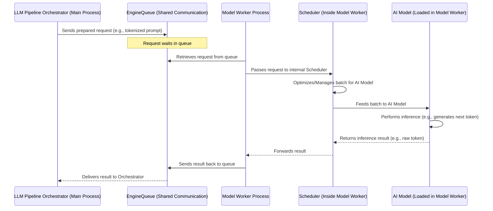

# Chapter 4: Model Worker

Welcome back! In [Chapter 3: LLM Pipeline Orchestrator (`TokenGeneratorPipeline`)](03_llm_pipeline_orchestrator___tokengeneratorpipeline___.md), we saw how the `TokenGeneratorPipeline` acts like an assembly line manager, preparing your requests (like "tell me a story") and coordinating their journey. But where does the *actual* story generation, the heavy lifting of the AI model, happen?

That's the job of the **Model Worker**! Think of it as the dedicated, high-tech workshop where our most skilled craftsman (the AI model) performs its magic.

## What Problem Does the Model Worker Solve?

Imagine our AI application is like a busy restaurant. The API layer (Chapter 2) is the front-of-house taking orders. The `TokenGeneratorPipeline` (Chapter 3) is the head chef who organizes the order tickets and makes sure ingredients are prepped.
Now, what if cooking a complex dish (running the AI model) takes a long time? If the head chef also had to cook every single part of every dish, the whole restaurant would grind to a halt while they're busy at one stove. New customers couldn't even place orders!

The Model Worker solves this by being a **specialized chef in a separate kitchen (a separate process)**.
*   It **loads the actual AI model** (the powerful, but resource-intensive cooking equipment).
*   It receives "cooking orders" (batches of prepared prompts) from the head chef via a dedicated delivery system (the [EngineQueue](07_enginequeue_.md)).
*   It **does the intensive work** (running the model to generate text, embeddings, etc.).
*   It sends the finished "dish" (the model's output) back.

Because it runs separately, the main restaurant (the API server) stays responsive and can keep taking new orders even if the Model Worker is busy crafting a masterpiece.

## Meet the Model Worker: The AI's Powerhouse

The Model Worker is where the core AI computation happens. It's a separate process launched by the main `modular` application. Here are its key characteristics:

1.  **Loads the AI Model**: When the Model Worker starts, its first job is to load the actual AI model (e.g., a large language model) into memory. This model is its primary "tool."
2.  **Runs in a Separate Process**: This is crucial. By using Python's `multiprocessing`, the Model Worker operates independently of the main API server process. If the model takes 5 seconds to generate a response, the API server isn't frozen for those 5 seconds; it can continue to handle other incoming requests.
3.  **Receives Batched Requests**: It doesn't just get one prompt at a time. It receives requests that have been grouped into "batches" from the [EngineQueue](07_enginequeue_.md). This is often more efficient for the AI model.
4.  **Internal Scheduler**: Inside the Model Worker, there's a [Scheduler](05_scheduler___tokengenerationscheduler____embeddingsscheduler___.md) (which we'll explore in the next chapter). This internal scheduler takes the batches from the [EngineQueue](07_enginequeue_.md) and intelligently manages how they are fed to the AI model for processing.
5.  **Processes Through the Model**: This is the "heavy lifting." The Model Worker takes the batched inputs and runs them through the loaded AI model to perform tasks like:
    *   Generating the next token in a sequence (for text generation).
    *   Calculating embeddings for text.
6.  **Sends Results Back**: Once the model produces an output, the Model Worker sends these results back, typically via the same [EngineQueue](07_enginequeue_.md), to the component that requested them (like the [LLM Pipeline Orchestrator (`TokenGeneratorPipeline`)](03_llm_pipeline_orchestrator___tokengeneratorpipeline___.md)).

Think of the Model Worker as a highly specialized craftsman in a workshop. The workshop (the Model Worker process) contains all the tools (the AI model). The craftsman receives orders (batches of prompts from the [EngineQueue](07_enginequeue_.md)), uses their tools to create the product (model inference), and then sends the product out.

## The Journey of a Request Batch to and from the Model Worker

Let's trace how a request batch interacts with the Model Worker, picking up from where the [LLM Pipeline Orchestrator (`TokenGeneratorPipeline`)](03_llm_pipeline_orchestrator___tokengeneratorpipeline___.md) (from Chapter 3) sends a request:

1.  **Request Sent to Queue**: The `TokenGeneratorPipeline` (in the main process) puts a processed request (or a bundle of them) onto the [EngineQueue](07_enginequeue_.md).
2.  **Worker Receives from Queue**: The Model Worker process is constantly monitoring the [EngineQueue](07_enginequeue_.md). It picks up the request.
3.  **Internal Scheduling**: The [Scheduler](05_scheduler___tokengenerationscheduler____embeddingsscheduler___.md) *inside* the Model Worker takes this request. It might hold onto it briefly to combine it with other requests into an optimal batch for the AI model.
4.  **Model Inference**: The [Scheduler](05_scheduler___tokengenerationscheduler____embeddingsscheduler___.md) passes the finalized batch to the loaded AI model. The model performs its computation (e.g., predicts the next word).
5.  **Result Captured**: The AI model produces an output (e.g., the generated word/token).
6.  **Result Sent to Queue**: The Model Worker (via its internal [Scheduler](05_scheduler___tokengenerationscheduler____embeddingsscheduler___.md)) sends this result back to the [EngineQueue](07_enginequeue_.md).
7.  **Pipeline Receives Result**: The `TokenGeneratorPipeline` (back in the main process) picks up the result from the [EngineQueue](07_enginequeue_.md) and continues processing it (e.g., decoding it for the user).

Here's a diagram showing this flow:



This separation ensures that the demanding task of AI inference doesn't slow down the main application's ability to accept and manage new requests.

## Under the Hood: Starting and Running the Model Worker

The Model Worker is primarily managed by code in `src/max/serve/pipelines/model_worker.py`. Let's look at simplified versions of key functions.

### Launching the Model Worker Process

The `start_model_worker` function is responsible for creating and starting the new process for the Model Worker.

```python
# Simplified from: src/max/serve/pipelines/model_worker.py
import multiprocessing

# @asynccontextmanager
async def start_model_worker(
    model_factory: callable, # A function that creates the AI model instance
    # ... other args like batch_config, settings ...
):
    mp_context = multiprocessing.get_context("spawn")
    # ... (ProcessControl and EngineQueue setup) ...

    worker_process = mp_context.Process(
        name="model-worker-process",
        target=_model_worker_process_fn, # Function to run in the new process
        daemon=True,
        args=(
            # ... (arguments for _model_worker_process_fn) ...
            model_factory, # Pass the factory to the new process
            # ...
        ),
    )
    worker_process.start() # Start the new process!
    # ... (health checks and monitoring logic) ...
    # yield engine_queue # The queue to communicate with the worker
```
*   `multiprocessing.get_context("spawn")`: This gets a multiprocessing context. "spawn" is a way to start a fresh process.
*   `mp_context.Process(...)`: This creates a new process.
    *   `target=_model_worker_process_fn`: This tells the new process to run the `_model_worker_process_fn` function.
    *   `args=(...)`: These are the arguments passed to `_model_worker_process_fn`. Importantly, `model_factory` is passed so the new process knows how to create the AI model.
*   `worker_process.start()`: This actually launches the new process.
*   The actual function in `modular` includes sophisticated health checks and process monitoring using `ProcessControl` and `ProcessMonitor` to ensure the worker is running correctly. It also sets up the [EngineQueue](07_enginequeue_.md) for communication.

### The Worker's Main Job

Once the new process starts, it runs `_model_worker_process_fn`, which in turn calls `model_worker_run_v3` (in `modular`'s current structure). This is where the core logic of the worker resides.

```python
# Simplified from: src/max/serve/pipelines/model_worker.py

# This function runs in the separate Model Worker process
async def model_worker_run_v3(
    pc: ProcessControl, # For health and lifecycle management
    model_factory: callable, # Function to load/create the AI model
    pipeline_config: TokenGeneratorPipelineConfig, # Config for batching
    queues: Mapping[str, MaxQueue], # Queues for communication (EngineQueue parts)
    settings: Settings, # Application settings from Chapter 1
    # ... (metric_client_factory for telemetry) ...
):
    # ... (logging and metrics setup) ...

    # 1. Load the AI Model
    # `model_factory()` calls the function to get an instance of the model pipeline
    # This could be a TokenGenerator or EmbeddingsGenerator
    ai_model_pipeline = model_factory()
    logger.info("AI Model loaded in Model Worker.")

    # 2. Create the Scheduler
    # The Scheduler will manage requests from the queue and feed the model
    scheduler = _create_internal_scheduler( # Helper to pick correct scheduler
        ai_model_pipeline, pc, pipeline_config, queues
    )
    logger.info("Internal Scheduler created.")

    pc.set_started() # Signal that the worker is ready

    # 3. Run the Scheduler's main loop
    # This loop continuously processes requests
    scheduler.run()

    pc.set_completed() # Signal that the worker has finished (e.g., on shutdown)
    logger.info("Model Worker stopped.")
```
Let's break this down:
1.  **Load the AI Model**: `ai_model_pipeline = model_factory()` is where the actual AI model (like `TokenGenerator` or `EmbeddingsGenerator`) is instantiated. The `model_factory` was passed in when the process started. This can be a time-consuming step, which is another good reason it happens in a separate worker process.
2.  **Create the Scheduler**: `scheduler = _create_internal_scheduler(...)` sets up the internal [Scheduler](05_scheduler___tokengenerationscheduler____embeddingsscheduler___.md). This scheduler (e.g., `TokenGenerationScheduler` or `EmbeddingsScheduler`) is responsible for taking items from the input part of the [EngineQueue](07_enginequeue_.md), forming batches according to `pipeline_config`, running them through `ai_model_pipeline`, and putting results onto the output part of the [EngineQueue](07_enginequeue_.md). We'll learn all about this scheduler in [Chapter 5: Scheduler (`TokenGenerationScheduler`, `EmbeddingsScheduler`)](05_scheduler___tokengenerationscheduler____embeddingsscheduler___.md).
3.  **Run the Scheduler's Loop**: `scheduler.run()` starts the main processing loop. The scheduler will now continuously:
    *   Check the [EngineQueue](07_enginequeue_.md) for incoming requests.
    *   Form batches.
    *   Execute batches on the `ai_model_pipeline`.
    *   Send results back via the [EngineQueue](07_enginequeue_.md).
    This loop continues until the worker is told to shut down.

The `Settings` object (from [Chapter 1: Settings (`Settings` class)](01_settings___settings__class__.md)) is also passed to the worker, influencing its behavior (e.g., logging levels, specific model configurations).

## Why is a Separate Process So Important?

Using a separate process for the Model Worker offers several advantages:

*   **Non-Blocking API Server**: The most significant benefit. The API server (handling HTTP requests) can remain quick and responsive, even if the AI model takes several seconds or more to process a request. It doesn't get "stuck" waiting for the model.
*   **CPU-Intensive Work Isolation**: AI model inference is often CPU-bound (or GPU-bound). Isolating this to a separate process can help manage system resources more effectively and prevents it from starving the API server process for CPU time. (Note: Python's Global Interpreter Lock (GIL) means true parallelism for CPU-bound tasks in one process is limited, making separate processes even more beneficial).
*   **Potential for Scalability**: While `modular`'s current design focuses on a single Model Worker per main application instance, this architectural separation is a common pattern in systems that scale out by running multiple worker processes (perhaps even on different machines).
*   **Resilience (Limited)**: If the Model Worker encounters a critical error and crashes, the main API server process *might* remain alive, allowing it to log the error or attempt a restart of the worker. However, without the worker, it can't serve model requests.

## Conclusion

The Model Worker is the powerhouse of `modular`, the dedicated workshop where the AI model performs its demanding computations. By running in a separate process, it ensures that the main application remains responsive while the heavy lifting of model inference is handled efficiently. It loads the model, receives batched requests via the [EngineQueue](07_enginequeue_.md), and uses an internal [Scheduler](05_scheduler___tokengenerationscheduler____embeddingsscheduler___.md) to manage the flow of data through the AI model, sending results back for the user.

You've now seen how the request gets to the Model Worker. But how does the worker *inside* itself manage these requests, decide what to run next, and form efficient batches for the AI model? That's the role of the **Scheduler**, which we'll explore in detail in [Chapter 5: Scheduler (`TokenGenerationScheduler`, `EmbeddingsScheduler`)](05_scheduler___tokengenerationscheduler____embeddingsscheduler___.md).

---

Generated by [AI Codebase Knowledge Builder](https://github.com/The-Pocket/Tutorial-Codebase-Knowledge)