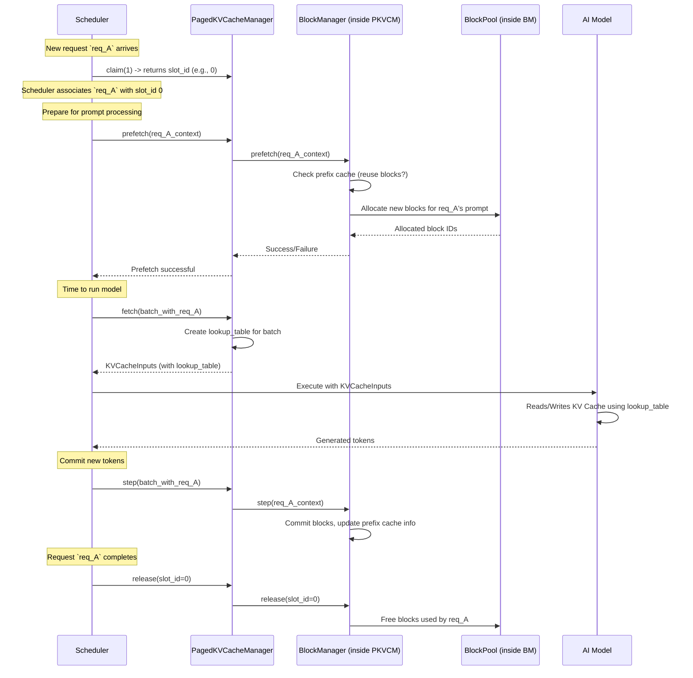

# Chapter 6: KV Cache Management

In [Chapter 5: Scheduler (`TokenGenerationScheduler`, `EmbeddingsScheduler`)](05_scheduler___tokengenerationscheduler____embeddingsscheduler___.md), we saw how the Scheduler intelligently batches requests to keep our AI model busy. But when an LLM generates text, especially long sequences, how does it "remember" what it said at the beginning of a sentence or paragraph to make sense of what comes next? If it had to re-read and re-calculate everything from scratch for every new word, it would be incredibly slow!

This is where **KV Cache Management** comes to the rescue. It's like giving our LLM a super-fast, very smart scratchpad.

## What Problem Does KV Cache Management Solve?

Imagine you're asking an LLM to write a story: "Once upon a time, in a land far, far away, lived a brave..."

When the LLM generates "brave," it needs to remember "Once upon a time, in a land far, far away, lived a" to make sure "brave" fits the context. This "memory" involves complex calculations called "attention" (specifically, Key and Value tensors, or KV for short).

If, for the *next* word (e.g., "knight"), the LLM had to re-calculate the attention for "Once upon a time... lived a brave" all over again, it would be a huge waste of time and energy.

**KV Cache Management** solves this by:
1.  **Storing** these intermediate attention calculations (the Keys and Values) from previously processed tokens in a special memory area called the **KV Cache**.
2.  **Reusing** these stored calculations when generating subsequent tokens.

This dramatically speeds up text generation because the model only needs to compute attention for the newest token, not the entire sequence again and again. It's like a high-speed "thought buffer" for the LLM.

The `KVCacheManager` is the component in `modular` responsible for handling this critical memory.

## Key Concepts: The LLM's Smart Scratchpad

Let's break down how this "smart scratchpad" works, especially with advanced techniques like **Paged Attention**:

### 1. The KV Cache: What's Stored?

When the LLM processes a sequence of tokens (like your prompt "Tell me a story"), for each token, it computes Key (K) and Value (V) tensors in its attention layers. These K and V tensors represent the "importance" and "content" of previous tokens.
*   **Keys (K)**: Help the model decide which past tokens are relevant to the current token.
*   **Values (V)**: Provide the information from those relevant past tokens.

The KV Cache stores these K and V tensors for all processed tokens in a sequence. So, when generating the 100th word, the K and V tensors for the first 99 words are already in the cache, ready to be used.

### 2. Paged Attention: Virtual Memory for the GPU

Storing the KV Cache for many long sequences can take up a lot of GPU memory. If managed poorly, this can lead to "out of memory" errors or limit how many requests we can process at once.

**Paged Attention** is a clever technique, similar to how virtual memory works in your computer's operating system, but for the GPU's KV Cache.
*   **Analogy**: Imagine your LLM's scratchpad isn't one long scroll of paper, but a binder full of fixed-size pages.
*   **Blocks/Pages**: The KV Cache is divided into fixed-size chunks called "blocks" or "pages." Each block can store the KV tensors for a certain number of tokens (e.g., 128 tokens).
*   **Flexibility**: Instead of needing one large contiguous memory block for each request's entire KV history, the system can allocate these smaller, non-contiguous pages as needed.

This provides several benefits:
*   **Reduced Fragmentation**: It's easier to find and allocate memory for new requests because we're looking for small pages, not one huge chunk.
*   **Higher Concurrency**: More requests can share the GPU memory efficiently.
*   **Prefix Caching**: If multiple requests start with the same prompt (e.g., a system message), their initial KV Cache pages can be shared, saving memory and computation. This is like having pre-written common introductions in our page binder.

### 3. The `KVCacheManager` and `BlockManager`

*   **`KVCacheManager`**: This is the main abstraction (an abstract base class defined in `src/max/nn/kv_cache/manager.py`). It defines the interface for managing the KV Cache. A key implementation is the `PagedKVCacheManager` (in `src/max/nn/kv_cache/paged_cache/paged_cache.py`), which uses Paged Attention.
*   **`BlockManager`**: Used by `PagedKVCacheManager`, this component (in `src/max/nn/kv_cache/paged_cache/block_manager.py`) is the low-level accountant for the pages. It keeps track of:
    *   Which pages are free.
    *   Which pages are assigned to which requests.
    *   Handles allocation, deallocation, and potentially even copying pages (e.g., for prefix caching or swapping to CPU memory if GPU memory is full).

### 4. Communicating with the Model: `KVCacheInputs`

When the model needs to perform an attention calculation, the `KVCacheManager` provides it with `KVCacheInputs`. These are special data structures (like `RaggedKVCacheInputs` or `PaddedKVCacheInputs`) that tell the model:
*   Where the actual KV cache data is stored (e.g., a pointer to the GPU memory holding all blocks).
*   A "lookup table" or similar mechanism that maps logical token positions in a request to the specific physical blocks in the cache.
*   The current lengths of the cached sequences.

```python
# Simplified dataclass definitions from src/max/nn/kv_cache/manager.py

@dataclass
class KVCacheInputs: # Base class
    pass

@dataclass
class RaggedKVCacheInputs(KVCacheInputs):
    # For Paged Attention, these tell the model how to find its "pages"
    blocks: Tensor          # The big tensor on GPU holding all cache blocks
    cache_lengths: Tensor   # How many tokens are already cached for each request
    lookup_table: Tensor    # Maps request tokens to physical block locations
    max_lengths: Tensor     # Helps manage generation limits
```
This `RaggedKVCacheInputs` essentially gives the model a map to navigate its "paged scratchpad."

## How the Scheduler Uses the KV Cache Manager

The [Scheduler (`TokenGenerationScheduler`, `EmbeddingsScheduler`)](05_scheduler___tokengenerationscheduler____embeddingsscheduler___.md) (Chapter 5), which lives inside the [Model Worker](04_model_worker_.md) (Chapter 4), heavily relies on the `KVCacheManager` (specifically, an instance like `PagedKVCacheManager`) to manage memory for the requests it's processing.

Here's a simplified flow:

1.  **New Request Arrives**:
    *   The Scheduler gets a new request. Before it can be processed, it needs space in the KV Cache.
    *   Scheduler: "Hey `KVCacheManager`, I have a new request `req_A`. Can you reserve a spot for it?"
    *   `KVCacheManager.claim(1)`: The manager reserves a logical "slot" for this request. Let's say it gets slot ID `0`.
    *   Scheduler (to itself): "Okay, `req_A` is now `seq_id=0` in the cache."

2.  **Preparing the First Batch (Context Encoding)**:
    *   The Scheduler wants to process the initial prompt for `req_A`.
    *   Scheduler: "Hey `KVCacheManager` (`paged_manager` in `TokenGenerationScheduler`), prepare the cache for `req_A` (now `ctx_A` which knows its `seq_id=0`) and tell me if it's possible."
    *   `PagedKVCacheManager.prefetch(ctx_A)`:
        *   The internal `BlockManager` looks for free pages on the GPU.
        *   It might reuse pages if `req_A`'s prompt has a common prefix already cached (prefix caching).
        *   It allocates the necessary pages for `req_A`'s prompt.
        *   If successful, it returns `True`. If not (e.g., no GPU memory), it returns `False`, and the Scheduler might have to wait or evict something.
    *   This `prefetch` step ensures that when `fetch` is called later, the memory is ready.

3.  **Running the Model (Getting Cache Inputs)**:
    *   Scheduler: "Okay, `KVCacheManager`, give me the actual cache input tensors for the current batch (which includes `req_A`)."
    *   `PagedKVCacheManager.fetch([ctx_A, ...])`:
        *   This constructs `RaggedKVCacheInputs` (or similar). It populates the `lookup_table` that tells the model which physical pages correspond to `req_A`'s tokens.
        *   These inputs are passed to the AI model. The model uses them to read from and write to the correct pages in the KV Cache during attention.

4.  **After Model Step (Committing to Cache)**:
    *   The model generates a new token for `req_A`.
    *   Scheduler: "Hey `KVCacheManager`, `req_A` has a new token. Update its state in the cache."
    *   `PagedKVCacheManager.step([ctx_A, ...])`:
        *   The internal `BlockManager` "commits" the newly generated token's KV data. This might involve marking a page as fully used and potentially making it available for future prefix caching.

5.  **Request Finishes**:
    *   `req_A` has finished generating all its tokens.
    *   Scheduler: "`KVCacheManager`, `req_A` (identified by `seq_id=0`) is done. You can free its memory."
    *   `PagedKVCacheManager.release(seq_id=0)`: The `BlockManager` returns all pages used by `req_A` to the free pool.

This interaction ensures that GPU memory for the KV Cache is used efficiently, allowing many requests to be processed.

## Under the Hood: A Closer Look at `PagedKVCacheManager`

Let's peek at the internal workings.

### High-Level Flow with Paged Attention:



### Code Snippets:

**1. `KVCacheManager` Abstract Base Class (`src/max/nn/kv_cache/manager.py`)**
This class defines the contract that all KV cache managers must follow.

```python
# Simplified from: src/max/nn/kv_cache/manager.py
class KVCacheManager(ABC, Generic[T]): # T is KVCacheAwareContext
    # ... (constructor) ...

    @abstractmethod
    def fetch(self, batch: list[T], num_steps: int = 1) -> list[KVCacheInputs]:
        # Returns KVCacheInputs for the model to use
        ...

    def claim(self, n: int) -> list[int]:
        # Claims 'n' logical slots for new sequences, returns their IDs
        seq_ids = []
        for _ in range(n):
            seq_id = self.available.pop() # 'available' is a set of free slot IDs
            self.active.add(seq_id)
            seq_ids.append(seq_id)
        return seq_ids

    def release(self, seq_id: int) -> None:
        # Releases a slot ID, making it available again
        self.active.remove(seq_id)
        self.available.add(seq_id)
    
    @abstractmethod
    def step(self, batch: list[T]) -> None:
        # Commits new tokens into the cache after a model step
        ...
```
This shows the key methods `fetch`, `claim`, and `release` that the Scheduler interacts with.

**2. `PagedKVCacheManager` Initialization (`src/max/nn/kv_cache/paged_cache/paged_cache.py`)**
This is where the paged attention system is set up.

```python
# Simplified from: src/max/nn/kv_cache/paged_cache/paged_cache.py
class PagedKVCacheManager(KVCacheManager):
    def __init__(self, params: KVCacheParams, ..., page_size: int = 128, ...):
        super().__init__(...)
        self.page_size = page_size
        # Calculate total_num_pages based on available GPU memory and page_size
        # ...
        
        # Allocate the main GPU tensor to hold all cache blocks (pages)
        self.device_tensors: list[Tensor] = [] # One per GPU device
        for device in self.devices:
            self.device_tensors.append(
                Tensor(shape=self.block_shape(), ...) # shape like [num_pages, 2, layers, page_size, heads, dim]
            )

        # Initialize the BlockManager to manage these pages
        self.block_manager = BlockManager(
            total_num_blocks=self.total_num_pages,
            block_size=self.page_size,
            # ... other args like block_copy_engine for prefix caching ...
        )
        self.prefetched_seq_ids: set[int] = set()
```
The `PagedKVCacheManager` allocates a large chunk of memory on the GPU (`self.device_tensors`) to hold all the blocks/pages. It then creates a `BlockManager` to manage these pages.

**3. `PagedKVCacheManager.prefetch` and `fetch`**
The `prefetch` method ensures blocks are available *before* `fetch` is called.

```python
# Simplified from: src/max/nn/kv_cache/paged_cache/paged_cache.py
    @traced # For performance profiling
    def prefetch(self, data: KVCacheAwareContext, num_steps: int = 1) -> bool:
        seq_id = data.cache_seq_id
        # Ask BlockManager to reuse/allocate blocks for this request
        scheduled = self.block_manager.prefetch(data, num_steps)
        if scheduled:
            self.prefetched_seq_ids.add(seq_id)
        return scheduled

    @traced
    def fetch(self, batch: list[KVCacheAwareContext], num_steps: int = 1) -> list[RaggedKVCacheInputs]:
        # ... (Ensure prefetch was called for items in batch or call it now) ...
        
        # For each request in the batch:
        #   Get its allocated block IDs from self.block_manager.get_req_blocks(seq_id)
        #   Construct a lookup_table_np (numpy array) mapping [batch_idx, logical_page_idx] to physical_block_id
        #   Construct cache_lengths_np (how many tokens already cached)
        # ...
        
        # Convert numpy arrays to Tensors
        # lut_table_host = Tensor.from_numpy(lookup_table_np)
        # cache_lengths_host = Tensor.from_numpy(cache_lengths_np)
        
        # Create RaggedKVCacheInputs for each device
        ret_list = []
        for i, device in enumerate(self.devices):
            ret_list.append(
                RaggedKVCacheInputs(
                    blocks=self.device_tensors[i], # The big GPU tensor of blocks
                    cache_lengths=cache_lengths_host.to(device=device),
                    lookup_table=lut_table_host.to(device=device),
                    max_lengths=max_lengths_host, # For generation limits
                )
            )
        return ret_list
```
`prefetch` relies on the `BlockManager` to do the heavy lifting of block allocation. `fetch` then assembles the `RaggedKVCacheInputs` that the model will use, including the crucial `lookup_table`.

**4. `BlockManager` in Action (`src/max/nn/kv_cache/paged_cache/block_manager.py`)**
The `BlockManager` handles the actual page allocations and prefix caching.

```python
# Simplified from: src/max/nn/kv_cache/paged_cache/block_manager.py
class BlockManager(Generic[T]): # T is KVCacheAwareContext
    def __init__(self, ..., total_num_blocks: int, block_size: int, ...):
        self.block_size = block_size
        self.device_block_pool = BlockPool(total_num_blocks, ...)
        # self.host_block_pool (if swapping to CPU is enabled)
        self.req_to_blocks: dict[int, list[KVCacheBlock]] = defaultdict(list) # Tracks blocks per request

    def prefetch(self, ctx: T, num_steps: int = 1) -> bool:
        self.reuse_blocks_from_prefix_cache(ctx) # Try to use existing cached blocks
        try:
            self.allocate_new_blocks(ctx, num_steps) # Allocate remaining needed blocks
        except RuntimeError: # Not enough free blocks
            return False
        return True

    def allocate_new_blocks(self, ctx: T, num_steps: int = 1):
        # Calculate num_new_blocks needed for ctx.current_length + num_steps
        # ...
        if num_new_blocks > len(self.device_block_pool.free_block_queue):
            raise RuntimeError("Not enough free blocks")
        for _ in range(num_new_blocks):
            # Get a KVCacheBlock object from the pool
            new_block = self.device_block_pool.alloc_block() 
            self.req_to_blocks[ctx.cache_seq_id].append(new_block)
            
    def step(self, ctx: T) -> None: # Called after model generates tokens
        if self.enable_prefix_caching:
            self.commit_to_prefix_cache(ctx) # Marks blocks as "committed"

    def release(self, seq_id: int) -> None:
        for block in self.req_to_blocks[seq_id]:
            self.device_block_pool.free_block(block) # Return block to the pool
        self.req_to_blocks[seq_id] = []
```
The `BlockManager` uses a `BlockPool` (which manages lists of free and used blocks) to perform its duties. `reuse_blocks_from_prefix_cache` and `commit_to_prefix_cache` are key for the prefix caching optimization.

### What About Swapping and the `KVCacheAgent`?

*   **Swapping to Host Memory**: If GPU memory for the KV Cache is extremely full, the `BlockManager` can be configured (via `total_num_host_blocks` and a `host_block_pool`) to copy some less-recently-used blocks from GPU to regular CPU RAM. If those blocks are needed again, they're copied back. This is like your computer using its hard drive as extra RAM, but slower. (See `maybe_offload_gpu_block_to_host` in `BlockManager`).
*   **`KVCacheAgent`**: `modular` has an experimental feature called the `KVCacheAgent`. If enabled (via the `experimental_enable_kvcache_agent` setting in `src/max/entrypoints/cli/serve.py`), it starts a separate gRPC server (`src/max/serve/kvcache_agent/kvcache_agent.py` started by `src/max/serve/pipelines/kvcache_worker.py`).
    *   **Purpose**: This agent can expose the state of the KV Cache (e.g., which blocks are on GPU, which are on CPU, how full the cache is) to external monitoring systems or potentially even to other processes that might want to influence cache management.
    *   **How it works**: The `BlockManager` (or other parts of the cache system) would send messages (like `KVCacheChangeMessage`) to a queue. The `KVCacheAgentServer` reads from this queue and updates its internal state, which subscribers can then query via gRPC. This is an advanced feature for observability and control.

## Conclusion

KV Cache Management is a cornerstone of efficient LLM inference. By storing and reusing intermediate attention computations (Keys and Values), it drastically reduces redundant calculations. Techniques like **Paged Attention**, managed by components like `PagedKVCacheManager` and `BlockManager`, further optimize this by:
*   Treating GPU memory like a set of manageable pages.
*   Reducing memory fragmentation.
*   Enabling higher concurrency and features like prefix caching.
*   Potentially swapping less-used cache data to host memory.

This "smart scratchpad" allows the LLM to "remember" its previous thought process quickly and efficiently, leading to faster generation of coherent text. The [Scheduler (`TokenGenerationScheduler`, `EmbeddingsScheduler`)](05_scheduler___tokengenerationscheduler____embeddingsscheduler___.md) works hand-in-hand with the KV Cache Manager to orchestrate this memory usage.

But how do all these components—the Pipeline Orchestrator, the Model Worker, the Scheduler, and the KV Cache Manager—talk to each other, especially when they might be in different processes? That's where our next topic, the [EngineQueue](07_enginequeue_.md), comes in!

---

Generated by [AI Codebase Knowledge Builder](https://github.com/The-Pocket/Tutorial-Codebase-Knowledge)