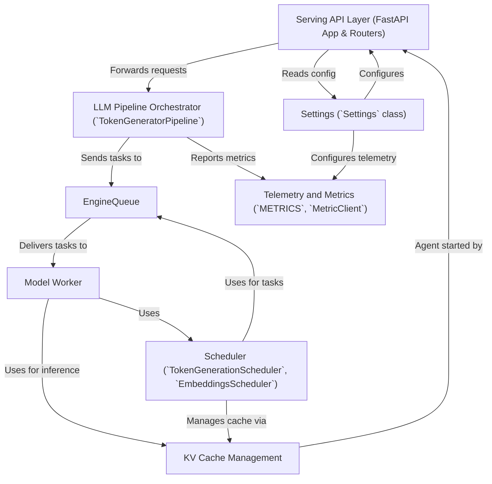

# Tutorial: modular

The project, `modular`, is a **high-performance serving framework** for *Large Language Models (LLMs)*. It allows users to easily deploy and run LLMs, handling incoming requests, orchestrating the generation process, and streaming back responses. Key features include efficient *request batching*, advanced *KV cache management* for speed, and a *modular architecture* to manage different parts of the serving stack like API endpoints, model execution, and telemetry.

**Source Repository:** [None](None)

---

Generated by [AI Codebase Knowledge Builder](https://github.com/The-Pocket/Tutorial-Codebase-Knowledge)