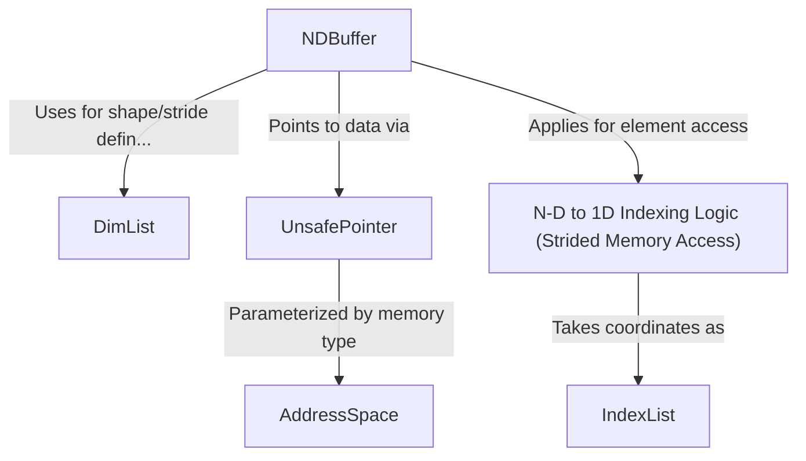

# Tutorial: mojo

The project `mojo` (as represented by these abstractions) provides a system for **high-performance, multi-dimensional array (tensor) operations**.
It features `NDBuffer` as a central data structure that acts as a *smart view over raw memory*, pointed to by an `UnsafePointer`.
The `NDBuffer`'s structure (shape and memory layout strides) is defined using `DimList`.
Accessing elements in an `NDBuffer` is done using `IndexList` for coordinates, which are then converted to a 1D memory offset by *strided N-D to 1D indexing logic*.
The `AddressSpace` parameter allows these operations to be tailored for different memory systems, like CPU or GPU, for *optimal performance*.

**Source Repository:** [None](None)

## Chapters

1. [AddressSpace
](01_addressspace_.md)
2. [UnsafePointer
](02_unsafepointer_.md)
3. [IndexList
](03_indexlist_.md)
4. [DimList
](04_dimlist_.md)
5. [NDBuffer
](05_ndbuffer_.md)
6. [N-D to 1D Indexing Logic (Strided Memory Access)
](06_n_d_to_1d_indexing_logic__strided_memory_access__.md)

---

Generated by [AI Codebase Knowledge Builder](https://github.com/The-Pocket/Tutorial-Codebase-Knowledge)