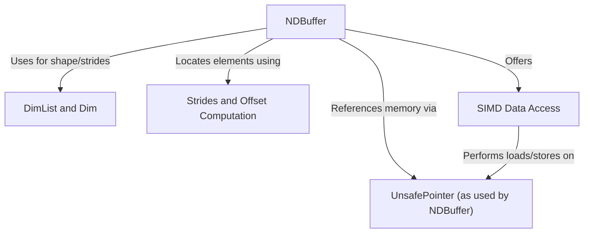

# Tutorial: mojo

The `mojo` project provides a core data structure called **NDBuffer**, which is a *non-owning, multi-dimensional view* into a block of memory, similar to a tensor. It's designed for high-performance computing by allowing direct memory manipulation via `UnsafePointer`s and supporting *efficient element access* through `Strides and Offset Computation`. `NDBuffer` can handle both *statically known and dynamically determined* dimension sizes using `DimList` and `Dim` abstractions, and it facilitates `SIMD Data Access` for accelerated, vectorized operations on data.

**Source Repository:** [None](None)

## Chapters

1. [UnsafePointer (as used by NDBuffer)
](01_unsafepointer__as_used_by_ndbuffer__.md)
2. [DimList and Dim
](02_dimlist_and_dim_.md)
3. [NDBuffer
](03_ndbuffer_.md)
4. [Strides and Offset Computation
](04_strides_and_offset_computation_.md)
5. [SIMD Data Access
](05_simd_data_access_.md)

---

Generated by [AI Codebase Knowledge Builder](https://github.com/The-Pocket/Tutorial-Codebase-Knowledge)