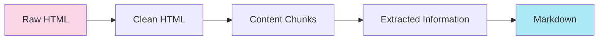
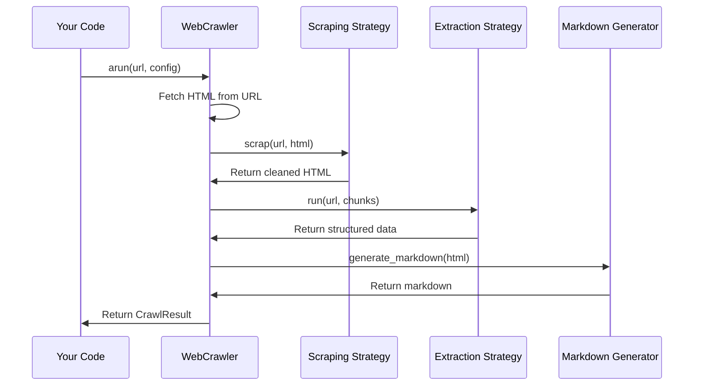

# Chapter 3: Content Extraction Pipeline

In [Chapter 2: AsyncWebCrawler](02_asyncwebcrawler_.md), we learned how to use the AsyncWebCrawler to fetch web content. But what happens to that content after it's downloaded? How does it go from raw HTML to structured, usable information? Let's find out!

## What is the Content Extraction Pipeline?

Imagine you're a gold miner. You don't just find a chunk of earth and call it a day - you need to extract the gold! You'll wash the dirt away, break down larger rocks, separate the gold from other minerals, and finally polish it into something valuable.

The Content Extraction Pipeline works the same way, but for web content. It's a series of steps that transform messy HTML into clean, structured content that's ready to use:



## A Simple Example

Let's start with a simple use case: extracting the main article content from a news website and converting it to readable markdown.

```python
from crawl4ai import AsyncWebCrawler, CrawlerRunConfig
from crawl4ai.content_scraping_strategy import WebScrapingStrategy

async def extract_article():
    # Set up a configuration with our pipeline components
    config = CrawlerRunConfig(
        scraping_strategy=WebScrapingStrategy()
    )
    
    # Use the crawler with our config
    async with AsyncWebCrawler() as crawler:
        result = await crawler.arun(
            url="https://example.com/article", 
            config=config
        )
        
        print(result.markdown)
```

In this code, we're using the `WebScrapingStrategy` to clean the HTML, and the default settings for the other pipeline steps. The crawler will return our article as clean markdown!

## The Four Key Components

The Content Extraction Pipeline has four main components, each handling a specific part of the transformation process:

### 1. Content Scraping Strategy

This strategy cleans up the raw HTML by removing ads, navigation menus, footers, and other non-content elements.

```python
from crawl4ai.content_scraping_strategy import WebScrapingStrategy

# Create a simple scraping strategy
scraping_strategy = WebScrapingStrategy()

# OR customize it to focus on specific parts of the page
custom_strategy = WebScrapingStrategy(
    css_selector="article.main-content"
)
```

The scraping strategy is like a filter that separates the gold (main content) from the dirt (ads, menus, etc.).

### 2. Chunking Strategy

This strategy splits the content into manageable pieces (chunks) that can be processed individually.

```python
from crawl4ai.chunking_strategy import RegexChunking

# Create a strategy that splits content by paragraphs
chunking_strategy = RegexChunking(patterns=[r"\n\n"])

# OR create a strategy for fixed-length chunks
from crawl4ai.chunking_strategy import FixedLengthWordChunking
fixed_chunks = FixedLengthWordChunking(chunk_size=100)
```

Think of the chunking strategy as cutting a large gold nugget into smaller pieces that are easier to process.

### 3. Extraction Strategy

This strategy extracts specific information from the chunks, like article titles, author names, dates, or any other structured data.

```python
from crawl4ai.extraction_strategy import RegexExtractionStrategy

# Create a strategy that extracts dates using regex
extraction_strategy = RegexExtractionStrategy(
    patterns={"date": r"\d{1,2}/\d{1,2}/\d{4}"}
)
```

The extraction strategy is like identifying and separating different types of precious metals from your raw materials.

### 4. Markdown Generation Strategy

This strategy converts the processed content into readable markdown format.

```python
from crawl4ai.markdown_generation_strategy import DefaultMarkdownGenerator

# Create a markdown generator with citations
markdown_generator = DefaultMarkdownGenerator(citations=True)
```

The markdown generator is like the final polish that turns your raw gold into a beautiful, finished product.

## Putting It All Together

Now let's see how to use all four components together in a complete pipeline:

```python
from crawl4ai import AsyncWebCrawler, CrawlerRunConfig
from crawl4ai.content_scraping_strategy import WebScrapingStrategy
from crawl4ai.chunking_strategy import RegexChunking
from crawl4ai.extraction_strategy import JsonCssExtractionStrategy
from crawl4ai.markdown_generation_strategy import DefaultMarkdownGenerator

async def extract_article_data():
    # 1. Set up each component of our pipeline
    scraping = WebScrapingStrategy(css_selector="article")
    chunking = RegexChunking()
    extraction = JsonCssExtractionStrategy({
        "title": "h1",
        "author": ".author-name",
        "content": "article p"
    })
    markdown_gen = DefaultMarkdownGenerator()
    
    # 2. Create a config with our pipeline
    config = CrawlerRunConfig(
        scraping_strategy=scraping,
        chunking_strategy=chunking,
        extraction_strategy=extraction,
        markdown_generator=markdown_gen
    )
    
    # 3. Run the crawler with our config
    async with AsyncWebCrawler() as crawler:
        result = await crawler.arun(
            url="https://example.com/article", 
            config=config
        )
        
    # 4. Access the extracted content
    print(f"Title: {result.extracted_content['title']}")
    print(f"Markdown: {result.markdown}")
```

In this example:
1. We create each component with specific settings
2. We build a configuration that includes all our components
3. We run the crawler with our custom pipeline
4. We access both the structured data and the markdown output

## Understanding the Default Pipeline

If you don't specify custom components, crawl4ai uses sensible defaults:

```python
from crawl4ai import AsyncWebCrawler, CrawlerRunConfig

async def simple_extraction():
    # Using all default pipeline components
    config = CrawlerRunConfig()
    
    async with AsyncWebCrawler() as crawler:
        result = await crawler.arun(
            url="https://example.com/article", 
            config=config
        )
        
    print(result.markdown)
```

By default:
- It uses `WebScrapingStrategy` to extract the main content
- It uses `RegexChunking` to split by paragraphs
- It doesn't use an extraction strategy (no structured data)
- It uses `DefaultMarkdownGenerator` for markdown conversion

## What Happens Under the Hood

When you run a crawl with a Content Extraction Pipeline, here's what's happening step by step:



Let's look at some of the actual implementation:

```python
# From AsyncWebCrawler.aprocess_html method
scraping_strategy = config.scraping_strategy
result: ScrapingResult = scraping_strategy.scrap(url, html, **params)

# Later in the same method
if config.extraction_strategy:
    chunking = config.chunking_strategy
    sections = chunking.chunk(content)
    extracted_content = config.extraction_strategy.run(url, sections)
```

Each strategy is called in sequence, passing the results from one step to the next.

## Customizing Each Component

Let's look at how to customize each component in more detail:

### Advanced Content Scraping

The `WebScrapingStrategy` has many options for fine-tuning:

```python
from crawl4ai.content_scraping_strategy import WebScrapingStrategy

advanced_scraping = WebScrapingStrategy(
    css_selector="article",        # Focus on specific element
    min_text_length=100,           # Min text length to keep
    keep_images=True,              # Keep images in content
    extract_metadata=True          # Extract page metadata
)
```

This creates a scraping strategy that focuses on article elements, ignores sections with less than 100 characters, keeps images, and extracts metadata like title and description.

### Advanced Chunking

For more complex chunking needs:

```python
from crawl4ai.chunking_strategy import SlidingWindowChunking

# Create overlapping chunks for better context
sliding_chunks = SlidingWindowChunking(
    window_size=200,  # Words per chunk
    step=100          # Words to move forward
)
```

This creates chunks that overlap, which can be useful when analyzing text where context matters.

### Advanced Extraction

For extracting complex structured data:

```python
from crawl4ai.extraction_strategy import JsonLxmlExtractionStrategy

# Extract product information from an e-commerce page
product_extractor = JsonLxmlExtractionStrategy({
    "name": "//h1[@class='product-title']/text()",
    "price": "//span[@class='price']/text()",
    "description": "//div[@id='description']//text()",
    "specs": "//table[@class='specs']"
})
```

This uses XPath expressions to extract specific product data from an e-commerce page.

### Advanced Markdown Generation

For customizing the markdown output:

```python
from crawl4ai.markdown_generation_strategy import DefaultMarkdownGenerator
from crawl4ai.content_filter_strategy import PruningContentFilter

# Generate markdown with citations and content filtering
markdown_gen = DefaultMarkdownGenerator(
    content_filter=PruningContentFilter(),  # Remove less relevant content
    citations=True,                         # Include citations
    content_source="cleaned_html"           # Use cleaned HTML as source
)
```

This creates a markdown generator that filters out less relevant content and includes citations for links.

## How the Pipeline Processes a Real Web Page

Let's walk through what happens when you process a typical news article:

1. **Raw HTML**: The crawler fetches the complete HTML of the article page, which includes navigation menus, ads, comments, footers, etc.

2. **Content Scraping**: The `WebScrapingStrategy` analyzes the page and identifies the main article content, removing everything else.

   Before: `<html>...<header>...</header><main><article>Real content</article></main><footer>...</footer>...</html>`
   
   After: `<article>Real content</article>`

3. **Chunking**: The `RegexChunking` strategy splits the content into paragraphs.

   Before: `<article><p>Paragraph 1</p><p>Paragraph 2</p></article>`
   
   After: `["<p>Paragraph 1</p>", "<p>Paragraph 2</p>"]`

4. **Extraction**: The `JsonCssExtractionStrategy` extracts specific information using CSS selectors.

   Input: `["<p>Paragraph 1</p>", "<p>Paragraph 2</p>"]`
   
   Output: `{"content": ["Paragraph 1", "Paragraph 2"]}`

5. **Markdown Generation**: The `DefaultMarkdownGenerator` converts the HTML to markdown.

   Input: `<article><p>Paragraph 1</p><p>Paragraph 2</p></article>`
   
   Output: `Paragraph 1\n\nParagraph 2`

The final `CrawlResult` includes both the markdown output and any structured data that was extracted.

## Implementation Details

The Content Extraction Pipeline is implemented through a series of strategy classes. Let's look at some of the implementation details:

### ContentScrapingStrategy

The base class for scraping strategies:

```python
# From content_scraping_strategy.py
class ContentScrapingStrategy(ABC):
    @abstractmethod
    def scrap(self, url: str, html: str, **kwargs) -> ScrapingResult:
        """Scrape content from HTML."""
        pass
```

Different implementations use various techniques:
- `WebScrapingStrategy` uses readability algorithms
- `LXMLWebScrapingStrategy` uses LXML for HTML parsing

### ChunkingStrategy

The base class for chunking strategies:

```python
# From chunking_strategy.py
class ChunkingStrategy(ABC):
    @abstractmethod
    def chunk(self, text: str) -> list:
        """Chunk the given text."""
        pass
```

The implementation shown in the code you provided includes:
- `RegexChunking` for pattern-based splitting
- `FixedLengthWordChunking` for fixed-size chunks
- `SlidingWindowChunking` for overlapping chunks

### ExtractionStrategy

The base class for extraction strategies:

```python
# Hypothetical from extraction_strategy.py
class ExtractionStrategy(ABC):
    @abstractmethod
    def run(self, url: str, chunks: list) -> dict:
        """Extract structured data from chunks."""
        pass
```

Different implementations support different methods:
- `RegexExtractionStrategy` for pattern matching
- `JsonCssExtractionStrategy` for CSS selector-based extraction
- `LLMExtractionStrategy` for using language models

### MarkdownGenerationStrategy

The base class for markdown generators:

```python
# From markdown_generation_strategy.py
class MarkdownGenerationStrategy(ABC):
    @abstractmethod
    def generate_markdown(self, input_html: str, **kwargs) -> MarkdownGenerationResult:
        """Generate markdown from HTML."""
        pass
```

The `DefaultMarkdownGenerator` implementation handles:
- Converting HTML to markdown
- Adding citations for links
- Filtering content if a content filter is provided

## Conclusion

The Content Extraction Pipeline is a powerful system that transforms raw HTML into useful content through a series of specialized steps. By understanding and customizing each component, you can extract exactly the information you need from any web page.

In this chapter, we've learned:
- How the pipeline works as a sequence of processing steps
- The four key components: scraping, chunking, extraction, and markdown generation
- How to customize each component for specific needs
- How to use the complete pipeline in your crawl4ai applications

In the next chapter, [URL Filtering & Scoring](04_url_filtering___scoring_.md), we'll explore how to decide which URLs to crawl and how to prioritize them, which is essential for building efficient web crawlers.

---

Generated by [AI Codebase Knowledge Builder](https://github.com/The-Pocket/Tutorial-Codebase-Knowledge)