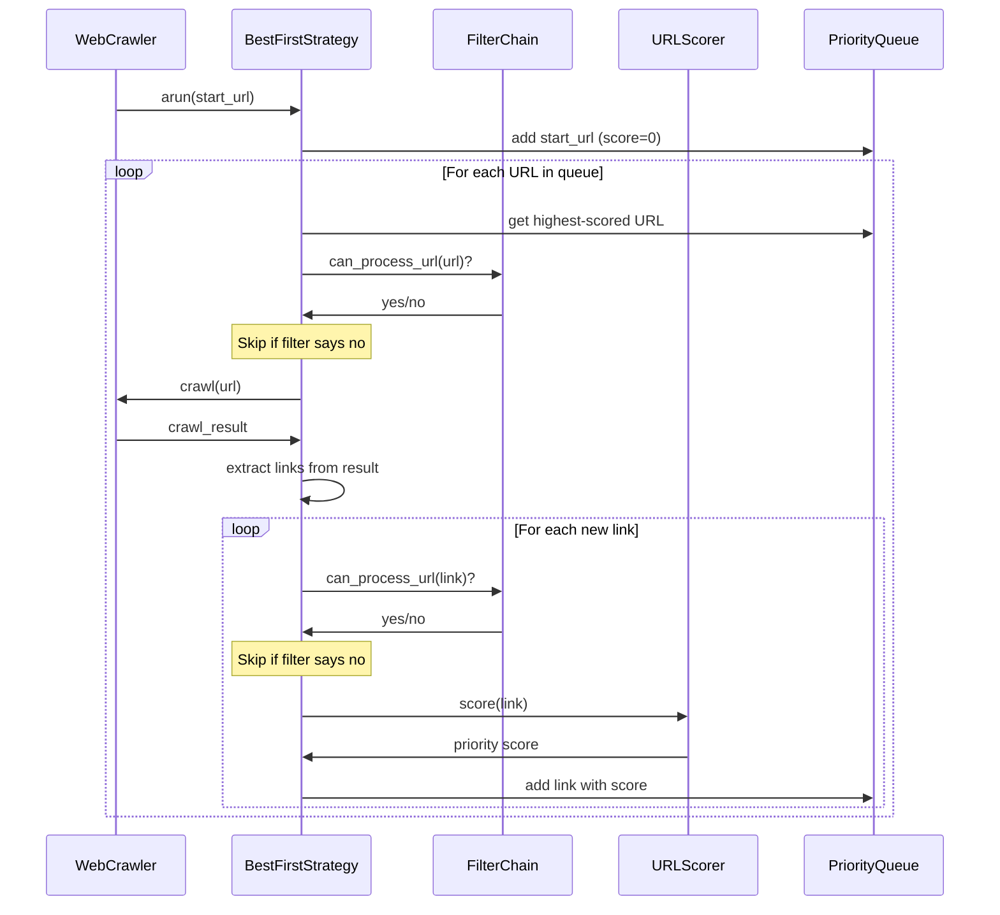

# Chapter 4: URL Filtering & Scoring

In [Chapter 3: Content Extraction Pipeline](03_content_extraction_pipeline_.md), we learned how to process and extract useful information from web pages. But how do we decide which URLs to crawl in the first place, and in what order? That's where URL filtering and scoring come in!

## Understanding URL Filtering and Scoring

Imagine you're hosting a party with a VIP section. You need two people:
1. A bouncer who decides who gets in based on specific rules (the URL filter)
2. A host who decides the order people enter based on their importance (the URL scorer)

When crawling the web, you don't want to crawl everything - that would be inefficient and might get you blocked! Instead, you want to:
- Filter out URLs you don't care about (like advertisements or irrelevant domains)
- Prioritize the most valuable URLs to crawl first

Let's see how `crawl4ai` helps us do this!

## URL Filters: The Bouncers

URL filters are simple yes/no decision makers. They look at a URL and decide: "Should we crawl this or not?"

### Creating a Simple Domain Filter

Let's say you only want to crawl pages from `example.com`:

```python
from crawl4ai.deep_crawling.filters import DomainFilter

# Create a filter that only allows example.com
domain_filter = DomainFilter(allowed_domains=["example.com"])

# Test it
is_allowed = domain_filter.apply("https://example.com/page1")  # True
is_blocked = domain_filter.apply("https://other-site.com/page1")  # False
```

This filter acts like a bouncer who only lets in people from a specific city!

### Filtering by Content Type

Maybe you only want HTML pages and PDFs, not images or other files:

```python
from crawl4ai.deep_crawling.filters import ContentTypeFilter

# Create a filter for HTML and PDF files
content_filter = ContentTypeFilter(allowed_types=["text/html", "application/pdf"])

# Now only HTML and PDF URLs will pass through
```

This filter checks the content type (often inferred from the URL extension) and only allows specified types.

### Pattern-Based Filtering

You can also filter URLs based on patterns:

```python
from crawl4ai.deep_crawling.filters import URLPatternFilter

# Exclude admin pages and pages with "login" in the URL
pattern_filter = URLPatternFilter(
    patterns=["/admin/*", "*/login*"], 
    reverse=True  # Exclude matching patterns instead of including them
)
```

This filter looks for specific patterns in URLs and rejects or accepts them accordingly.

## URL Scorers: The Judges

While filters make yes/no decisions, scorers assign a numerical value to each URL. Higher scores mean higher priority!

### Scoring by Keyword Relevance

Let's score URLs higher if they contain keywords we're interested in:

```python
from crawl4ai.deep_crawling.scorers import KeywordRelevanceScorer

# URLs with these keywords will score higher
keyword_scorer = KeywordRelevanceScorer(
    keywords=["python", "tutorial", "programming"],
    weight=1.0
)
```

This scorer gives higher scores to URLs containing our keywords. The `weight` parameter lets us control how important this particular scoring factor is.

### Scoring by Freshness

For news or time-sensitive information, you might want to prioritize recent content:

```python
from crawl4ai.deep_crawling.scorers import FreshnessScorer

# Prioritize URLs with recent dates in them
freshness_scorer = FreshnessScorer(weight=0.8, current_year=2024)
```

This scorer looks for dates in URLs (like `/2024/04/` or `2023-news`) and scores newer content higher.

### Combining Multiple Scorers

You'll often want to combine multiple scoring criteria:

```python
from crawl4ai.deep_crawling.scorers import CompositeScorer

# Combine our scorers
combined_scorer = CompositeScorer([
    keyword_scorer,  # From previous example
    freshness_scorer,  # From previous example
    # Add more scorers as needed
])
```

Each scorer contributes to the final score, letting you balance different factors when deciding crawling priority.

## Putting It All Together

Now let's see how to use filters and scorers together in a complete crawling setup:

```python
from crawl4ai import AsyncWebCrawler, CrawlerRunConfig
from crawl4ai.deep_crawling import BestFirstCrawlingStrategy
from crawl4ai.deep_crawling.filters import FilterChain

# Create a chain of filters
filter_chain = FilterChain([domain_filter, content_filter, pattern_filter])

# Create a crawler strategy with our filters and scorer
strategy = BestFirstCrawlingStrategy(
    max_depth=3,  # How deep to crawl
    filter_chain=filter_chain,  # Our filters
    url_scorer=combined_scorer,  # Our scorer
    max_pages=100  # Limit total pages
)

# Set up the crawler with our strategy
config = CrawlerRunConfig(deep_crawl_strategy=strategy)

# Start crawling!
async with AsyncWebCrawler() as crawler:
    results = await crawler.arun(
        url="https://example.com", 
        config=config
    )
```

This sets up a complete crawling system that:
1. Starts at `example.com`
2. Only crawls URLs that pass all our filters
3. Prioritizes URLs based on our scoring criteria
4. Stops after 100 pages or when it reaches depth 3

## What Happens Under the Hood

Let's look at what happens when you run a crawler with filters and scorers:



When you run a crawler with URL filtering and scoring:

1. The crawler adds the start URL to a priority queue
2. It takes the highest-scored URL from the queue
3. It checks if the URL passes all filters
4. If it passes, the URL is crawled
5. New URLs found during crawling go through the same process:
   - Check if they pass the filters
   - Score them to determine priority
   - Add them to the priority queue
6. The process repeats until the queue is empty or limits are reached

## Implementation Details

Let's look at how the `BestFirstCrawlingStrategy` implements this process:

```python
# From crawl4ai/deep_crawling/bff_strategy.py
async def _arun_best_first(self, start_url, crawler, config):
    queue = asyncio.PriorityQueue()
    # Start with the initial URL (score 0, depth 0)
    await queue.put((0, 0, start_url, None))
    visited = set()
    
    while not queue.empty():
        # Get highest priority URL
        score, depth, url, parent_url = await queue.get()
        if url in visited:
            continue
        visited.add(url)
        
        # Crawl the URL
        result = await crawler.arun(url=url, config=config)
        yield result
        
        # Only process successful crawls
        if result.success:
            # Discover new links
            new_links = []
            await self.link_discovery(result, url, depth, visited, new_links)
            
            # Score and add links to queue
            for new_url, new_parent in new_links:
                new_score = self.url_scorer.score(new_url)
                await queue.put((new_score, depth+1, new_url, new_parent))
```

The key parts of this implementation are:
1. Using a priority queue to always process the highest-scored URL next
2. Checking if URLs have been visited to avoid duplicates
3. Using filters during link discovery to filter out unwanted URLs
4. Scoring new URLs to determine their priority in the queue

Let's also look at how filters are applied in the filter chain:

```python
# From crawl4ai/deep_crawling/filters.py
async def apply(self, url: str) -> bool:
    """Apply all filters concurrently when possible"""
    self.stats._counters[0] += 1  # Count total URLs processed
    
    # Apply each filter
    for filter_ in self.filters:
        result = filter_.apply(url)
        
        # If filter returns False, URL is rejected
        if not result:
            self.stats._counters[2] += 1  # Count rejections
            return False
    
    # All filters passed
    self.stats._counters[1] += 1  # Count accepted URLs
    return True
```

This shows how the filter chain works - it applies each filter in sequence, and if any filter says "no," the URL is immediately rejected.

## Real-World Examples

### Technical Documentation Crawler

Let's say you want to crawl Python documentation but only care about tutorials and library references:

```python
# Filter for docs.python.org
domain_filter = DomainFilter(allowed_domains=["docs.python.org"])

# Only interested in tutorial and library sections
pattern_filter = URLPatternFilter(patterns=["/tutorial/*", "/library/*"])

# Prioritize based on keywords
keyword_scorer = KeywordRelevanceScorer([
    "beginners", "tutorial", "examples", "howto"
], weight=1.5)  # Give higher weight to beginner-friendly content
```

### News Crawler

For a news crawler that focuses on recent technology articles:

```python
# Only allow news sites
domain_filter = DomainFilter(allowed_domains=[
    "techcrunch.com", "theverge.com", "wired.com"
])

# Exclude category pages and author pages
pattern_filter = URLPatternFilter(
    patterns=["/author/*", "/category/*", "/tag/*"], 
    reverse=True
)

# Prioritize recent articles and tech keywords
freshness = FreshnessScorer(weight=1.2)  # High weight on recency
tech_terms = KeywordRelevanceScorer(
    ["ai", "python", "machine learning", "data science"], 
    weight=1.0
)
```

## Conclusion

URL filtering and scoring are powerful tools that help you focus your web crawling on the most relevant and valuable content. Filters act as gatekeepers that eliminate unwanted URLs, while scorers help you prioritize the most important content first.

By combining different filters and scorers, you can create sophisticated crawling strategies that efficiently collect exactly the data you need. This makes your crawlers more effective and less likely to waste resources on irrelevant content.

In the next chapter, [Deep Crawling System](05_deep_crawling_system_.md), we'll explore how to use these filtering and scoring techniques to build complete web crawling systems that can navigate complex website structures.

---

Generated by [AI Codebase Knowledge Builder](https://github.com/The-Pocket/Tutorial-Codebase-Knowledge)