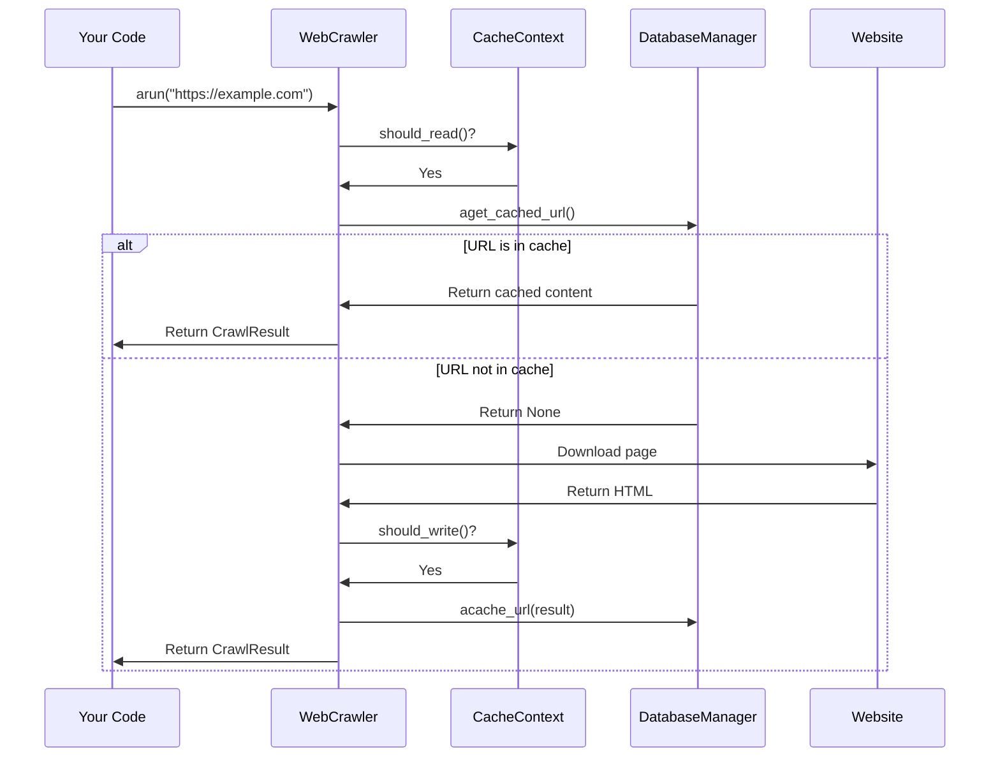

# Chapter 6: Caching System

In [Chapter 5: Deep Crawling System](05_deep_crawling_system_.md), we learned how to explore websites beyond a single page. As you crawl multiple pages, you might notice something: crawling the same page multiple times wastes time and resources. This is where the Caching System comes in!

## What is the Caching System?

Imagine you're doing research for a school project. When you find a useful article online, you might save a copy or print it out so you don't have to search for it again later. The Caching System in crawl4ai works the same way:

- It stores content you've already crawled (like HTML, extracted text, images)
- It lets you retrieve this content later without having to download it again
- It saves time, reduces network traffic, and is more polite to the websites you visit

Let's see how this works with a simple example:

```python
from crawl4ai import AsyncWebCrawler, CrawlerRunConfig
from crawl4ai.cache_context import CacheMode

async def crawl_with_cache():
    # First run: will download and cache the page
    async with AsyncWebCrawler() as crawler:
        result1 = await crawler.arun(
            url="https://example.com",
            config=CrawlerRunConfig(cache_mode=CacheMode.ENABLED)
        )
        
    # Second run: will use the cached version (much faster!)
    async with AsyncWebCrawler() as crawler:
        result2 = await crawler.arun(
            url="https://example.com",
            config=CrawlerRunConfig(cache_mode=CacheMode.ENABLED)
        )
```

In this example, the first crawl downloads the page from the internet and saves it to the cache. The second crawl doesn't need to download the page again - it just retrieves the saved version from the cache!

## How Caching Works: Core Components

The Caching System has three main components:

### 1. CacheMode Enum: Controlling Caching Behavior

The `CacheMode` enum lets you decide how caching should work for each crawl operation:

```python
from crawl4ai.cache_context import CacheMode

# Different caching options
enabled = CacheMode.ENABLED      # Normal caching (read and write)
disabled = CacheMode.DISABLED    # No caching at all
read_only = CacheMode.READ_ONLY  # Only read from cache, don't write
write_only = CacheMode.WRITE_ONLY # Only write to cache, don't read
bypass = CacheMode.BYPASS        # Skip cache for this operation
```

These modes give you precise control over when to use and update the cache.

### 2. CacheContext: Making Caching Decisions

The `CacheContext` class helps decide whether to read from or write to the cache for a specific URL:

```python
from crawl4ai.cache_context import CacheContext

# Create a cache context for a URL
context = CacheContext(
    url="https://example.com",
    cache_mode=CacheMode.ENABLED
)

# Check if we should read from cache
if context.should_read():
    # Try to get content from cache
    
# Check if we should write to cache
if context.should_write():
    # Save content to cache
```

The `CacheContext` considers both the cache mode and the URL type (for example, you can't cache raw HTML).

### 3. AsyncDatabaseManager: Storing and Retrieving Data

The `AsyncDatabaseManager` is the storage engine that actually saves and retrieves your cached content:

```python
from crawl4ai.async_database import async_db_manager

# Check if a URL is in the cache
cached_result = await async_db_manager.aget_cached_url(url)
if cached_result:
    # Use the cached content
    
# Store a new result in the cache
await async_db_manager.acache_url(result)
```

You don't usually need to use this directly - the `AsyncWebCrawler` handles it for you.

## Using the Cache: Practical Examples

Let's look at some common use cases for the Caching System:

### Example 1: Basic Caching (Default Behavior)

By default, crawl4ai has caching enabled:

```python
from crawl4ai import AsyncWebCrawler

async def basic_crawl():
    async with AsyncWebCrawler() as crawler:
        # Caching is enabled by default
        result = await crawler.arun(url="https://example.com")
```

This automatically saves the result and will use the cached version next time.

### Example 2: Refreshing the Cache (Bypassing)

Sometimes you want fresh content instead of cached content:

```python
from crawl4ai import AsyncWebCrawler, CrawlerRunConfig
from crawl4ai.cache_context import CacheMode

async def refresh_content():
    async with AsyncWebCrawler() as crawler:
        # Skip cache and fetch fresh content
        result = await crawler.arun(
            url="https://example.com",
            config=CrawlerRunConfig(cache_mode=CacheMode.BYPASS)
        )
```

This fetches a fresh copy from the website and updates the cache.

### Example 3: Reading from Cache Only (Offline Mode)

If you want to work offline or reduce server load:

```python
from crawl4ai import AsyncWebCrawler, CrawlerRunConfig
from crawl4ai.cache_context import CacheMode

async def offline_mode():
    async with AsyncWebCrawler() as crawler:
        # Only use cache, don't fetch from the internet
        result = await crawler.arun(
            url="https://example.com",
            config=CrawlerRunConfig(cache_mode=CacheMode.READ_ONLY)
        )
```

This will only return content if it's already in the cache, and won't attempt to download it.

## How It Works Under the Hood

When you crawl a URL with caching enabled, here's what happens behind the scenes:



1. Your code calls `crawler.arun()` with a URL
2. The crawler creates a `CacheContext` to determine caching behavior
3. If reading from cache is allowed, it checks the database for the URL
4. If the URL is in the cache, it returns the cached content
5. If not, it downloads the page from the website
6. If writing to cache is allowed, it saves the result to the database
7. Finally, it returns the result to your code

## Implementation Details

Let's look at how this is implemented in the code. Here's a simplified version of how caching works in the `arun` method:

```python
# From the AsyncWebCrawler.arun method
async def arun(self, url: str, config: CrawlerRunConfig = None):
    # Create cache context
    cache_context = CacheContext(url, config.cache_mode, False)
    
    # Try to get cached result if appropriate
    if cache_context.should_read():
        cached_result = await async_db_manager.aget_cached_url(url)
        
    if cached_result:
        # Use cached content
        return CrawlResultContainer(cached_result)
    else:
        # Fetch and process new content
        async_response = await self.crawler_strategy.crawl(url, config=config)
        crawl_result = await self.aprocess_html(url=url, html=async_response.html)
        
        # Update cache if appropriate
        if cache_context.should_write():
            await async_db_manager.acache_url(crawl_result)
            
        return CrawlResultContainer(crawl_result)
```

This simplified code shows the core caching logic:
1. Create a `CacheContext` with the URL and cache mode
2. If we should read from cache, try to get the cached result
3. If we have a cached result, return it
4. Otherwise, fetch and process the content
5. If we should write to cache, save the result
6. Return the result

The actual database operations happen in the `AsyncDatabaseManager` class. Here's a simplified example of how it saves content to the database:

```python
# From the AsyncDatabaseManager.acache_url method
async def acache_url(self, result: CrawlResult):
    # Store content files and get hashes
    content_hashes = await self._store_content_files(result)
    
    # Store metadata in SQLite database
    await self.execute_with_retry(
        "INSERT INTO crawled_data VALUES (?, ?, ?, ?)",
        (result.url, content_hashes["html"], content_hashes["markdown"])
    )
```

The `AsyncDatabaseManager` does more than just use a database - it also:
1. Stores large content (HTML, screenshots) as separate files
2. Uses hash values to avoid duplicating content
3. Manages database connections efficiently
4. Handles errors and retries failed operations

## Advanced Usage: Optimizing Caching

Here are some tips for getting the most out of the Caching System:

### Memory-Efficient Crawling

If you're crawling many pages but don't need to update the cache:

```python
from crawl4ai import AsyncWebCrawler, CrawlerRunConfig
from crawl4ai.cache_context import CacheMode

async def memory_efficient_crawl():
    config = CrawlerRunConfig(
        cache_mode=CacheMode.READ_ONLY,  # Don't write to cache
        screenshot=False  # Screenshots use a lot of storage
    )
    
    async with AsyncWebCrawler() as crawler:
        result = await crawler.arun(url="https://example.com", config=config)
```

### Refreshing Specific Content Types

Sometimes you want to update screenshots but use cached text:

```python
async def refresh_screenshots():
    # First check if we have a cached version
    config_check = CrawlerRunConfig(cache_mode=CacheMode.READ_ONLY)
    
    async with AsyncWebCrawler() as crawler:
        cached = await crawler.arun(url="https://example.com", config=config_check)
        
        # If we have text but no screenshot, get a fresh version with screenshot
        if cached.success and not cached.screenshot:
            config_refresh = CrawlerRunConfig(
                cache_mode=CacheMode.ENABLED,
                screenshot=True
            )
            await crawler.arun(url="https://example.com", config=config_refresh)
```

### Clearing the Cache

If you need to clear the cache:

```python
from crawl4ai.async_database import async_db_manager

async def clear_cache():
    # Clear all cached data
    await async_db_manager.aclear_db()
    
    # Or completely rebuild the database
    await async_db_manager.aflush_db()
    await async_db_manager.ainit_db()
```

Be careful with these operations, as they will delete all your cached data!

## Conclusion

The Caching System in crawl4ai is like your personal web library - it stores copies of web content you've already downloaded, saving time and resources when you need to access the same content again.

In this chapter, we learned:
- How the Caching System stores and retrieves web content
- How to control caching behavior with the `CacheMode` enum
- How the `CacheContext` and `AsyncDatabaseManager` work together
- How to use the cache effectively for different scenarios

Using the Caching System makes your web crawling more efficient and respectful to the websites you're crawling. Instead of repeatedly downloading the same content, you can use your local copies, reducing network traffic and making your crawling faster.

In the next chapter, [Dispatcher Framework](07_dispatcher_framework_.md), we'll learn how to manage multiple crawling tasks efficiently using the dispatcher system.

---

Generated by [AI Codebase Knowledge Builder](https://github.com/The-Pocket/Tutorial-Codebase-Knowledge)