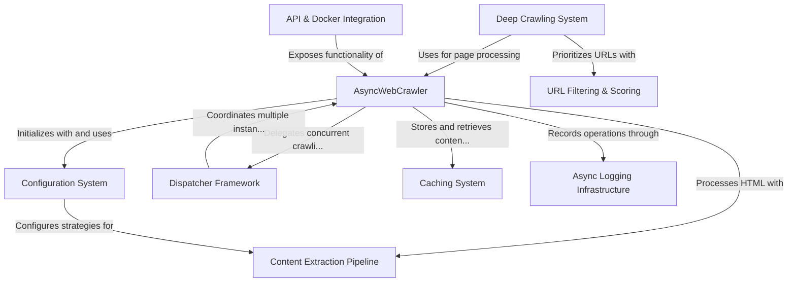

# Tutorial: My Crawl4ai

**Crawl4ai** is an *intelligent web crawling framework* designed specifically for AI applications. It provides **asynchronous web crawling** capabilities with configurable strategies for *content extraction*, deep website exploration, and smart URL prioritization. 

The library manages resources efficiently through its *dispatcher framework* and *caching system*, while offering flexible logging and content filtering. It can be deployed as a **service** via Docker with API endpoints, making it suitable for both simple data collection and complex distributed crawling tasks.

**Source Repository:** [https://github.com/unclecode/crawl4ai](https://github.com/unclecode/crawl4ai)

---

Generated by [AI Codebase Knowledge Builder](https://github.com/The-Pocket/Tutorial-Codebase-Knowledge)