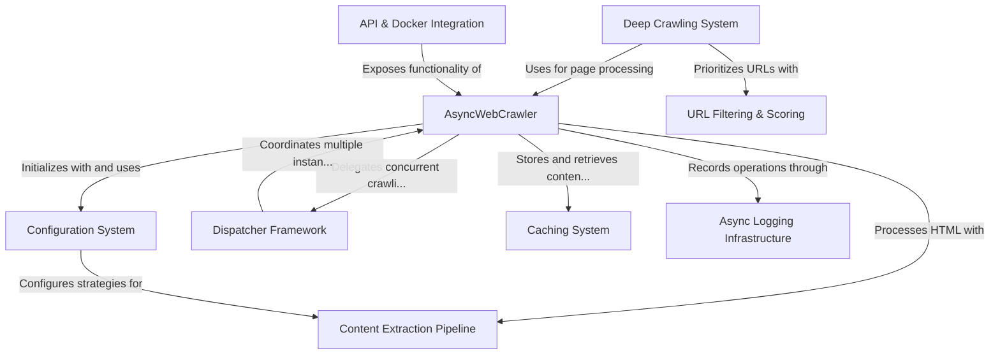

# Tutorial: crawl4ai

**Crawl4ai** is an *intelligent web crawling framework* designed specifically for AI applications. It provides **asynchronous web crawling** capabilities with configurable strategies for *content extraction*, deep website exploration, and smart URL prioritization. 

The library manages resources efficiently through its *dispatcher framework* and *caching system*, while offering flexible logging and content filtering. It can be deployed as a **service** via Docker with API endpoints, making it suitable for both simple data collection and complex distributed crawling tasks.

**Source Repository:** [https://github.com/unclecode/crawl4ai](https://github.com/unclecode/crawl4ai)

## Chapters

1. [Configuration System
](01_configuration_system_.md)
2. [AsyncWebCrawler
](02_asyncwebcrawler_.md)
3. [Content Extraction Pipeline
](03_content_extraction_pipeline_.md)
4. [URL Filtering & Scoring
](04_url_filtering___scoring_.md)
5. [Deep Crawling System
](05_deep_crawling_system_.md)
6. [Caching System
](06_caching_system_.md)
7. [Dispatcher Framework
](07_dispatcher_framework_.md)
8. [Async Logging Infrastructure
](08_async_logging_infrastructure_.md)
9. [API & Docker Integration
](09_api___docker_integration_.md)

---

Generated by [AI Codebase Knowledge Builder](https://github.com/The-Pocket/Tutorial-Codebase-Knowledge)