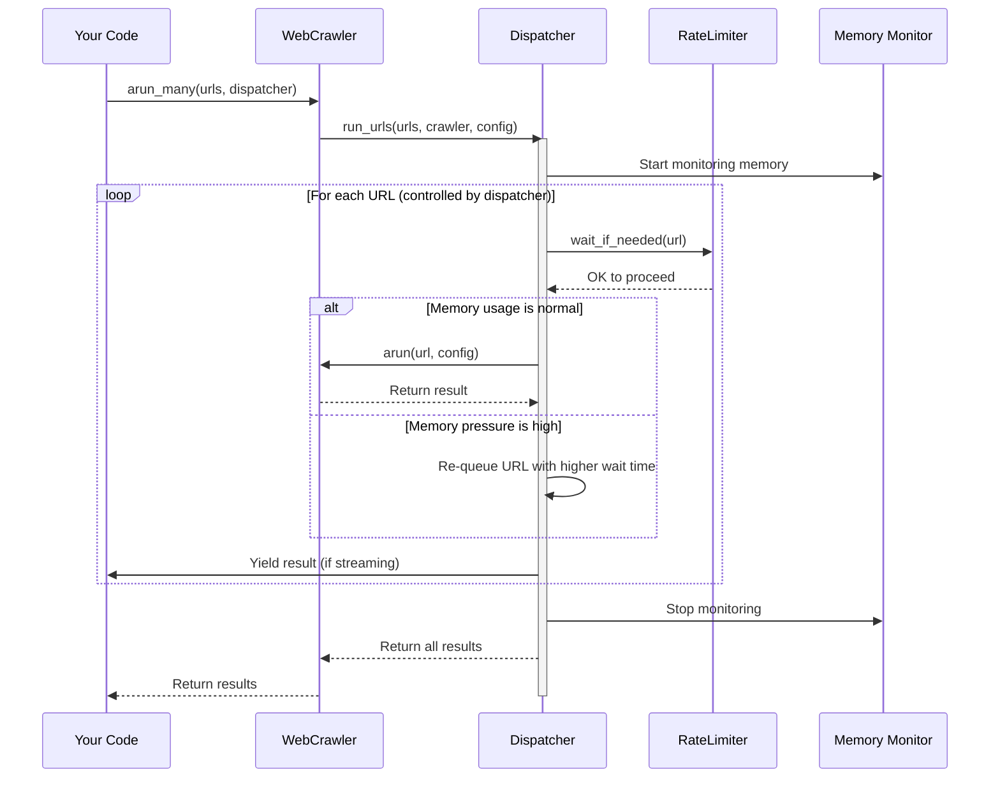

# Chapter 7: Dispatcher Framework

In [Chapter 6: Caching System](06_caching_system_.md), we learned how to store and reuse web content to make our crawlers more efficient. Now, let's explore how to manage multiple crawling operations happening at the same time with the Dispatcher Framework.

## What is the Dispatcher Framework?

Imagine you're running a busy restaurant kitchen. You need a head chef (the dispatcher) who coordinates all the cooks (crawler instances), making sure they don't overcrowd the kitchen or use too many ingredients at once.

The Dispatcher Framework in crawl4ai works the same way - it coordinates multiple crawler instances:

- It controls how many web pages are crawled at the same time
- It makes sure your computer's memory doesn't get overwhelmed
- It ensures websites aren't bombarded with too many requests at once

Let's see a simple example of how this works:

```python
from crawl4ai import AsyncWebCrawler, SemaphoreDispatcher, CrawlerRunConfig

async def crawl_multiple_sites():
    # Create a dispatcher that allows 3 crawls at a time
    dispatcher = SemaphoreDispatcher(semaphore_count=3)
    
    # List of URLs to crawl
    urls = ["https://example.com", "https://example.org", "https://example.net"]
    
    # Create a crawler and run multiple URLs using our dispatcher
    async with AsyncWebCrawler() as crawler:
        results = await crawler.arun_many(
            urls=urls,
            dispatcher=dispatcher,
            config=CrawlerRunConfig()
        )
    
    return results
```

In this example, we're using a `SemaphoreDispatcher` to crawl three URLs at the same time, not one after another. This is much faster!

## Two Types of Dispatchers

The Dispatcher Framework offers two main types of dispatchers, each with different strengths:

### 1. SemaphoreDispatcher: Simple and Predictable

The `SemaphoreDispatcher` is like a restaurant with a fixed number of tables. It allows a specific number of crawls to happen at the same time - no more, no less.

```python
from crawl4ai import SemaphoreDispatcher

# Create a dispatcher that allows 5 simultaneous crawls
dispatcher = SemaphoreDispatcher(semaphore_count=5)
```

This dispatcher is great when:
- You want predictable behavior
- You know exactly how many concurrent crawls your system can handle
- You want to set a strict limit on resource usage

### 2. MemoryAdaptiveDispatcher: Smart and Flexible

The `MemoryAdaptiveDispatcher` is like a restaurant that adjusts how many tables are available based on how busy the kitchen is. It monitors your computer's memory and automatically adjusts how many crawls happen at once.

```python
from crawl4ai import MemoryAdaptiveDispatcher

# Create a dispatcher that adapts to memory usage
dispatcher = MemoryAdaptiveDispatcher(
    memory_threshold_percent=90.0,  # Slow down when memory reaches 90%
    max_session_permit=20           # Never exceed 20 simultaneous crawls
)
```

This dispatcher is perfect when:
- You want to maximize efficiency without crashing your program
- Your system's available memory changes over time
- You're crawling pages with unpredictable memory requirements

## Managing Rate Limits with RateLimiter

When crawling websites, it's important to be polite and not send too many requests too quickly. The `RateLimiter` helps with this:

```python
from crawl4ai import RateLimiter, MemoryAdaptiveDispatcher

# Create a rate limiter that waits 1-3 seconds between requests
rate_limiter = RateLimiter(
    base_delay=(1.0, 3.0),  # Wait 1-3 seconds between requests
    max_delay=60.0,         # Never wait more than 60 seconds
    max_retries=3           # Try a maximum of 3 times if rate limited
)

# Add the rate limiter to our dispatcher
dispatcher = MemoryAdaptiveDispatcher(rate_limiter=rate_limiter)
```

The `RateLimiter` tracks each domain separately and adjusts wait times if it detects rate limiting (like HTTP 429 responses).

## Processing Results in Real-Time with Streaming

Sometimes you don't want to wait for all URLs to finish crawling before processing results. Streaming allows you to process results as they come in:

```python
from crawl4ai import AsyncWebCrawler, CrawlerRunConfig

async def stream_results():
    urls = ["https://example.com", "https://example.org", "https://example.net"]
    
    # Enable streaming in the configuration
    config = CrawlerRunConfig(stream=True)
    
    async with AsyncWebCrawler() as crawler:
        # This returns an async generator
        results_generator = await crawler.arun_many(urls=urls, config=config)
        
        # Process results as they arrive
        async for result in results_generator:
            print(f"Just finished: {result.url}")
            # Process each result immediately
```

With streaming, you can start working with results from fast-loading pages while slower pages are still being crawled.

## A Complete Example: News Crawler with Memory Adaptation

Let's put everything together in a more complete example. Imagine we're building a news crawler that needs to handle many URLs efficiently:

```python
from crawl4ai import (
    AsyncWebCrawler, MemoryAdaptiveDispatcher, RateLimiter, CrawlerRunConfig
)

async def crawl_news_sites():
    # Create a memory-adaptive dispatcher with rate limiting
    dispatcher = MemoryAdaptiveDispatcher(
        memory_threshold_percent=85.0,  # Be conservative with memory
        rate_limiter=RateLimiter(base_delay=(2.0, 5.0))  # Be extra polite
    )
    
    # List of news sites to crawl
    news_sites = [
        "https://example-news.com/tech",
        "https://example-news.com/business",
        # ... more URLs ...
    ]
    
    # Configure how we want to crawl
    config = CrawlerRunConfig(
        screenshot=True,  # Take screenshots
        stream=True       # Process results as they arrive
    )
    
    # Run the crawler with our dispatcher
    async with AsyncWebCrawler() as crawler:
        results_stream = await crawler.arun_many(
            urls=news_sites,
            config=config,
            dispatcher=dispatcher
        )
        
        # Process each result as it completes
        async for result in results_stream:
            if result.success:
                print(f"Successfully crawled: {result.url}")
                # Process the content...
            else:
                print(f"Failed to crawl: {result.url}")
```

This example shows how to:
1. Create a memory-adaptive dispatcher with rate limiting
2. Configure it for cautious memory usage and polite crawling
3. Stream and process results as they become available

## What Happens Under the Hood

When you use the Dispatcher Framework, a lot happens behind the scenes. Let's look at a simplified view:



Here's what happens step by step:

1. Your code calls `crawler.arun_many()` with a list of URLs and a dispatcher
2. The WebCrawler passes the URLs to the dispatcher's `run_urls` method
3. The dispatcher starts a memory monitor if it's a `MemoryAdaptiveDispatcher`
4. For each URL:
   - The dispatcher checks with the rate limiter if it's OK to crawl
   - If memory usage is normal, it crawls the URL
   - If memory is under pressure, it might delay some URLs
   - It yields or collects the result
5. Finally, all results are returned to your code

## Implementation Details: MemoryAdaptiveDispatcher

Let's look at how the `MemoryAdaptiveDispatcher` is implemented:

```python
# From crawl4ai/async_dispatcher.py (simplified)
class MemoryAdaptiveDispatcher(BaseDispatcher):
    def __init__(
        self,
        memory_threshold_percent=90.0,
        critical_threshold_percent=95.0,
        recovery_threshold_percent=85.0,
        max_session_permit=20,
        rate_limiter=None,
    ):
        self.memory_threshold_percent = memory_threshold_percent
        self.critical_threshold_percent = critical_threshold_percent
        self.max_session_permit = max_session_permit
        self.rate_limiter = rate_limiter
        self.memory_pressure_mode = False
```

The constructor sets up thresholds for memory management:
- `memory_threshold_percent`: When to start slowing down (90% by default)
- `critical_threshold_percent`: When to pause crawling (95% by default)
- `max_session_permit`: Maximum concurrent crawls (20 by default)

The dispatcher monitors memory with a background task:

```python
# From the _memory_monitor_task method (simplified)
async def _memory_monitor_task(self):
    while True:
        # Check current memory usage
        self.current_memory_percent = psutil.virtual_memory().percent
        
        # Enter pressure mode if memory is high
        if not self.memory_pressure_mode and self.current_memory_percent >= self.memory_threshold_percent:
            self.memory_pressure_mode = True
            
        # Exit pressure mode if memory is lower
        elif self.memory_pressure_mode and self.current_memory_percent <= self.recovery_threshold_percent:
            self.memory_pressure_mode = False
            
        await asyncio.sleep(self.check_interval)
```

This continuously checks memory usage and adjusts the `memory_pressure_mode` flag, which affects how URLs are processed.

## Implementation Details: SemaphoreDispatcher

The `SemaphoreDispatcher` is simpler but still powerful:

```python
# From crawl4ai/async_dispatcher.py (simplified)
class SemaphoreDispatcher(BaseDispatcher):
    def __init__(self, semaphore_count=5, rate_limiter=None):
        super().__init__(rate_limiter)
        self.semaphore_count = semaphore_count
        
    async def crawl_url(self, url, config, task_id, semaphore):
        async with semaphore:
            # Crawl the URL with rate limiting
            if self.rate_limiter:
                await self.rate_limiter.wait_if_needed(url)
                
            result = await self.crawler.arun(url, config=config)
            return result
```

The `SemaphoreDispatcher` uses an asyncio Semaphore to limit concurrent tasks. When a task is done, it releases its slot, allowing another task to start.

## Advanced Usage: Monitoring Crawl Progress

You can monitor the progress of your crawls using the `CrawlerMonitor`:

```python
from crawl4ai import AsyncWebCrawler, MemoryAdaptiveDispatcher, CrawlerMonitor

async def monitored_crawl():
    # Create a monitor
    monitor = CrawlerMonitor()
    
    # Create a dispatcher with the monitor
    dispatcher = MemoryAdaptiveDispatcher(monitor=monitor)
    
    # Run your crawl
    async with AsyncWebCrawler() as crawler:
        results = await crawler.arun_many(
            urls=["https://example.com", "https://example.org"],
            dispatcher=dispatcher
        )
        
    # Get statistics about the crawl
    stats = monitor.get_statistics()
    print(f"Completed: {stats['completed']} URLs")
    print(f"Failed: {stats['failed']} URLs")
    print(f"Average memory usage: {stats['avg_memory_usage']} MB")
```

The monitor collects statistics about each URL, including success/failure, memory usage, and timing.

## Conclusion

The Dispatcher Framework is like having an expert traffic controller for your web crawling operations. It helps you crawl multiple websites simultaneously while being careful about system resources and polite to the websites you're visiting.

In this chapter, we've learned:
- How to use the `SemaphoreDispatcher` for simple concurrent crawling
- How to use the `MemoryAdaptiveDispatcher` for smart resource management
- How to enforce rate limits with the `RateLimiter`
- How to process results in real-time with streaming
- How the dispatch process works under the hood

With the Dispatcher Framework, you can build efficient, robust, and polite web crawlers that make the most of your system's resources without overwhelming them.

In the next chapter, [Async Logging Infrastructure](08_async_logging_infrastructure_.md), we'll learn how to track what's happening in our crawlers with detailed logs, which is especially important when dealing with complex crawling operations.

---

Generated by [AI Codebase Knowledge Builder](https://github.com/The-Pocket/Tutorial-Codebase-Knowledge)